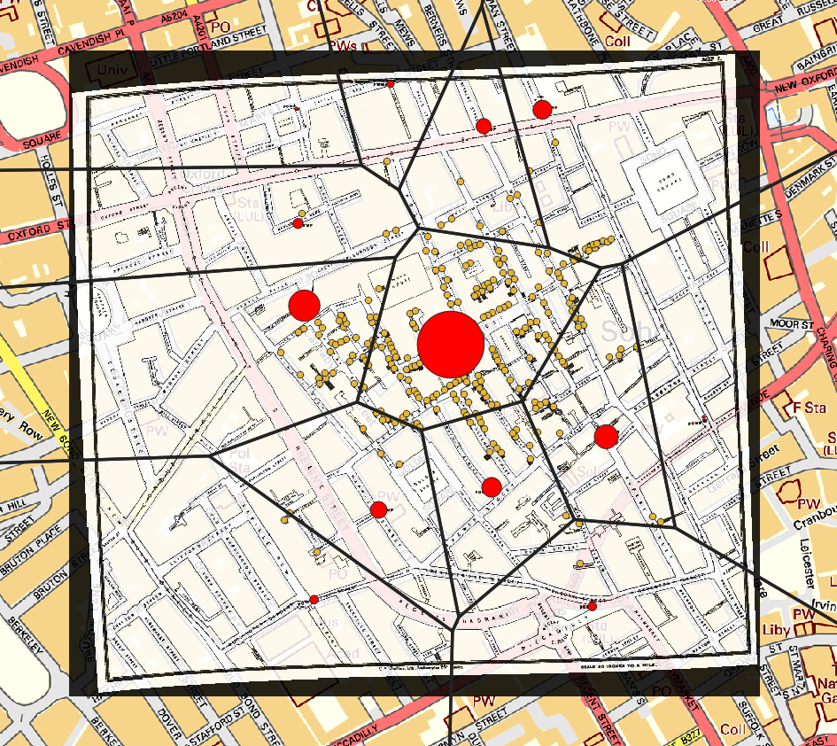

class: center, middle, first

# Présentation du module SIG

  

### LP Programmation Avancée

 

.author[
    Matthieu Viry (UAR RIATE / CNRS)
     
    🖂 <a href="mailto:matthieu.viry@cnrs.fr">matthieu.viry@cnrs.fr</a>
]

.date[
     
    06/02/2023
]

---

class: section-change

# Objectifs et modalités d'évaluation

---

## Objectifs

.pull-left[
### Pourquoi cet enseignement ?

.medium[
De nombreux secteurs professionnels utilisent les Systèmes d'Information Géographique : *Agriculture, aménagement, automobile, assurance et banque, bâtiment et travaux publics, défense, eau et assainissement, électricité, enseignement, environnement, épidémiologie, géologie, géomarketing, immobilier, ingénierie logistique, ressources naturelles, santé, services d’urgence, télécommunications, tourisme, urbanisme...*
]

Quelque soit le secteur professionnel dans lequel vous évoluerez, vous pouvez être amenés à **consulter, utiliser, gérer, analyser, représenter ou produire de l&#39;information géographique**. 

Ce cours vise à vous faire tendre vers l&#39;**autonomie**, savoir poser les **bonnes questions** et identifier les **outils et méthodes adéquats** pour utiliser de l&#39;information géographique.    
]

--

.pull-right[
### Apprendre à...

- **être familier** avec les notions "**d'information géographique**" et de "**Systèmes d'Information Géographique**",

- **connaître différentes formes de stockage et d'accès à l'information géographique**,

- **manipuler** de l&#39;information géographique :
    * dans un logiciel SIG de bureau (QGIS),
    * dans un SGBD spatial,
    * programmatiquement,

- **réaliser des analyses spatiales** simples,

- **visualiser** de l&#39;information géographique.

]

---

## Calendrier et modalités d&#39;évaluation

  

- **8 séances de 3h** (Semaine du 6 au 10 février 2023)

 

--

- **TP** : **1/2 de la note** finale

 

- **Examen terminal**, par écrit (QCM et questions ouvertes), le 10/02/2023 (45min + tiers temps éventuel) : **1/2 de la note** finale

---

class: section-change

# Programme

---

## Jour 1

.pull-left[

### Matin
- *Cours* / **Introduction au SIG**
    * Définition d'un SIG

    * L'information géographique

    * Coordonnées et système de référence spatial

    * Données vectorielles et matricielles

    * Les solutions techniques existantes

.center.w30[]
]

.pull-right[

### Après-midi

- *TD* / **Prise en main de QGIS**
    * Chargement de données

    * Gestion des styles des couches

    * Gestion des systèmes de coordonnées de références

    * Sélection par attribut

    * Sélection par localisation

    * Export des couches

.center.w30[]
]

---

## Jour 2

.pull-left[

### Matin

- *TD* / **Utilisation de QGIS**
    * Géotraitements (buffer, intersection, difference, etc.)

    * Jointures attributaires et spatiales

    * Croisement données vecteur et raster

    * Distance euclidienne ou temps de parcours ?

    * Présentation de la console Python
 

.center.w30[]

]

.pull-right[

### Après-midi

- *Cours* / **Représenter l'information géographique**
    * Concepts fondamentaux

    * Règles de sémiologie graphique

    * Lien entre données statistiques et variables visuelles

]

---

## Jour 3

.pull-left[

### Matin

- *Cours* / **Les SGBD-R Spatiaux**
    * Rappels SGBD et rappels SQL

    * Spécificités

    * Fonctionnalités proposées

- *TP* / **PostGIS 1**
    * Installation PostgreSQL/PostGIS

    * Import de données

    * Interroger la dimension spatiale des données

.w20.center[]
]

.pull-right[

### Après-midi

- *TP* / **PostGIS 2**
    * Import des données

    * Résoudre un problème simple d'analyse spatial en SQL

    * Visualiser les résultats dans QGIS et choisir une symbologie adaptée

    * Exporter la carte réalisée vers une page Web

.w45.center[]

]

---

## Jour 4

### Matin et après-midi

.pull-left[
- *Cours* / **Utilisation de services Web**
    * Protocoles d'échanges

    * Serveurs cartographiques
  
    * Frameworks de webmapping côté client

    * Présentation des géoservices IGN

    * Rappels en JavaScript

- *TP* / **Construction d'une application Web**
    * Présentation du sujet

    * Identification des verrous et des solutions possibles

    * Implémentation
]

.pull-right[
.w100.border[]
]

---

## Jour 5

### Devoir sur table, 45min (+ tiers temps éventuel).

### Pas de document / smartphone / ordinateur autorisé.

 

### QCM et questions ouvertes à propos des concepts fondamentaux des SIG et des solutions techniques propres à l'information géographique.

---

class: section-change

## Accéder aux supports...

## https://mthh.github.io/sig-lp-prog/

    
  

#### 🖂 <a href="mailto:matthieu.viry@cnrs.fr">matthieu.viry@cnrs.fr</a>

