class: center, middle, first

# Module SIG
# Séance 1 - Cours - Introduction aux SIG

### LP Programmation Avancée

<br>
<br>

.author[
    Matthieu Viry (UAR RIATE / CNRS)
    <br>
    🖂 <a href="mailto:matthieu.viry@cnrs.fr">matthieu.viry@cnrs.fr</a>
]

.date[
    <br>
    06/02/2023
]
---

class: section-change

# 1ère partie
## Définition d'un SIG et bref historique

---

## Qu'est-ce qu'un SIG ?

<br>

> **Systèmes d'Information Géographique**
> .innerdef[Système d'Information dédié à la gestion de données référencées spatialement (= géoréférencées)]

<br><br>

Constituants habituels d'un SIG :

- **Données** : primitives géométriques et données attributaires non géographiques

- **Logiciels** : Acquisition, Archivage, Analyse, Affichage, Abstraction, Anticipation.

- **Matériels** : serveurs, clients, ...

- **Méthodes**

- **Utilisateurs**

???
    
Les SIG sont l'ensemble des outils informatiques permettant de collecter, stocker, gérer, manipuler, analyser, modéliser et représenter de l’information géographique.

---


## Principes et fonctionnalités

Les SIG permettent d'opérer sur l'intégralité de la chaîne de traitement des données géographiques :

- **Digitalisation** - saisir et abstraire
- **Stockage** et **gestion** - base de données
- **Analyse** - géotraitements, analyse spatiale   
- **Représentation** - cartographie

--

.left-column-66[

Pour **modéliser la réalité**,  plusieurs couches d'information géographique,  **vecteur et/ou raster**, de différente nature et dans un même système de projection sont **superposées**.

Chaque **couche géographique contient des objets de même type** (adresses, parcelles, routes, bâtiments, cours d'eau, limites administratives...)

**Une couche géographique = un seul type d'objet géographique** : point, ligne, polygone (vecteur) ou image géoréférencée (raster)

Il est ensuite possible de réaliser de puissantes **analyses croisées**.

]

.right-column-33[
.center[

]
]

???

Définir chaine de traitement des données géo...

---

## Principes et fonctionnalités

Un SIG permet de travailler sur les **trois composantes de l'information géographique** :

.pull-left[
.medium[
### Composante sémantique
**Les attributs** qui décrivent les objets géographiques (ex : libellé, population, catégorie) **peuvent être modifiés, supprimés, ajoutés et surtout requêtés** : Il est possible de sélectionner des objets géographiques **en fonction de la valeur des attributs**.

### Composante géométrique
Possibilité de **modifier la localisation** et/ou **la forme** des objets géographiques, de **calculer des surfaces**, **des distances**, ou encore des **zones tampons**, de **convertir des polygones en point**... Les opérations possibles sur la géométrie des objets sont multiples.
]
]

.pull-right[
.medium[
### Composante topologique
Une fonctionnalité puissante qui consiste à **requêter des objets par localisation**, c'est à dire **en fonction de leur positionnement par rapport à d'autres objets**. Pour cela on peut utiliser une série d'opérateur, exemple : *Contient*, *Croise*, *Intersecte*, *Est à l’intérieur*...]

.center[


.small[
Ex : *Sélection d'objets géographiques ponctuels situés à une certaine distance (euclidienne) d'autres objets géographiques ponctuels*
]]]

???

Citer les 3 composantes... et dire que nous reviendrons dessus

---

## Avant les SIG... &nbsp;&nbsp;&nbsp;&nbsp; Londres, 1854

.left-column[
**John Snow** est un médecin britannique.

Ses travaux sur la **propagation** du choléra dans le quartier de Soho à Londres en 1854 sont reconnus dans l'histoire de l'**épidémiologie moderne** et de l'**analyse spatiale**.

.medium[

.left-column-33[
.w90[]
]


.right-column-66[
Il va identifier la **cause de l'épidémie** en utilisant un procédé simple, mais innovant, qui repose sur le principe de fonctionnement des SIG : **superposer deux couches géographiques différentes** :

- **Les lieux de résidence des décès liés à l'épidémie**.
- **Les pompes à eau du quartier**.
]

Il déterminera que la **transmission s'effectue par l'eau** et **identifiera le foyer de contamination** : la pompe de Brewer Street.
]
]

.right-column[
.w95[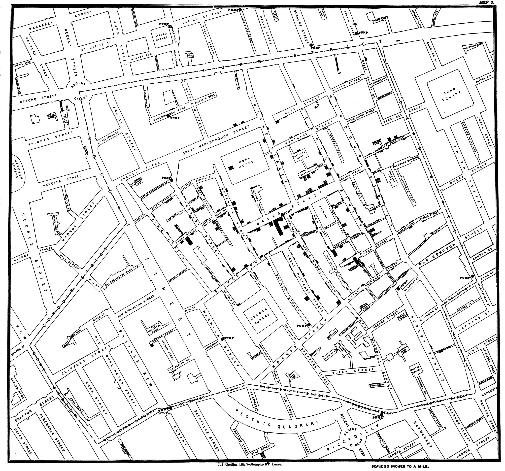]

**Carte de John Snow** avec la localisation des lieux de résidence des personnes décédées du choléra.
]

---

## Avant les SIG... &nbsp;&nbsp;&nbsp;&nbsp; Londres, 1854

.left-column[
**John Snow** est un médecin britannique.

Ses travaux sur la **propagation** du choléra dans le quartier de Soho à Londres en 1854 sont reconnus dans l'histoire de l'**épidémiologie moderne** et de l'**analyse spatiale**.

.medium[

.left-column-33[
.w90[]
]


.right-column-66[
Il va identifier la **cause de l'épidémie** en utilisant un procédé simple, mais innovant, qui repose sur le principes de fonctionnement des SIG : **superposer deux couches géographiques différentes** :

- **Les lieux de résidence des décès liés à l'épidémie**.
- **Les pompes à eau du quartier**.
]

Il déterminera que la **transmission s'effectue par l'eau** et **identifiera le foyer de contamination** : la pompe de Brewer Street.
]
]

.right-column[
.w95[]

.medium[Carte de John Snow revue par Mark Monmonnier, 1996]
]

---

## Avant les SIG... &nbsp;&nbsp;&nbsp;&nbsp; Londres, 1854

.center[Si John Snow avait utilisé un système d'information géographique...]

.dflex[
.w70[] .w90[]
]

---

## Une brève histoire des SIG


- **Les prémices** (fin années 60's - 1980) : objet de recherche universitaire

--

- **Les débuts de la démocratisation** (années 1990) : croissance importante

--

- **La numérisation** (1990 - 2010) et l'**exploitation** (à partir de 2002)

--

- **L'intégration au SI** (années 2000) : première solutions spatiales - Oracle, PostGIS, etc.

--

- **Le Web** : ESRI, GeoServer, MapServer + Interopérabilité : WMS, WFS, etc.

--

- **La mobilité** : premiers dispositifs mobiles

--

- **L'externalisation** (2007) : services externalisés de données spatiales

--

- **La VGI** (à partir de 2005, surtout après 2010) : *crowdsourcing* géographique

--

<br>

.medium[**Les SIG sont aujourd’hui utilisés dans de nombreux domaines** : Agriculture, aménagement du territoire, architecture, assurances & banque, automobile, BTP, cadastre, découpage électoral, défense, démographie, eau et assainissement, électricité, enseignement, environnement, épidémiologie, équipement, géologie, géomarketing, gestion de flotte, gestion de patrimoine, gestion de réseaux, gestion des sols, Internet, immobilier, implantation de commerces, ingénierie logistique, optimisation de parcours, pétrole et gaz, publicité, recherche, ressources naturelles, santé, services d'urgence, télécommunications, tourisme,...]


???

• Les prémices (années 70-80) Objet de recherche en particulier aux USA et au
Canada (Tomlinson), premières tentatives de définition des SIG
• au début (années 1990), plans sur papier (à refaire environ tous les 10 ans,
imprécis, etc.) ;
• transposition (numérisation) de l’information, sur 20 ans (jusqu’aux années
2010) ;
• exploitation de l’information (à partir de 2002 environ).
• intégration dans le SI : vers les années 2000, premières cartouches spatiales.
Oracle et PostGIS.
• serveurs Web de bases spatiales (2002) -> ESRI, GeoServer, MapServer +
interopérabilité : WMS, WFS, WFS-T.
• mobilité (2005)
• services externalisés de données spatiales (2007).
Remarque : les premiers utilisateurs de SIG en France -> les collectivités locales avec
le cadastre. Puis la défense (intérêt stratégique des cartes - confidentiel).

"Information géographique bénévole" / Volunteered geographic information (VGI)

---

class: section-change

# 2ème partie
## Coordonnées et <br >Système de Référence Spatiale

---


## Coordonnées géographiques

<br>

Une information géographique est forcément décrite par **une position et une forme sur la surface de la Terre**.

<br>

--

> - Sur quel **référentiel** se base-t-on pour localiser un objet sur Terre ?

> - Comment détermine-t-on **les coordonnées géographiques** d'un objet géographique ?    

> - Qu'est-ce qu'un **système de référence spatiale** ? Qu'est-ce qu'une **projection cartographique** ? 

--

<br>

Comprendre les méthodes de localisation et de projection de l'information géographique est fondamental pour correctement **gérer le système de coordonnées géographiques et la projection cartographique d'une couche dans un SIG.**

---

## Systèmes de Référence Spatiale


.center.w40[
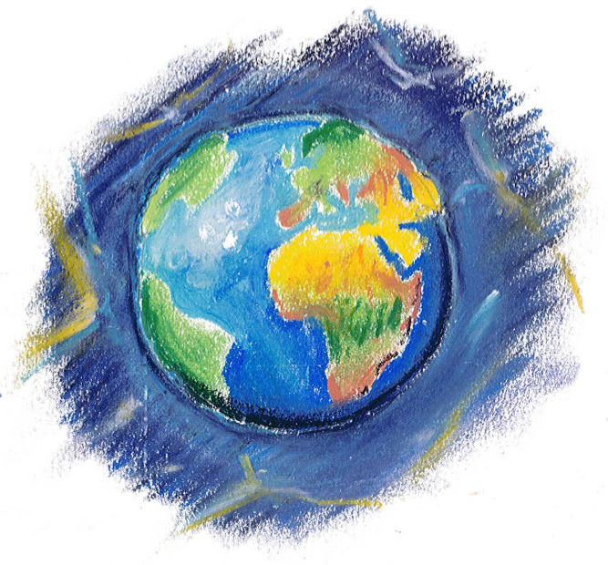
]

???

Les informations traitée dans un SIG sont donc des informations spatiales (au sens de spatialisées)...

---

## Systèmes de Référence Spatiale

.center.w40[

]

.center.m-auto[
**Le problème** : *Comment repérer n'importe quel point à la surface terrestre ?*
]

???

...Cela soulève un problème : Comment repérer n'importe quel point sur la surface de la terre ?...

---

## Systèmes de Référence Spatiale


.center.w40[

]

???

Si l'on considère la terre comme une sphère...

---

## Systèmes de Référence Spatiale

.center.w40[
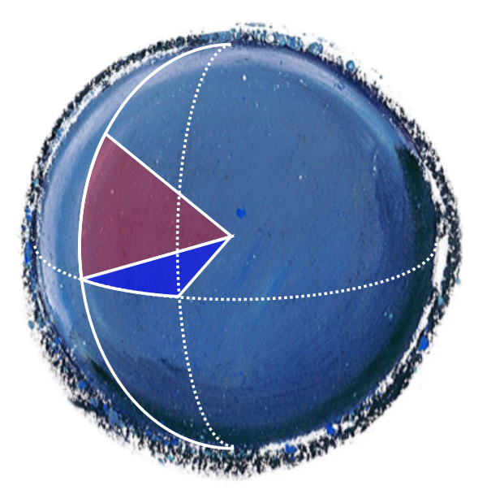
]

.center[Sur une sphère : (λ, φ) (longitude, latitude), par rapport à une .definition[origine].]

???

...on peut repérer un point un point avec ses coordonnées
lambda et phi, qui correspondent à la longitude et la latitude.

On voit parfois également (lambda, phi, r) où `r` représente la distance au centre de la sphère.

---

## Systèmes de Référence Spatiale

Le problème ...

.dflex.center[
.w60[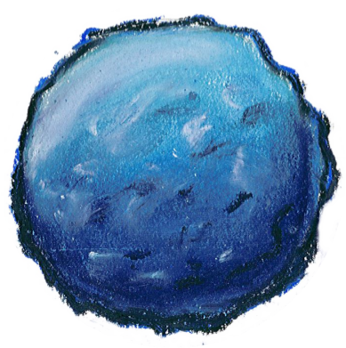] .w60[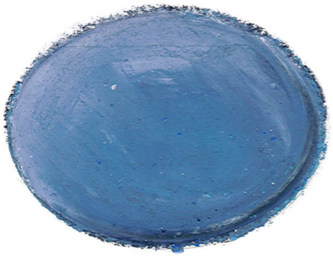]
]

???

... c'est que la terre n’est pas une surface régulière, ni une sphère parfaite.

Elle est légèrement aplatie aux pôles et bosselée selon les continents. Son apparence sphérique lorsqu'on l'observe depuis l'espace masque les nombreuses petites irrégularités de sa surface.

Alors, comment caractériser correctement la surface terrestre ?

---

## Systèmes de Référence Spatiale

Il faut donc une .definition[surface de référence].

--

.dflex.center[
.w60[] .w60[] .w60[]
]

.dflex.center[
.foo[Geoide] .foo[Ellipsoide] .foo[Sphéroide] 
]

???

Il faut donc une surface de référence !!

On peut utiliser le géoı̈de (surface équipotentielle de gravité terrestre la plus proche de la surface terrestre réelle),
ou des approximations : ellipsoïde de révolution,
ou encore sphéroı̈de

Cette caractérisation du repère d’expression des coordonnées sur la surface terrestre
(latitude, longitude) conduit à la définition d’un système géodésique.

---

## Le géoïde terrestre

Toute mesure ayant besoin d'une référence, on modélise la forme de la Terre selon le modèle théorique du **géoïde**.

<br>
.left-column[

]

.right-column.medium[
    <br><br>
Un géoïde est une surface équipotentielle du champ de pesanteur coïncidant « au mieux » avec le **niveau moyen des océans et qui se prolonge sous les continents**.

**La surface du géoïde équivaut au niveau d'altitude 0** à l'échelle mondiale. La notion d'**altitude traduit donc la hauteur au-dessus du géoïde**.

Pour la France, il est calé sur un niveau zéro scellé dans le port de Marseille.
]

---

## Formalisation mathématique du géoïde


.left-column[

<br><br>
<br><br>
Le géoïde est une **surface difforme** à laquelle on ne saurait appliquer des **relations mathématiques**.

<br>

Pour modéliser cette surface, on utilise une **figure géométrique régulière** : **l'ellipsoïde**.

<br>

Il s'agit d'un volume globalement sphérique présentant un aplatissement aux pôles.
]

.right-column.w90[

]

---

## L'ellipsoïde terrestre


**L'ellipsoïde est la surface mathématique qui se rapproche le plus du géoïde**.

Il sert de **référence pour la construction des projections cartographiques**. Positionner l'ellipsoïde en fonction du géoïde permet de construire un **système géodésique**.

.left-column.center[

]

.right-column.center[
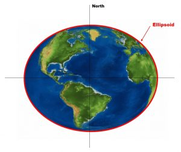
]

---

## Les systèmes géodésiques

Un **système géodésique** sert de repère pour déterminer les coordonnées géographiques (ou géodésiques) d'un objet à la surface de la Terre.

<br>
--

.left-column.w50.center[

]

.right-column.w50.center[

]


**Ces coordonnées sont des valeurs angulaires, calculées par rapport à un parallèle (équateur) et un méridien de référence (Greenwich)**. Les coordonnées d'un objet traduit (au minimum) deux dimensions : la **latitude** et la **longitude**.

---

## Les systèmes géodésiques à connaître


**Un même ellipsoïde peut être positionné différemment par rapport au géoïde**, et ainsi constituer des systèmes de référence géodésiques **différents**. Le même objet n'aura pas les mêmes coordonnées géographiques dans différents systèmes géodésiques.

- **WGS84 (World Geodesic System 1984)**
Le plus utilisé au monde. C'est ce système géodésique qui est utilisé pour le GPS (système de positionnement par satellites).

- **ITRS (International Terrestrial Reference System)**
Le plus précis à l'échelle mondiale (précision centimétrique).

- **RGF93 (Réseau Géodésique Français 1993)**
Système géodésique officiel en France métropolitaine.

- **NTF (Nouvelle Triangulation de la France)** Ancien système géodésique français de référence, couvrant le territoire métropolitain.

---

## Les coordonnées géographiques


Les coordonnées géographiques peuvent être exprimées en **degrés décimaux** (DD) ou en **Degrés-minutes-secondes** (DMS)

<br>

.center.w70[

]


---

## Référence spatiale 

<br>

.important[
    Des coordonnées géographiques n’ont de sens que par rapport à un Système de Référence Spatiale.
]

--
<br><br><br>
**Exemple** : *World Geodetic System 84* (définition OGC WKT)

```
GEOGCS ["WGS 84" ,
    DATUM ["WGS_1984" ,
        SPHEROID ["WGS 84" ,6378137 ,298.257223563 ,
            AUTHORITY ["EPSG" ,"7030"]] ,
        AUTHORITY ["EPSG" ,"6326"]] ,
    PRIMEM ["Greenwich " ,0 ,
        AUTHORITY ["EPSG" ,"8901"]] ,
    UNIT ["degree" ,0.01745329251994328 ,
        AUTHORITY ["EPSG" ,"9122"]] ,
    AUTHORITY ["EPSG" ,"4326"]]
```

???

Ainsi, le système de coordonnées le plus utilisé à l’heure actuelle (c’est notamment celui
qui est utilisé par les systèmes GPS) est le WGS84 (World Geodetic System
1984) qui s’appuie sur un ellipsoïde de référence.


---
## Déformer pour représenter : De la surface terrestre à la carte

.center.w70[
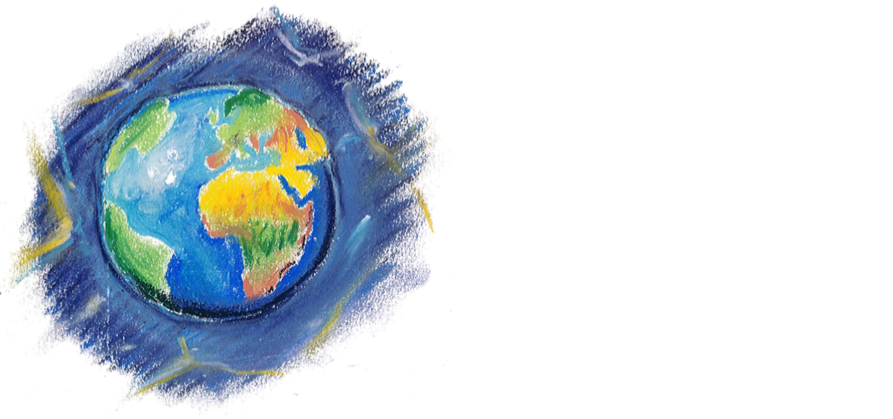
]

???

Un système géodésique permet de localiser un objet sur une surface en 3 dimensions...

---
## Déformer pour représenter : De la surface terrestre à la carte

.center.w70[
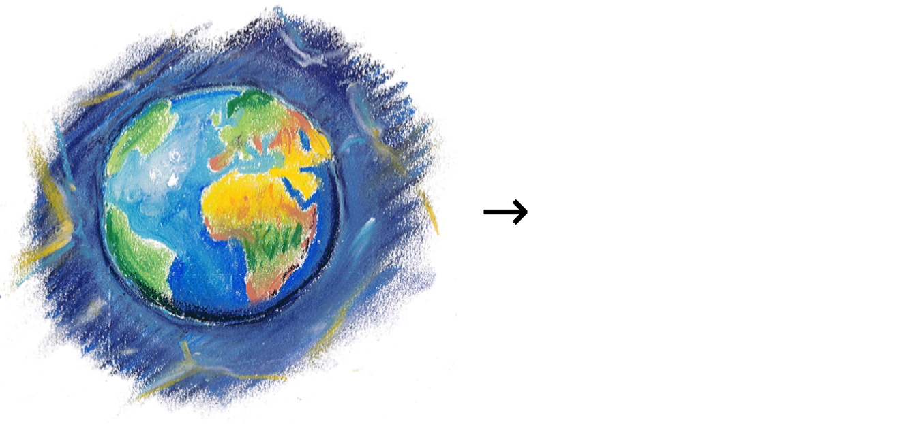
]

???

Mais alors ...

---
## Déformer pour représenter : De la surface terrestre à la carte

.center.w70[
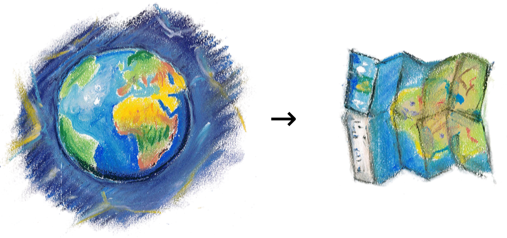
]

???

...comment représenter l'information géographique sur un plan en deux dimensions, sur une carte ?

---
## Déformer pour représenter : De la surface terrestre à la carte

.center.w70[

]

.center[
**Première idée** : (x, y) = (λ, φ) = (longitude, latitude)
]

---

## Projection plate carrée

.center.w70[
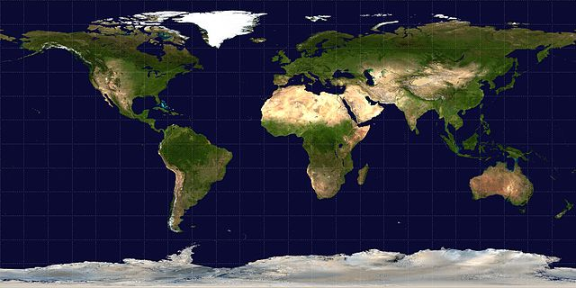
]


---

## Projection plate carrée

.center.w70[


Déformations → carte inutilisable pour la navigation par exemple.

Il faut donc un .definition[système de projection.]
]

???

Pour minimiser les déformations, au moins localement par exemple

---

## Systèmes de projection

**Système de projection** : (λ, φ) → (x, y)

<br>
--

**Une projection est un procédé mathématique permettant de passer de l'ellipsoïde à sa représentation sur une surface plane**.

--

<br>

*Toute projection induit forcément une déformation.*

--

<br>
On peut les classer selon leurs propriétés (ou *type d'altération*) :
- projection .definition[équivalente] : conserve localement les surfaces
- projection .definition[conforme] : conserve localement les angles, donc les formes
- projection .definition[aphylactique] : les projections équidistantes conservent les
distances à partir d’un point donné
- projection .definition[gnomonique] : tout grand cercle (= cercle coupant la sphère en
deux hémisphères égaux) est représenté comme une ligne droite.

???

Une projection est un procédé mathématique permettant de passer de l'ellipsoïde à sa représentation sur une surface plane.

Toutes les projections provoquent des déformations. Plus l'espace représenté est vaste, plus les altérations sont importantes.

Les projections cartographiques peuvent se classer selon le type d'altération et la surface de projection.

---

## Surfaces de projection

Un ellipsoïde **peut être projeté sur différentes surfaces**, facilement **représentables en deux dimensions**.

.center[

]

???

Pour un plan tangent, le cône, le cylindre ou le plan ne touchent la Terre que le long d'une seule droite ou qu'à un point.

Dans le cas d'un plan sécant, le cône ou le cylindre coupent au travers de la Terre au moyen de deux cercles.

Le lieu du point de contact définit l'endroit où les distorsions sont les moins importantes. Il est appelé parallèle de référence

Les projections planes peuvent être orientées de différentes manières : polaire (directe), équatoriale (transverse) et oblique.


---

## Projections courantes : cylindrique

<br><br><br>

.center.w80[
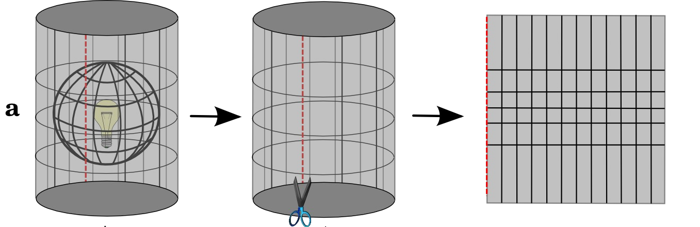
]

???

Une projection cylindrique est la projection de la Terre sur un cylindre tangent à un grand cercle ou sécant en deux cercles. Lorsque la sphère est projetée sur un seul cylindre, il y a une importante distorsion des hautes latitudes, où les surfaces sont considérablement agrandies.


---

## Projections courantes : cylindrique

.center.w50[
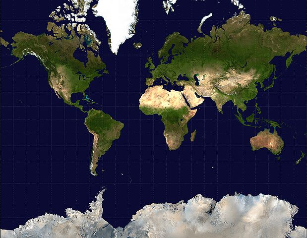
]


.center[
**Exemples** : Mercator, Peters, Robinson, UTM
]

???


---

## Projections courantes : conique

<br><br><br>

.center.w80[
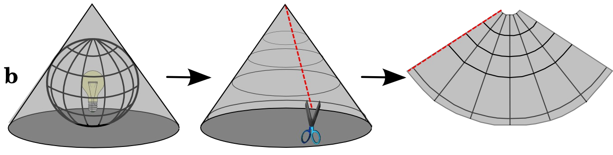
]

???

Dans la projection conique les méridiens et les parallèles sont projetés sur un cône qui est tangent avec le parallèle souhaité. Cette projection permet d'établir des cartes assez fidèles à la réalité dans les régions voisines du parallèle de contact. Par contre les régions éloignées sont très déformées et souvent un des deux hémisphères ne peut être cartographié en même temps que l'autre.

---

## Projections courantes : conique


.center.w70[

]


.center[
**Exemples** : Conique conforme de Lambert, ...
]

???


---

## Projections courantes : azimutale

<br><br><br>

.center.w80[
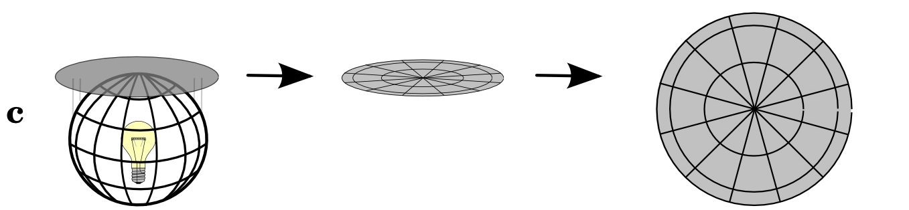
]

???

Une projection azimutale est une manière de projeter une sphère sur un plan, et en particulier, une façon de représenter entièrement la surface de la Terre sous la forme d'un disque.

---

## Projections courantes : azimutale

.center.w40[
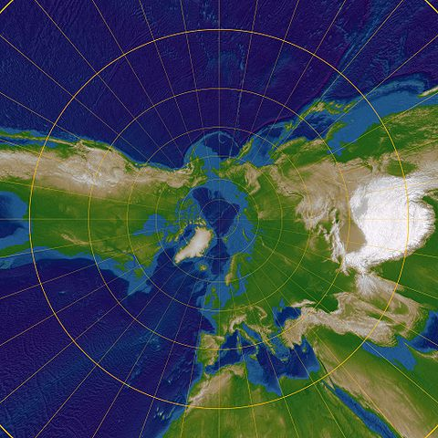
]

.center[
**Exemples** : gnomonique, orthographique, ...
]

---

## D'autres projections cartographiques ...

.center.w60[
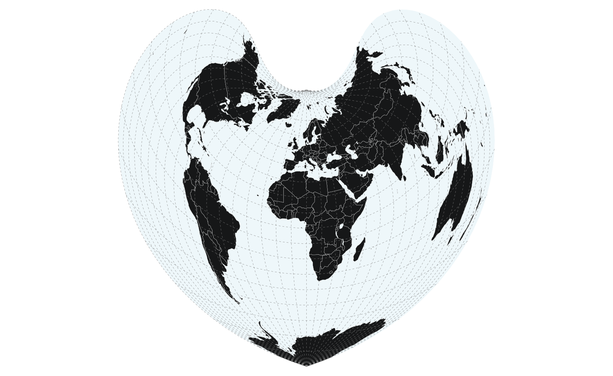

*Projection de Bonne*
]

---


## D'autres projections cartographiques ...

.center.w60[
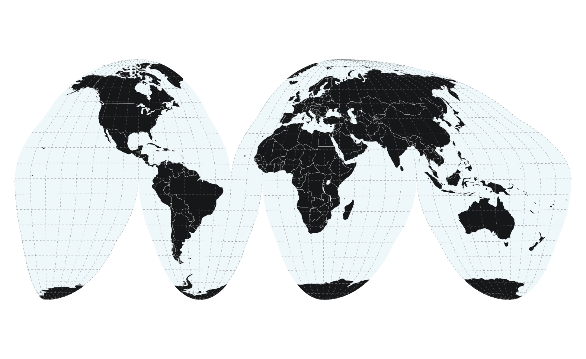

*Projection homolosine de Goode*
]


---


##  Systèmes de référence spatiale

<br>

.definition[Système de référence spatiale] : système permettant de représenter des éléments
dans l’espace, de manière non ambiguë,
- à l’aide de coordonnées géographiques (λ, φ) ; coordonnées .definition[non projetées]
- à l’aide de coordonnées planes (x, y) ; coordonnées .definition[projetées]

<br>
--

<br>

Un SRS est défini par :
- un ellipsoïde de référence
- une origine
- un système de projection (si SRS projeté)
- un identifiant unique ; nomenclature EPSG (*European Petroleum Survey
Group*) ; SRID (*Spatial Reference System Identifier*) propres aux SIG.

???


La dénomination des systèmes de coordonnées dans les SIG:
- SRID: *Spatial Reference Identifier* (par ex. dans PostGIS)
- SRS: *Spatial Reference System* (par ex. dans GDAL ou QGIS en anglais)
- SCR: Système de Coordonnées de Référence (par ex. dans QGIS en français)
- Système de coordonnées
- Système de coordonnées X,Y


---

##  Systèmes de référence spatiale : exemples

<br>

**Exemples** :

- WGS84 (Système de coordonnées non projetées) : EPSG 4326
- Lambert 93 (Système de coordonnées projetées utilisé en France Métropolitaine, ellipsoïde
de référence GRS 1980 - échelle nationale) : EPSG 2154
-  Martinique 1938 / UTM zone 20N  : EPSG:2973
- ETRS89-extended / LAEA Europe : EPSG:3035

<br>

On peut consulter les spécificités des systèmes de coordonnées sur différents sites Web comme [spatialreference.org](https://spatialreference.org/) et [epsg.io](https://epsg.io/):

- https://spatialreference.org/ref/epsg/2154/
- https://epsg.io/3035

---

##  Systèmes de référence spatiale : exemples

<br>

- Pour s’amuser un peu :
[http://imgs.xkcd.com/comics/map_projections.png](http://imgs.xkcd.com/comics/map_projections.png)

<br>

- Pour voir les déformations induites par la projection Mercator :
[https://thetruesize.com/](https://thetruesize.com/)

.center.w40[
    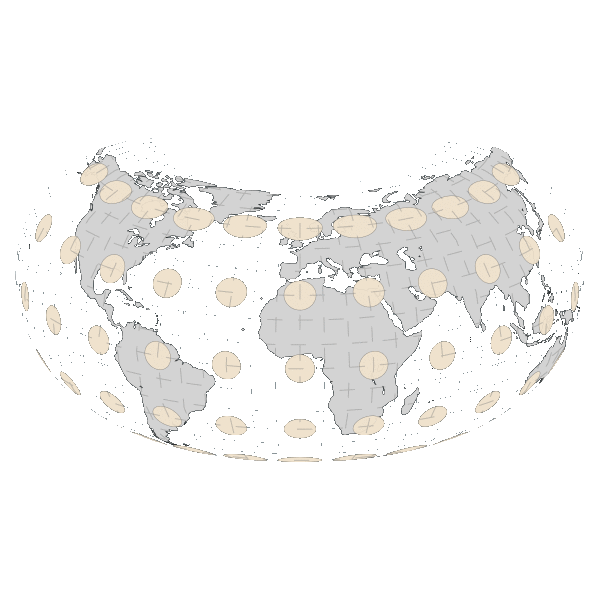
]
---


class: section-change

# 3ème partie
## L'Information Géographique et ses données

<br>

- Les composantes de l'information géographique

- Données vectorielles

- Données matricielles

---

## L'information géographique


.pull-left[
L'information géographique peut être définie comme «**l'ensemble de la description d'un objet et de sa position géographique à la surface de la Terre.**» (*Association Française pour l'Information Géographique*).

Toute information contenant une référence à un localisation, qu’il s’agisse d’un **point** précis du territoire, d’**une ligne** (route, frontière, cours d'eau) ou encore d’**une surface** (aire protégée, zone d’emploi, commune...) **a une dimension géographique**.

Entre **60 et 80%** de l’information que nous traitons possède une dimension géographique. (*Hahmann S. et Burghardt D., 2012, « How much information is geospatially referenced? Networks and cognition »*).
]

--

.pull-right[
Pour qu'une information soit considérée comme géographique, celle-ci doit précisément être **localisée dans l'espace**.    

La force des données géographiques est de pouvoir les croiser entre elles lorsqu'elles partagent un même socle géographique. On crée ainsi de la donnée à valeur ajoutée préparant la prise de décision (*Ministère de la Transition écologique et de la Cohésion des Territoires, 2019*).

]

---

## Les composantes de l'information géographique

<br>

.center.w80[
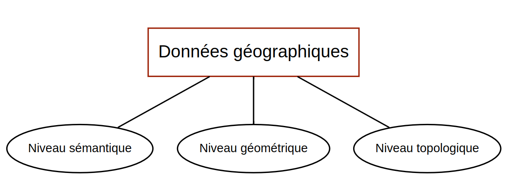
]

???

...

---

## Composante géométrique

La **composante géométrique** d'un objet géographique correspond à **sa forme et sa localisation** sur la surface terrestre, exprimés dans un **système de coordonnées** explicite.

--

.pull-left[
```
"geometry": {
    "type": "Polygon",
    "coordinates": [
        [
            [-1.5085551, 43.4774952],
            [-1.5085121, 43.4772442],
            [-1.5084111, 43.4772502],
            [-1.5084111, 43.4772342],
            [-1.5083331, 43.4772402],
            [-1.5084151, 43.4777432],
            [-1.5084611, 43.4777382],
            [-1.5084661, 43.4777652],
            [-1.5084181, 43.4777702],
            [-1.5084251, 43.4778052],
            ...
        ]
    ]
}
```
]


.pull-right.w70[
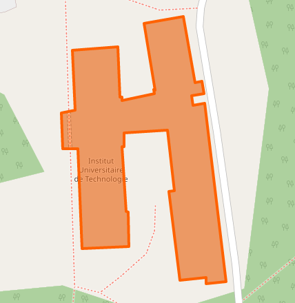

.small[&nbsp;&nbsp;&nbsp;&nbsp;*Source: [Bâtiment de l'IUT dans OpenStreetMap](https://www.openstreetmap.org/way/157255867)*]
]


---

## Composante topologique

La **composante topologique d'un objet géographique se déduit de sa composante géométrique**. Elle correspond aux relations géométriques éventuelles avec d'autres objets géographiques.

--

.center.w55[


.small[*Source : https://commons.wikimedia.org/wiki/File:TopologicSpatialRelarions2.png*]
]

???

Exemple : l'inclusion d'une parcelle dans une commune, la contiguïté entre deux communes, l'adjacence entre les différents nœuds des tronçons constituant des parcelles cadastrales, etc.), le croisement de deux routes en un point, le recouvrement partiel d'une commune par un zonage de protection ; ...

---

## Composante sémantique

La **composante sémantique** regroupe l'ensemble des informations relatives à un objet géographique, qui le décrivent et le caractérisent.

Ces informations sont souvent désignées sous le nom d'**attributs** (ou **données attributaires**).


.center.w70[
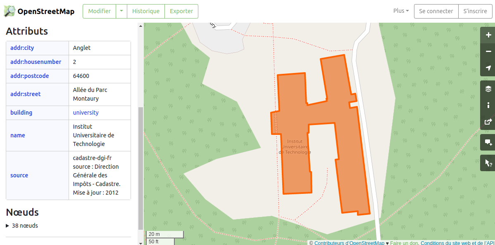

.small[*Source: [Bâtiment de l'IUT dans OpenStreetMap](https://www.openstreetmap.org/way/157255867)*]
]


---

## Deux types de données...

.dflex.center[
.w50[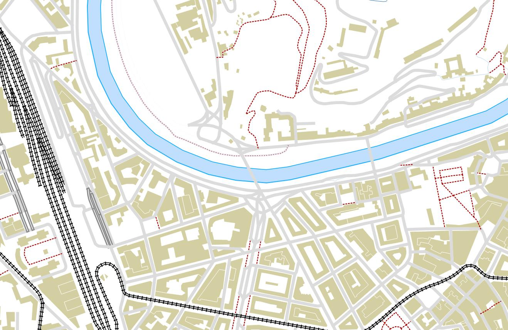] .w50[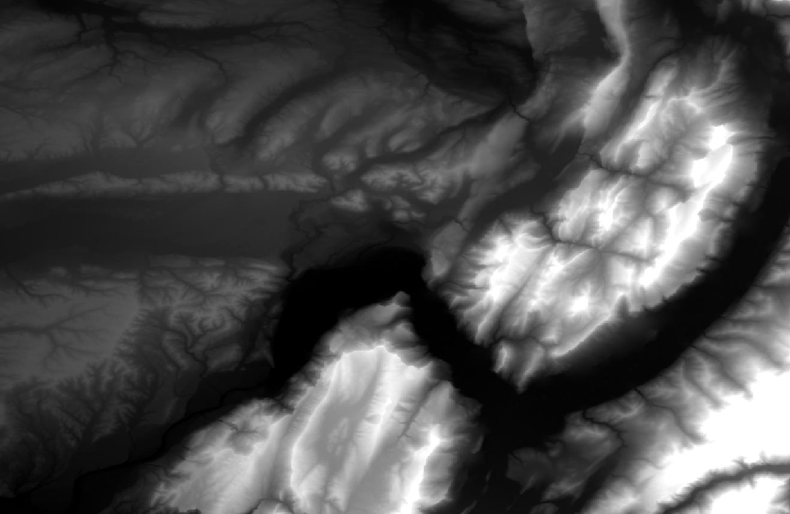]
]

--

.dflex.center[
.w50[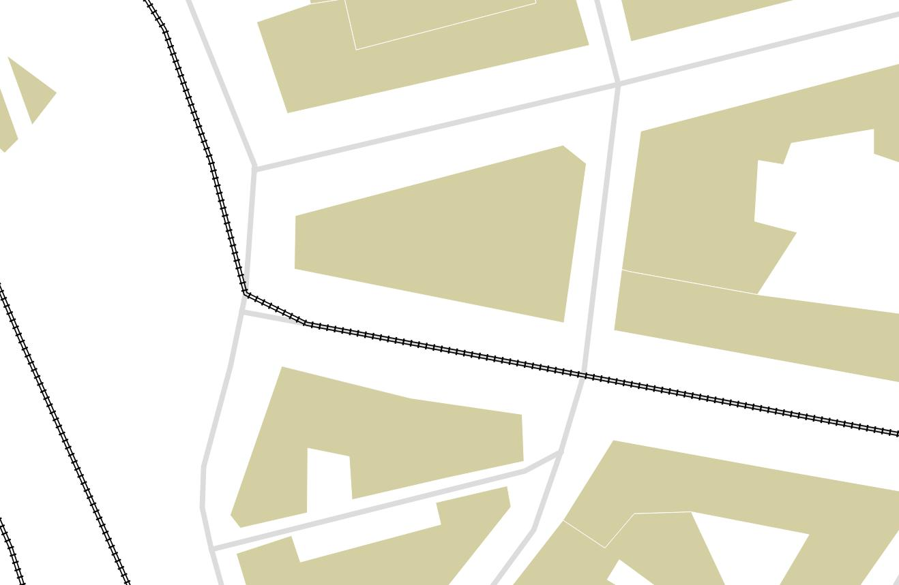] .w50[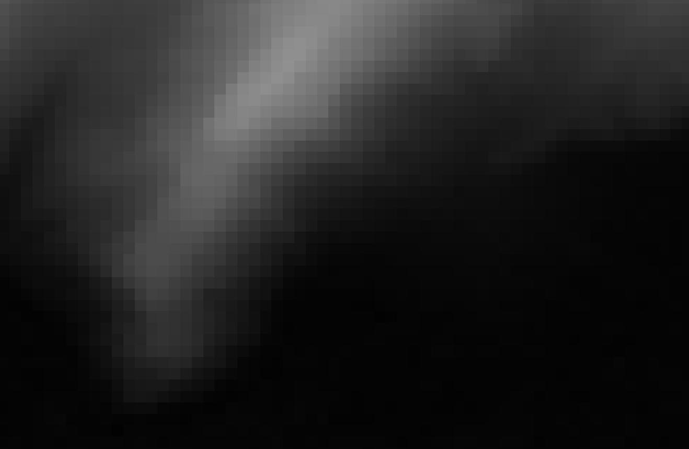]
]

--

.pull-left.center[Vecteur]
.pull-right.center[Raster]

???

Il va toutefois être nécessaires de différencier deux grands types de données : les données vectorielles et les données matricielles (ou "données vecteur" et "données raster").


---

## Données vectorielles

<br>

Le **format vectoriel** utilise le concept d'**objets géométriques** (point, ligne, polygone) **pour représenter et stocker des entités géographiques**.

<br><br>

Les objets vectoriels ne pixelisent pas (*pensez aux formats de dessin vectoriel comme le SVG par exemple*).

<br> 
.w30.center[]

---

## Données vectorielles : géométries

.pull-right[

<br>

.center.w100[
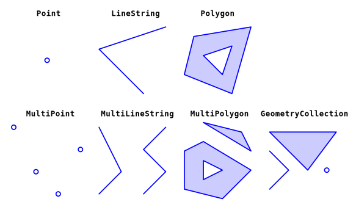
]
.small.center[*Source : https://geobgu.xyz/py/shapely.html*]
]

.pull-left[

- **_Point_** : géométrie à zéro dimension contenant un seul point ;

- **_LineString_** : séquence de points reliés par des morceaux de lignes droites, ne se coupant pas elles-mêmes ; géométrie unidimensionnelle ;

- **_Polygon_** : géométrie à aire positive (bidimensionnelle) ; la séquence de points forme un anneau fermé, sans intersection ; le premier anneau désigne l'anneau extérieur, zéro ou plus des anneaux suivants désignent des trous dans cet anneau extérieur ;

- **_MultiPoint_** : ensemble de points ;

- **_MultiLineString_** : Ensemble de lignes ;

- **_MultiPolygon_** : ensemble de polygones ;

- **_GeometryCollection_** : ensemble de géométries de tout type sauf GeometryCollection.
]

---

## Données vectorielles : attributs


.w90.center[


.small[*Source: [Bâtiment de l'IUT dans OpenStreetMap](https://www.openstreetmap.org/way/157255867)*]
]

---

## Données vectorielles : attributs


.w90.center[
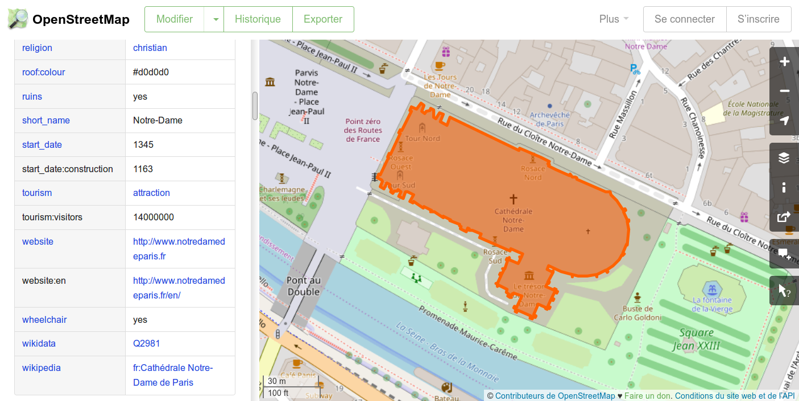

.small[*Source: Bâtiment de la cathédrale Notre-Dame de Paris dans OpenStreetMap*]
]

---

## Données vectorielles : entité

Ainsi, une **entité** (*Feature*) représente **une géométrie** et **des attributs**.

Une **couche de données** (*Layer*) représente un ensemble cohérent d'entités.

.left-column-66.w100[
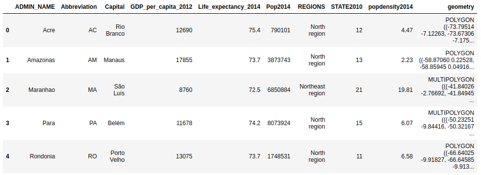
]

.right-column-33.w90[
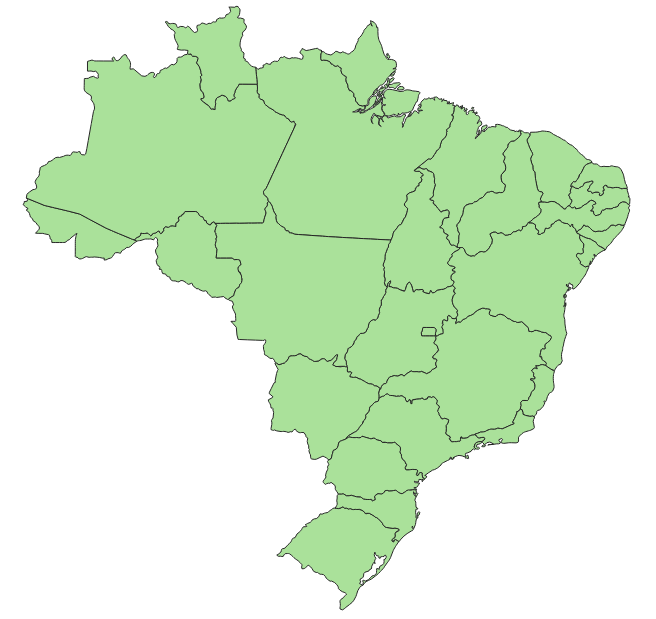
]

.center.clear[
**Exemple** : la couche des états fédéraux du Brésil.
]
  
???

Pensez par exemple à une table dans une base de données...


---

## Données matricielles


- Données matricielles *(raster)* = .definition[grille de cellules], localisée dans l'espace

- Cellule *(pixel)* = une valeur ou un vecteur de valeurs

--

<br><br>

.center.m-auto[

|1|2|2|1|4|5|2|2|2|2|3|4|
|-|-|-|-|-|-|-|-|-|-|-|-|
|2|2|2|1|2|5|2|2|3|2|3|4|
|2|7|8|2|3|1|1|1|2|3|3|4|
|2|9|9|2|3|2|0|1|1|2|3|5|
|2|2|2|2|3|5|2|2|2|3|4|6|
|2|2|2|2|3|5|4|6|5|2|3|5|
|1|1|2|2|3|5|7|8|7|2|3|5|
|0|1|9|4|4|5|7|7|7|2|3|3|
|0|7|9|6|4|5|2|1|2|2|3|1|

]


---

## Données matricielles


- Données matricielles *(raster)* = .definition[grille de cellules], localisée dans l'espace

- Cellule *(pixel)* = une valeur ou un vecteur de valeurs

.pull-left[
.w100[]

.medium.center[Ici chaque pixel contient une valeur : *l'altitude*.]
]

.pull-right[
<br>
Concrètement il s'agit d'une **image** (photographie aérienne, image satellitaire, etc.) **localisée dans l'espace**.

L'information géographique est stockée dans des cellules (*pixels*) contiguës.


Un jeu de données raster est caractérisé par sa **résolution** (taille des pixels).

La manipulation de données raster relève de méthodes bien spécifiques (télédétection, algèbre spatial, etc.).

]


???

Par exemple un pixel représente 5m dans la réalité

---

## Données matricielles

Caractérise en général des phénomènes continus tels que :

- images aériennes ou satellites,
- données d'élévation (ex: NASA SRTM, IGN BD ALTI, etc.)
- occupation du sol (ex: Theia OSO)
- etc.

<br>

.center.w25[


**Exemple** : Modèle Numérique de Terrain de l'IGN (pixels colorés en fonction de l'altitude)
]

---

## Pour résumer

.dflex.center[
.w100[]

.small[*Source : Nicolas Lambert, Christine Zanin, 2016, Manuel de cartographie.*]
]

---

class: section-change

# 4ème partie
## Solutions techniques

<br>

- Formats standards

- Protocoles d'échange

- Logiciels

- Autres problématiques


---

## Formats standards : données vectorielles

.dflex[
.foo[]
.foo[] .foo[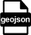] .foo[] 
]


- **ESRI Shapefile** : géométries (.shp), attributs (.dbf) et index (.shx), format binaire

- **GeoJSON** : RFC 7946, JSON + géométries, format texte

- **Geography Markup Language (GML)** : standard XML (OGC), format texte

- **Keyhole Markup Language (KML)** : développé par Google, devenu un standard de l'OGC, format texte

- **Mapinfo TAB format (MIF / MID)**

- **Well-Known-Text (WKT)** (seulement les géométries, pas d'attributs)

- **GeoPackage** : standard OGC (2014), basé sur SQLite

- GeoParquet, GeoArrow, etc.

- \+ des SGBD spatiaux *(voir plus bas)*


???

Certains de ces formats permettent d'échanger des données dans n'importe quel système de référence spatial, car ils stockent cette information quelque part.
D'autres ne permettent d'échanger des données qu'en coordonnées géographique (latitude longitude).

---

## Formats standards : ESRI Shapefile

Lorsque l'on manipule des données au format **ESRI Shapefile**, on manipule plusieurs fichiers en même temps (au moins 3, souvent 5, parfois plus...).

--

.border.w80.center[
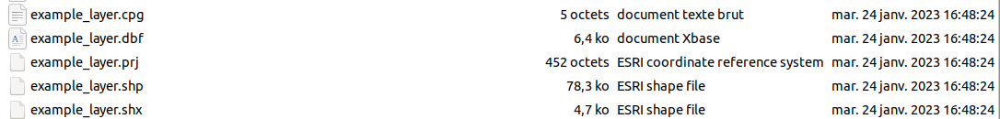
]

--

Trois sont indispensables :

- **.shp** : contient les géométries
- **.dbf** : contient les données attributaires
- **.shx** : contient l'index de la géométrie
 
D'autres fichiers peuvent également être fournis et sont *très* importants :

- **.cpg** : contient l'encoding des données *(UTF-8, ISO-8859-1, etc.)*
- **.prj** : contient la description du système de référence spatial

D'autres fichiers dépendent parfois du logiciel qui a été utilisé pour générer le Shapefile en question :

- **.shp.xml** : métadonnées
- **.sbn** et **.sbx** : index spatial des entités (avec ESRI ArcGIS)


???

Littéralement "fichier de forme" (parfois utilisé comme ça en français)


---

## Formats standards : GeoJSON


Il s'agit d'une extension au format JSON *(JavaScript Object Notation)*, spécifié dans la [RFC7946](https://tools.ietf.org/html/rfc7946).

<br>

**Exemple** d'une *FeatureCollection* avec deux entités :

<div class="small" style="transform: scale(0.7)translate(0, -94px)">


```js
{
    "type": "FeatureCollection",
    "features": [
        {
            "type": "Feature",
            "geometry": {
                "type": "Point",
                "coordinates": [102.0, -43.9]
            },
            "properties": {
                "prop0": "value0",
                "prop1": "value1"
            }
        },
        {
            "type": "Feature",
            "geometry": {
                "type": "Point",
                "coordinates": [22.0, 76.8]
            },
            "properties": {
                "prop0": "value0",
                "prop1": "value1"
            }
        }
    ]
}
```


---

## Formats standards : GML


Le **Geography Markup language** est un langage **dérivé du XML** pour encoder, manipuler et échanger des données géographiques. C'est un standard développé par l'Open Geospatial Consortium pour garantir l'interopérabilité des données dans le domaine de l'information géographique et de la géomatique.

<br>

**Exemple** d'une *FeatureCollection* avec deux entités :

<div class="small" style="transform: scale(0.7)translate(0, -94px)">


```xml
<?xml version="1.0" encoding="utf-8" ?>
<ogr:FeatureCollection
     gml:id="aFeatureCollection"
     xmlns:xsi="http://www.w3.org/2001/XMLSchema-instance"
     xsi:schemaLocation="http://ogr.maptools.org/ ex.xsd"
     xmlns:ogr="http://ogr.maptools.org/"
     xmlns:gml="http://www.opengis.net/gml/3.2">
  <gml:boundedBy><gml:Envelope srsName="EPSG:4326"><gml:lowerCorner>22.0 -43.9</gml:lowerCorner><gml:upperCorner>102.0 76.8</gml:upperCorner></gml:Envelope></gml:boundedBy>

  <ogr:featureMember>
    <ogr:ex gml:id="ex.0">
      <ogr:geometryProperty><gml:Point srsName="EPSG:4326" gml:id="ex.geom.0"><gml:pos>102.0 -43.9</gml:pos></gml:Point></ogr:geometryProperty>
      <ogr:prop0>value0</ogr:prop0>
      <ogr:prop1>value1</ogr:prop1>
    </ogr:ex>
  </ogr:featureMember>
  <ogr:featureMember>
    <ogr:ex gml:id="ex.1">
      <ogr:geometryProperty><gml:Point srsName="EPSG:4326" gml:id="ex.geom.1"><gml:pos>22.0 76.8</gml:pos></gml:Point></ogr:geometryProperty>
      <ogr:prop0>value0</ogr:prop0>
      <ogr:prop1>value1</ogr:prop1>
    </ogr:ex>
  </ogr:featureMember>
</ogr:FeatureCollection>
```


---

## Formats standards : données matricielles

<br><br>

- **GeoTIFF** : format TIFF enrichi avec des informations de géoréférencement

- **JPEG2000** *(pas seulement pour les données géospatiales)*

- **ESRI ASCII grid**

- ...

???

De nombreux autres formats.... parfois mêmes PNG avec informations de géoréférencement dans un fichier xml à côté...

---

## Protocoles d'échange

<br>

Existence de protocoles développés par l'OGC *(Open Geospatial Consortium)*

<br>

Les principaux :

- **Web Map Service (WMS)** : Obtenir une image matricielle sur un serveur

- **Web Feature Service (WFS)** : Obtenir des données vectorielles

<br>

Les autres qu'on peut rencontrer : **Web Coverage Service (WCS)**, **Web Processing Service (WPS)**, **Catalogue Service for the Web (CSW)**.


---

## Logiciels : SGBD spatiaux

<br><br>

- .definition[PostgreSQL] avec l'extension spatiale .definition[PostGIS] (solution la plus répandue)

- .definition[Oracle] et son extension spatiale (*Oracle Spatial and Graph*)

- .definition[SQLite] et son extension spatiale .definition[SpatiaLite]

- .definition[MySQL] / .definition[MariaDB] (support natif mais légèrement moins complet que PostGIS)

- .definition[Microsoft SQL Server] (support natif) 

- Etc.

<br>

.center.dflex[
.foo.w30[] .foo.w30[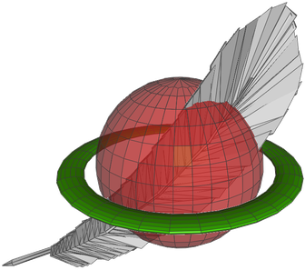]
]

---

## Logiciels : Serveurs cartographiques


<br><br>

- Intermédiaire côté serveur entre des SGBD et des clients

- Fondés sur les services webs de l’OGC (WMS-WFS)

- Exemples :
  * .definition[GeoServer]

  * .definition[MapServer]
    
  * .definition[QGIS Server]

---


## Logiciels : Clients Web


<br>

Il existe plusieurs bibliothèques JavaScript permettant d’afficher des
informations géographiques sous forme de couches matricielles (tuiles) ou
vectorielles (tuiles ou couches) :

<br>

- .definition[OpenLayers]

- .definition[Leaflet]

- .definition[MapBox GL JS]

- .definition[MapLibre]

.center.w60[
    
]

???

Bref historique + philosophie de chacune des libs

---

## Logiciels : Applications SIG Desktop


<br>

Applications de bureau :

- .definition[ESRI ArcGIS] (propriétaire)

- .definition[QGIS Desktop] (libre)

- .definition[MapInfo] (propriétaire)

<br>

Un peu hors-catégorie mais très intéressant et puissant :

- .definition[GRASS SIG] (environnement SIG initialement en ligne de commande,
développé depuis 1982, ses fonctionnalités peuvent maintenant être
utilisées depuis QGIS)

.center.w60[
    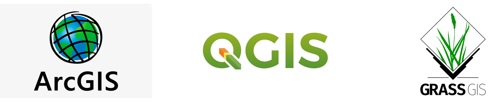
]


???

ArcInfo, le prédécesseur de ArcGis est sorti en 1982 puis est devenu ArcGis en 1999... Gros succès

QGIS est une solution libre développée depuis 2002.

MapInfo depuis 1986...

GRASS depuis 1982

---

## Logiciels : Bibliothèques

<br>

Une solide pile de bibliothèques libres et ouvertes dont des bindings existent
dans la plupart des langages :

<br>

- .definition[GDAL] - https://gdal.org/ *(I/O raster et vecteurs)*

- .definition[JTS] https://github.com/locationtech/jts *(primitives géométriques, prédicats spatiaux, géotraitements)* (Java) 

- .definition[GEOS] https://libgeos.org/ *(primitives géométriques, prédicats spatiaux, géotraitements)* (C/C++)

- .definition[PROJ] https://proj.org/ *(transformation de coordonnées d'un système de référence à un autre)*

<br>

.center.w40[

]

???

GDAL depuis 2000

JTS depuis 2000

GEOS depuis 2002

---

## Logiciels : Environnement d'analyse de données

Les logiciels d'analyse de données (R, SAS, SPSS, Mathematica, etc.) et les différents langages de scripts courants (Python, Ruby, JavaScript) permettent de traiter, explorer et analyser de manière interactive les données disposant d'une dimension géographique.

.pull-left.w100.border[
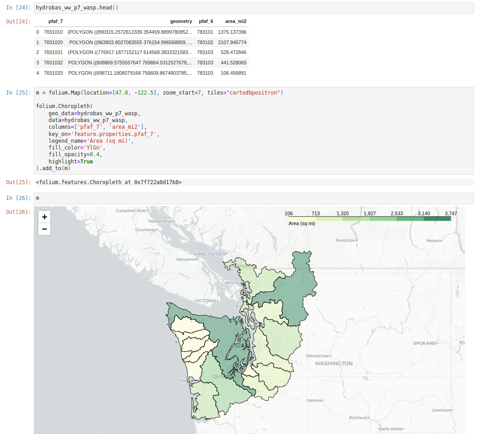
]

.pull-right.w110.border[

]

---

class: section-change

# 6ème partie

## Méthodes d'acquisition de l'information géographique

---

## Relevés de terrain

Le **levé topographique avec théodolite** permet de relever précisément l'étendue et la topographie d'un territoire.        
Le **relevé de point GPS** permet de collecter la localisation précise d'objet dans l'espace.

.center.w100.pull-left[
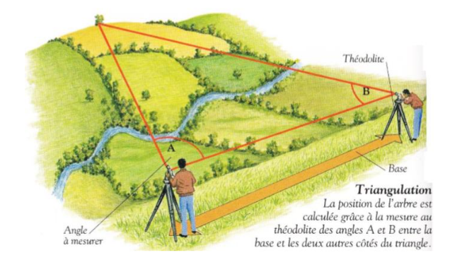
]
.center.w80.pull-right[

]


---

## Télédétection (image satellite)

**La télédétection comprend l’ensemble des procédés et techniques qui permettent d'acquérir à distance des informations sur les objets terrestres**, en utilisant les propriétés des ondes électromagnétiques émises ou réfléchies par ces objets. La collecte de données de télédétection est réalisée par des avions ou par des satellites. 

**Les informations géographiques collectées par télédétection sont stockées en format RASTER**. Le traitement de ce genre de données nécessite l'**utilisation de logiciels spécialisés (Envi, Erdas, Idrisi...).**.    


.center.w40[
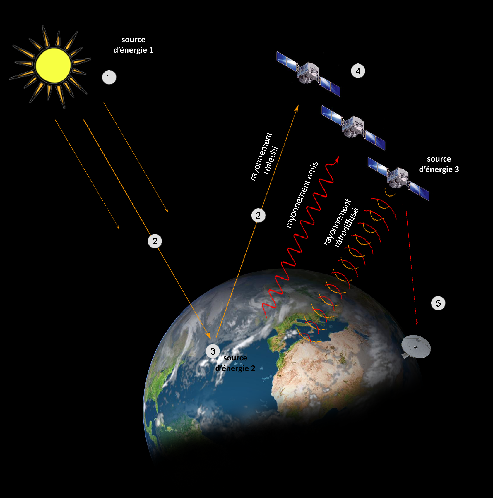
]

---

## Photogrammétrie (photo aérienne) et LiDAR


**Ces deux technologies permettent de déterminer la forme, les dimensions, la position dans l'espace d'un objet**. Elles sont très utilisées pour les levés topographiques, mais aussi pour de nombreuses autres applications.

.w60.center[
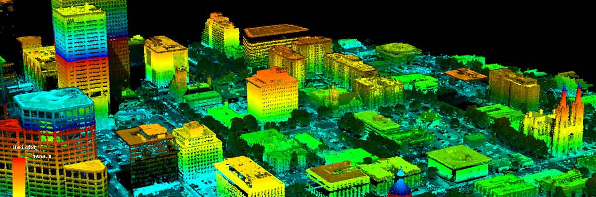
]

La photogrammétrie est une technologie passive. Elle est basée sur des images transformées de la 2D en modèles cartométriques 3D. Elle utilise le même principe que les yeux humains pour établir une perception de profondeur. La limitation de la photogrammétrie est qu’elle ne peut générer que des points basés sur ce que le capteur de la caméra peut voir.      

Lidar qui signifie Light Detection and Ranging est une technologie basée sur des faisceaux laser. Il tire au laser et mesure le temps qu’il faut pour que la lumière revienne. C’est ce qu’on appelle un capteur actif car il émet sa source d’énergie plutôt que de détecter l’énergie émise par les objets au sol.


---

## Digitalisation


**La digitalisation consiste à numériser des points à partir d'un support visuel**, c'est à dire à attribuer à chaque point des coordonnées X et Y dans un système quelconque. Cela revient le plus souvent à **créer des objets géographiques vectoriels à partir d'information géographique en mode RASTER (ex : photo aérienne)**. 

.center.w70[

]


---

## Les recensements et enquêtes 

**Les recensements de population et les enquêtes** contiennent la plupart du temps une dimension géographique. (ex : département de naissance, commune d'habitation, pays d'émigration...). Elles sont d'ailleurs **généralement diffusées par entités (objets) géographiques (IRIS, commune, département, région...)**.


.pull-left[

.center.w80[

]

Les données issues de recensements et d'enquêtes sont le plus souvent des données attributaires d'objets géographiques !

]

.pull-right[

<br>
<br>

Cette carte représente des données issues du RGP 2006 et fournies à l'échelle des communes françaises. 

Il suffit de les mettre en relation avec les polygones des limites communales françaises pour les transformer en données attributaires d'objets géographiques.

]

---

## Et... le Geoweb !

Le mot **Geoweb désigne le mélange du Web 2.0 (ou web participatif) avec tout ce qui est lié à l'information géographique**.

<br>
<br>

Les **SIG grand public** (ex : OpenStreetMap), les **bases de données participatives** ayant une dimension géographique (ex : Le boin coin) et les **applications** utilisant la géolocalisation (ex : Twitter) sont des outils du Geoweb.

<br>
<br>

.center.w30[

]

---

## Créer de l'information géographique

En dehors de l'information géographique créée par des organisations / institutions, une pratique de plus en plus répandue consiste à recourir à divers outils pour créer de l'information géographique et répondre à des **problématiques spécifiques** à son projet. 

Le développement des technologies (GPS, smartphone, SIG grand public en ligne) permet aujourd'hui au plus grand nombre de créer de l'information géographique. 

Les trois méthodes les plus répandues sont :

- **Géolocalisation par GPS**  : déterminer la localisation à partir de smartphones, GPS grand public et objets connectés.
- **Le Géocodage**:  déterminer la localisation (latitude, longitude) d'un point à partir d'une adresse.
- **La Numérisation/Digitalisation** : numériser des points à partir d’un support visuel. Une des première fonctionnalité des SIG. 


---

## Géolocalisation / GPS

Un exemple d'une application de suivi de bouquetins mis en oeuvre par le [Parc National du Mercantour](https://bouquetin.mercantour-parcnational.fr).

.center.w90[

]


---

## Géocodage

De nombreux outils de **géocodage** sont utilisables gratuitement sur le Web. Ces outils reposent sur une base de données d'adresse géoréférencées et déterminent une localisation géographique précise en latitude/longitude. Exemple : Le géocodeur [datagouv.fr](https://adresse.data.gouv.fr/tools)

.center.w90[

]


---


## Numérisation / Digitalisation

**Les SIG ont toujours permis de digitaliser de l'information géographique**. Mais aujourd'hui, **des outils grand public sont apparus** et permettent la digitalisation de données sans avoir de connaissances approfondies en SIG.

.center.w90[
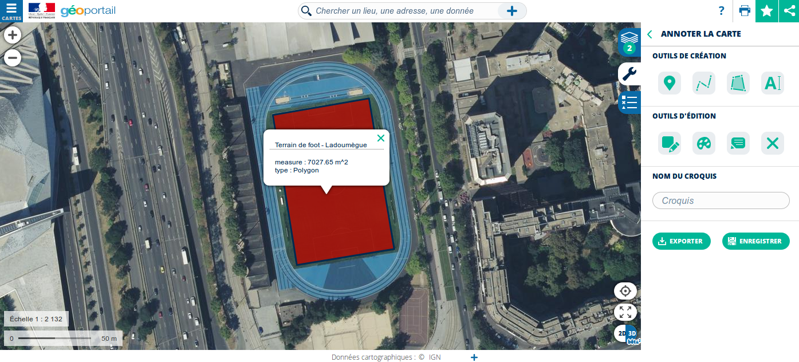
]

---

## Numérisation / Digitalisation

Par exemple, **uMap** est un logiciel libre grand public qui permet de positionner aisément des informations sur une carte et des les partager.

.center.w60[


*Exemple d'organisation de vacances collectives via uMap*
]


---

class: section-change

# 7ème partie
## Où trouver de l'information géographique ?

---


## Données publiques

La donnée publique couvre l’ensemble des données qui sont ou devraient être (légalement ou volontairement) publiées ou tenues à disposition du public, et qui sont **produites ou collectées par un État, une collectivité territoriale, un organe parapublic**, dans le cadre de leurs activités de **service public**.

L'accessibilité de la donnée publique (qui implique aussi la liberté d'accès aux documents administratifs) **est un des éléments de la transparence d'une gouvernance**. 

Cette information a d'autant plus de valeur pédagogique, historique, sociale, culturelle ou économique qu'elle est fiable, catégorisée, organisée, diffusée et réutilisable. 

**Des outils informatiques, parfois collaboratifs, permettent de mieux l'organiser et la valoriser dans la sphère du Web** (ex : [GéoCatalogue](http://www.geocatalogue.fr/)).

.center.w80[
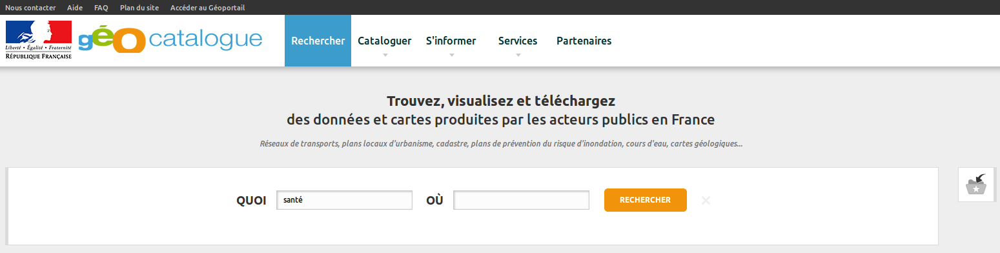
]

---

## Open Data

Une **donnée ouverte** est une donnée numérique d'origine publique ou privée. Elle peut être produite par une collectivité, un service public (éventuellement délégué) ou une entreprise.

Elle est diffusée de **manière structurée** selon une méthodologie et une **licence ouverte** garantissant son **libre accès** et sa réutilisation par tous, sans restriction technique, juridique ou financière mais selon certains devoirs pour l'utilisateur.

L'ouverture des données (dit « Open Data ») représente à la fois un mouvement, une philosophie d'accès à l'information et une pratique de publication de données librement accessibles et exploitables.

Un mouvement (initié dans les années 1990 par des chercheurs) pour l'**accès libre et gratuit** aux données scientifiques. Il s'est élargi depuis au domaine des données publiques.

<br>

.center.w40[

]
---


## Les fournisseurs d'information géographique (en France)  

### Un incontournable : l'Institut Géographique National

- [Géoservices de l'IGN](https://geoservices.ign.fr/telechargement)  
- [Géoportail (portail nationnal d’accès à l’information géographique de référence)](https://www.geoportail.gouv.fr/)    


### Les organismes publics et les collectivités territoriales

- [Bureau de Recherches Géologiques et Minières (BRGM)](http://infoterre.brgm.fr)
- [Agence de l'Environnement et de la Maîtrise de l'Energie (ADEME)](https://data.ademe.fr/)
- [Office national des forêts](https://www.onf.fr/onf/connaitre-lonf/+/35::open-data-pour-mieux-partager-les-donnees-forestieres.html)
- [Open Data Pays Basque](https://www.opendata-paysbasque.fr/explore/)
- [Open Data 64](https://data.le64.fr/pages/home2/)
- [Institut d'aménagement et d'urbanisme de la région Île-de-France (IAU-idf)](http://data.iau-idf.fr/)
- [Portail Open Data de la région Ile-de-France](https://data.iledefrance.fr/pages/home/)     
- [Mairie de Paris (Paris Data)](https://opendata.paris.fr)           
- ...


---

## Les fournisseurs d'information géographique (au niveau international)  

- [Eurostat - GISCO](https://ec.europa.eu/eurostat/web/gisco/geodata/reference-data)
- [Copernicus](https://land.copernicus.eu/)
- [Natural Earth](https://www.naturalearthdata.com/)
- [World Pop](https://www.worldpop.org/)
- [OpenStreetMap (OSM)](https://www.openstreetmap.fr/), données accessibles via des API comme [Overpass-turbo](http://overpass-turbo.eu/)
- [Global Administrative Boundaries (GADM)](https://gadm.org/)

---

## L’IGN

L’Institut National de l'Information Géographique et Forestière assure la production, l'entretien et la diffusion de **l'information géographique française de référence**. 


.pull-left[
L'IGN met à disposition une masse de données géographiques très importante. Il propose par exemple des données complètes sur le réseau hydrographique, le réseau routier, la topographie ou les différents découpages administratifs et statistiques français, ainsi qu'un certain nombre de référentiels. L'IGN propose des données en format vectoriel et raster. Un portail permet également de visualiser toutes les données :

.center.w80[
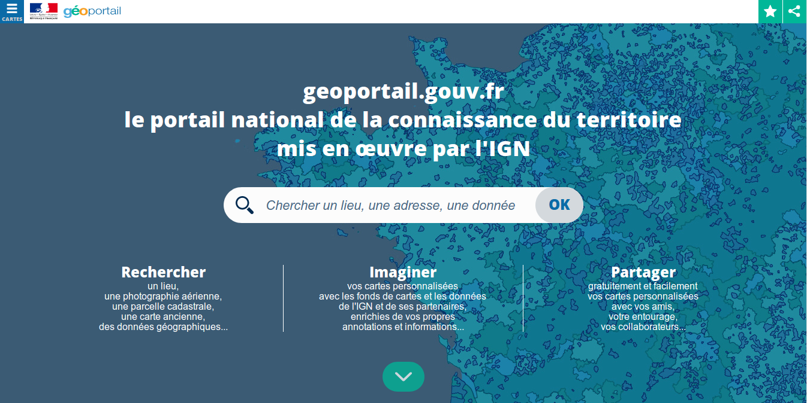
]
]

.pull-right[
.center.w80[
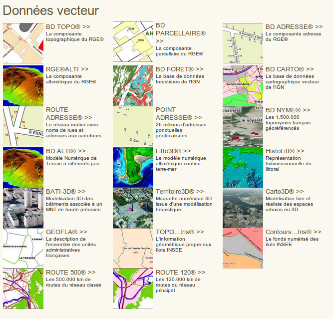
]
]


---

## Organismes publics et collectivités territoriales

De nombreux instituts d'aménagement et d'urbanisme, observatoires, fédérations, agences spatiales et collectivités territoriales mettent à disposition de l'information géographiques. Dans le cadre d'une politique d'ouverture des données publiques, **nombre de ces ressources sont centralisées sur des portails de diffusion**.


.pull-left[

.w90[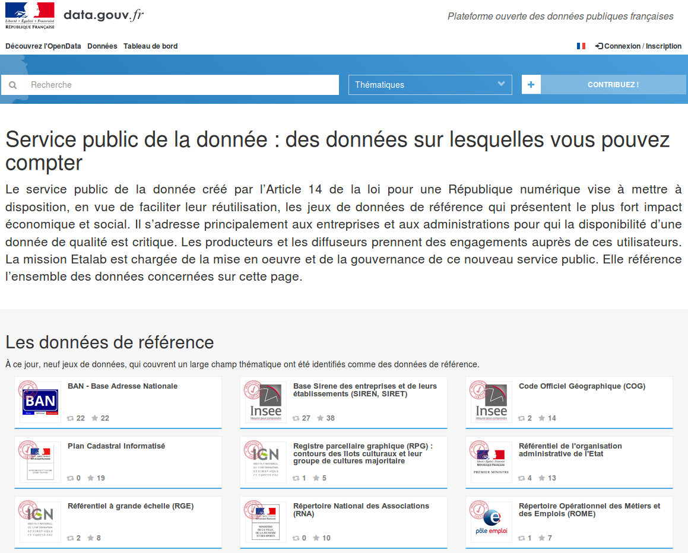]
.center.small[Portail national ([data.gouv.fr](https://www.data.gouv.fr/fr/))]
]

.pull-right[
.w100[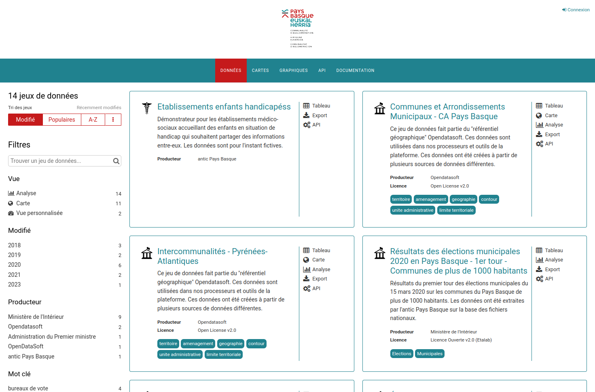]
.center.small[Portail régional ([www.opendata-paysbasque.fr](https://www.opendata-paysbasque.fr/))]

]


---

## OSM, la plateforme collaborative de l'information géographique libre

<br>

**OpenStreetMap (OSM)** est un projet de cartographie lancé en 2004 qui a pour but de **constituer une base de données géographiques libre du monde** en utilisant le système GPS et d'autres données libres et ouvertes.

**Tout le monde peut y contribuer et/ou utiliser les données**.

<br>

.center.w90[

]

---

##  Fournisseurs de données attributaires

<br><br>

De nombreuses sources fournissent des données/statistiques qui disposent de référentiels géographiques, qui peuvent facilement être mises en relation à des géométries de référence : 

- **Institut national de la statistique et des études économiques** [(INSEE)](https://www.insee.fr/fr/accueil)

- **Les organismes publics et les collectivités territoriales**.

- **Les plateformes collaboratives &amp; coproduction de contenus**, comme [Wikipédia](https://fr.wikipedia.org/wiki/Wikip%C3%A9dia:Accueil_principal)


---

## L'INSEE


L'**I**nstitut **N**ational de la **S**tatistique et des **E**tudes **E**conomiques est chargée de la production, de l'analyse et de la publication des statistiques officielles en France. Il organise et exploite les recensements de la population, mène des enquêtes, mesure les principaux indicateurs... Il est **LE producteur** des données statistiques de référence en France.

L'INSEE encourage la diffusion large de ses productions et bases de données. Il autorise la réutilisation des données, y compris à des fins commerciales. Cette réutilisation est, selon les cas, soumise ou non à la signature d'une licence.

Beaucoup des indicateurs sont fournis par entités géographiques (IRIS, quartier, commune, département...) qu'il suffit d'associer aux fonds de carte géréférencés de l'IGN pour des usages cartographiques.

.center[
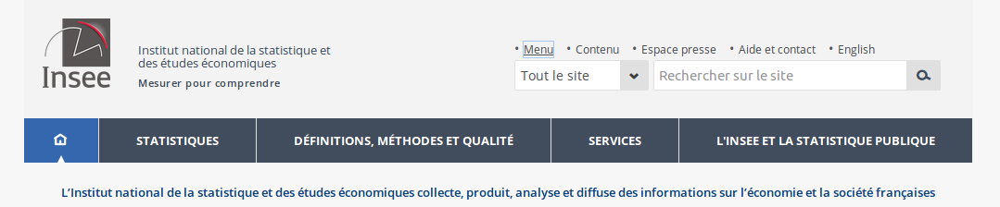
]


---

## Questions centrales pour rechercher de l'information géographique

<br>

- **Quel est mon espace d'étude ?** *Monde ? Europe ? France ? Département ?* ...

- **Quel est l'objet géographique sur lequel je travaille ?** *Pays ? Régions ? Communes ? Parcs naturels ? Rivières ? ...*

- **Quelle est la thématique que je souhaite explorer ?** *Environnement ? Démographie ? Transport? ...*

- **Quel est le format de données que je recherche ?** *Géométries ? Données statistiques à joindre à mes couches géographiques ?*

- **Données conventionnelles ou non ?**

- **Quelle période ?**

<br>

D'un point de vue général, privilégiez l'usage de ressources gérées et maintenues par des **institutions**. 

---

## L'importance des métadonnées

<br>

Avec la massification des données mises à disposition, **la documentation structurée** des données est essentielle. Elle facilite l'accès au contenu informationnel d'une ressource informatique. 

<br>

**Une métadonnée est littéralement une donnée sur une donnée. C'est un ensemble structuré d'informations décrivant une ressource** (pas spécifique à l'information géographique).

<br>

Les métadonnées synthétisent des informations élémentaires et facilitent la compréhension et l'utilisation des données : **Auteur, date de création/modification, technique de collecte, qualité, taille du fichier, unité de mesure, droits d'utilisation...**.

<br>

Consulter attentivement les métadonnées associées aux données géographiques est primordial.

---

## Exercice - Trouver des données pour un espace d'étude

Vous devez trouver les données suivantes pour notre espace d'étude des TD qui suivront, la *Communauté d'agglomération du Pays Basque* :

- Découpage des communes

- Équipements présents sur le territoire 

- Grille de répartition de la population

- Occupation du sol

Sur la base des informations vues jusqu'ici, essayer de trouver les sites Web proposant ces données.

Durée de l'exercice : *20 minutes**.

Nous ferons un point et téléchargerons tous ensemble les mêmes données dans le TD suivant, afin de partir d'une base commune.


---

class: section-change

# 8ème partie
## Exemples d'utilisations

<br>

---

## Exemples d'utilisations

- Analyse spatiale

- Aide à la décision

- Gestion de réseaux

- Gestion de données et de bases de données géographiques

- Visualisation de données / Cartographie


???

L’analyse spatiale est une étude formalisée de la configuration et des propriétés de l'espace produit et vécu par les sociétés humaines.
Elle recouvre un ensemble de théories et de méthodes pour l'analyse et la mesure des effets de la situation géographique.

Cf. première loi de la géographie énoncée par Waldo Tobler : "Tout est en relation avec tout le reste, mais les choses proches le sont plus que les choses distantes" / "Tout interagit avec tout, mais deux objets proches ont plus de chances de le faire que deux objets éloignés"

---

class: section-change

# Licence

---

## Informations de licence

[](http://creativecommons.org/licenses/by-sa/4.0/)

----
Images non-sourcées dans les slides :

- **Map Projection Families** - *CC-by-SA*, source : https://docs.qgis.org/3.22/fr/docs/gentle_gis_introduction/coordinate_reference_systems.html
- **Images avec orthophoto des différentes projections** et **logos des différents outils** - *CC-by-SA* ou *domaine publique*. Source Wikimedia.
- **Images des projections de Bonne et de Goode** - *CC-by-SA*, source : Matthieu Viry à partir de données Natural Earth.
- **Exemple d'images vectorielles et raster** - *CC-by-SA*, source : Sylvain Bouveret à partir de données OpenStreetMap® et Nasa SRTM.
- **Dessins d’illustration sur les projections** (géoïde, sphéroïde, etc.) - *CC-by-SA*, source : Sylvain Bouveret.

----

Cours réalisé sur la base des cours de Ronan Ysebaert (https://github.com/rysebaert/infogeo / https://github.com/rysebaert/qgis_data_shs) (sous licence CC-BY-SA 4.0) et de Sylvain Bouveret.