class: center, middle, first

# Module SIG
# Séance 2 - TD - QGIS

### LP Programmation Avancée

<br>
<br>

.author[
    Matthieu Viry (UAR RIATE / CNRS)
    <br>
    🖂 <a href="mailto:matthieu.viry@cnrs.fr">matthieu.viry@cnrs.fr</a>
]

.date[
    <br>
    06/02/2023
]

---

## Les données que nous allons explorer dans ce TD


<!-- - Communes et Arrondissements Municipaux - CA Pays Basque : https://www.opendata-paysbasque.fr/explore/dataset/communes-et-arrondissements-municipaux-france0/information/

- Géométries IRIS : https://geoservices.ign.fr/contoursiris#telechargement

- Données revenues IRIS : https://www.insee.fr/fr/information/2383389 -->

Les données que nous allons explorer dans ce TP et le suivant sont des extraits des jeux de données suivants:

- Découpages administratifs pour l'ensemble de la France, IGN ADMIN EXPRESS, version 2023: https://geoservices.ign.fr/adminexpress#telechargement

- BD TOPO de l'IGN : https://geoservices.ign.fr/bdtopo#49312

- Base permanente des équipements : https://www.insee.fr/fr/statistiques/3568638?sommaire=3568656

- Modèle numérique de terrain EU-DEM v1.1 : https://land.copernicus.eu/imagery-in-situ/eu-dem/eu-dem-v1.1/view

--

<br>

L'ensemble des données, dans une archive téléchargeable directement : [`data-seance2.zip`]() :


```
data-seance2
├── bpe21_ensemble_xy.csv        -> la base permanente des équipements (format CSV)
├── COMMUNE.*                    -> la couche COMMUNE extraite de IGN ADMIN EXPRESS
├── COURS_D_EAU.*                -> la couche COURS D'EAU extraite de IGN BD TOPO
└── EU_DEM_v11_E30N20-clip.tif   -> un extrait du MNT EU-DEM v1.1

```

---

## Les données que nous allons explorer dans ce TD

<br>
<br>

Comme vous pouvez le constater, ces données ont des emprises hétérogènes (Département des Pyrénées Atlantiques, France, Europe).

Il va être nécessaire d'effectuer des sélections (spatiales ou attributaires) et de reprojeter les données (i.e. convertir les données pour quelles utilisent un autre système de référence spatial).

Ces différentes manipulations sont au programme de cette séance de TD.

---

## L'application QGIS - Installation et ouverture


### Sur Windows :

- Rendez-vous sur https://qgis.org/ et téléchargez la dernière version ("*Download QGIS 3.28*").

### Sur MacOS X :

- Rendez-vous sur https://qgis.org/ et téléchargez la dernière version ("*Download QGIS 3.28*").

### Sur Linux :

- En fonction des distributions (voir sur https://qgis.org/en/site/forusers/alldownloads.html#linux).

<br>

.center.w60[

]

---

## L'application QGIS - Découverte de l'interface

.center.w75[
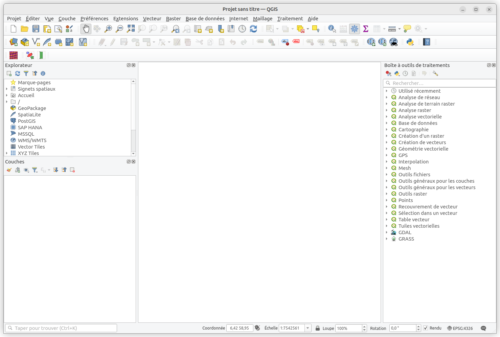
]

---

## L'application QGIS - Découverte de l'interface

.center.w75[
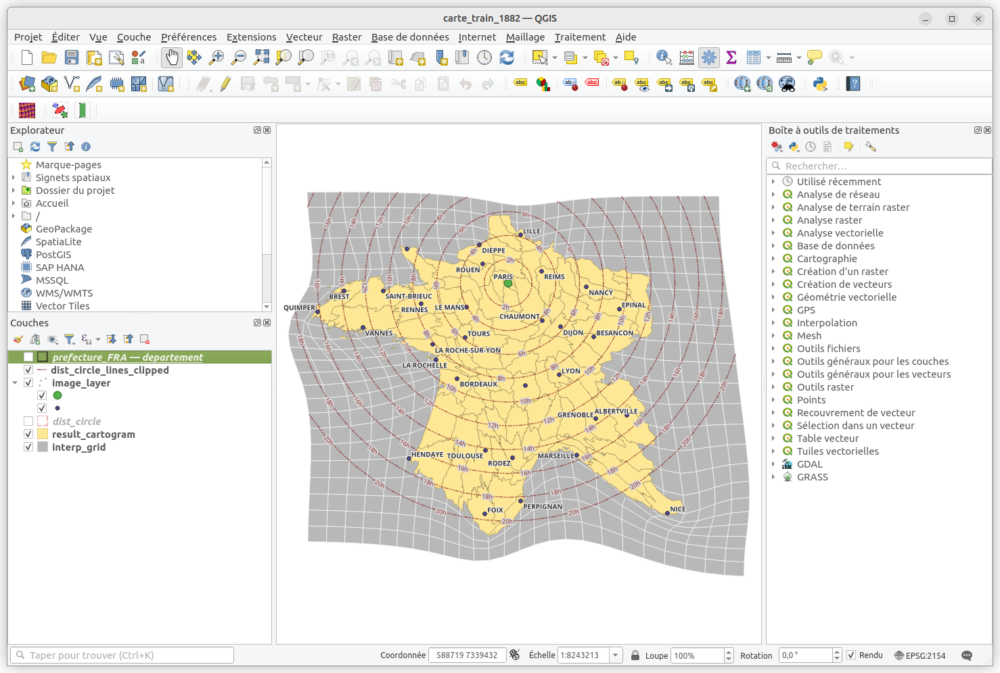
]


---

## Projet QGIS

Lors d'une session de travail dans QGIS, il n'est possible de travailler de manière simultanée que sur un seul *projet*.

De ce fait, l'état de votre session QGIS s'appelle un *projet*. Il est ainsi possible de sauvegarder l'état de votre travail dans un *fichier projet*.

Sont ainsi sauvegardés : 
- les couches présentes, leur visibilité et leurs styles
- le système de coordonnées de référence de la carte
- le niveau de zoom et l'étendue de la carte
- les mises en page de carte
- etc.

**_Attention_** : les couches en mémoire temporaire ne sont pas sauvegardées avec le projet, il est nécessaire de les sauvegarder manuellement individuellement.


---

## Organiser son travail

<br>

L'utilisation d'un SIG nécessite de la **rigueur méthodologique**, car l'on se retrouve vite submergé de fichiers. Vous devez donc :

- Travailler en **projet**.

- Utiliser des **intitulés de fichiers** intelligibles.

- Ranger vos données en utilisant des **sous-répertoires**.

- Stocker votre projet **sur une clef USB** (et faire une copie). 

--

<br>

Dans votre répertoire de travail, créez une architecture de sous-répertoires qui vous paraît cohérente et dans laquelle vous vous y retrouverez facilement. Ne gardez que les fichiers qui vous seront utiles.


---

## Démarrage


Commencez par **créer votre répertoire de travail** (sur une clé USB de préférence ou dans votre répertoire utilisateur). C'est dans ce dossier que vous sauvegarderez les différentes données que vous allez télécharger ou créer.


**Ouvrez ensuite Qgis et créez un nouveau projet** *(Projet > Enregistrer sous...)*.


---

## Système de Coordonnées de Référence

Nous avons vu que le **système de référence spatiale** (ici nommé *système de coordonnées de référence*) choisi pour les données est un élément de première importance.

Il est possible de gérer des aspects de ce paramètre à plusieurs niveaux dans l'interface de QGIS :

- au niveau du projet en cours (modification / gestion du SCR dans lequel s'affiche la carte),

- au niveau de chacune des couches de données (pour spécifier le SCR d'une couche si celui-ci n'a pas été détecté automatiquement).

---

## Système de Coordonnées de Référence (projet)

.left-column[
Le Système de Coordonnées de Référence du projet défini le Système de Coordonnées de Référence dans lequel seront affichées les données dans l'interface.

Les données qui ne sont pas dans ce SCR (et dont le SCR est connu) sont automatiquement transformée pour être affichée dans le SCR du projet. Attention toutefois lors de la réalisation de géotraitements où il faudra que toutes les couches soient bien dans le même SCR.

On accède au SCR du projet en cliquant sur le bouton suivant (dans la partie inférieure droite de l'interface):

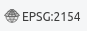

ou en allant dans *Projet > Propriétés... > SCR*.
]

.right-column.w115.border[

]

<br>

.center.clear[
**Sélectionnez dès maintenant le SCR "*RGF93 v1 / Lambert-93* - *EPSG:2154*" pour votre projet.** 
]

---

## Système de Coordonnées de Référence (couche)

.left-column[
<br><br>
Pour chaque couche, il est également possible de regarder quel SCR a été automatiquement détecté et, si besoin, de spécifier quel est son SCR.

<br>

Attention, cela ne sert pas à changer le SCR d'une couche (i.e. la *reprojeter* dans un autre SCR - une fonctionnalité dédiée existe pour cela) mais seulement à dire quel est son SCR actuel, notamment s'il n'a pas été détecté automatiquement par QGIS.
]

.right-column.w115.border[
<br><br>
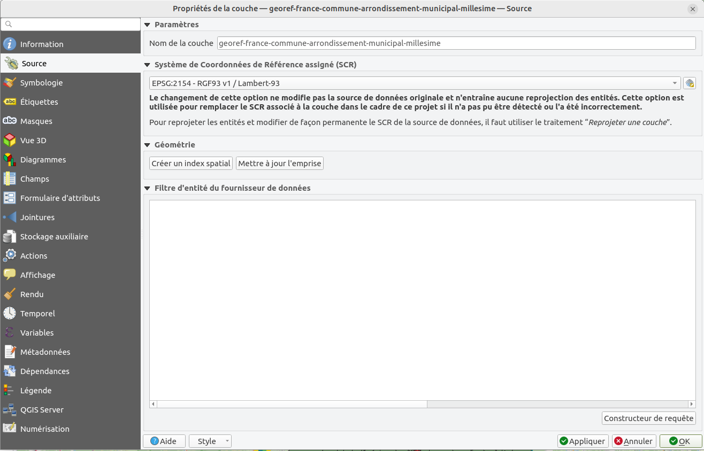
]

---

## Autres options utiles 

.left-column-33[
Différentes fonctionnalités sont proposées dans la **barre d'outils** pour :
- **zoomer**
- **obtenir des informations sur une entité**
- **sélectionner une ou plusieurs entités**
- **calculer de nouveaux attributs**
- **ouvrir la table attributaire d'une couche**
- etc.
]

.right-column-66.w120[
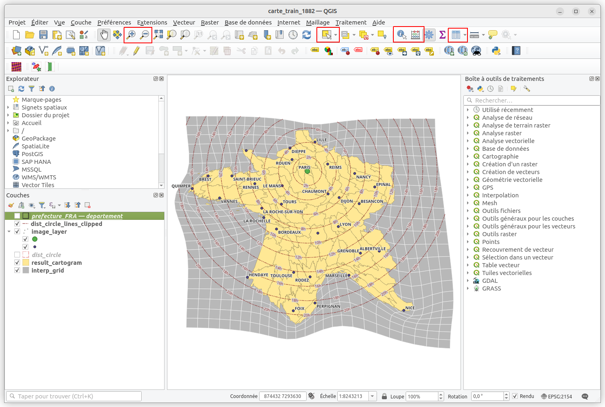
]


---

## Importer des données dans QGIS (1)

.left-column-33[
Plusieurs manières d'importer des données existent dans QGIS.

1. Il est généralement possible de faire un **glisser-déposer** depuis votre dossier de travail vers l'interface de QGIS.

2. Il existe un **menu dédié à l'import des données** accessible depuis *Couche > Gestionnaire des sources de données* (il propose des options en fonction du type de données à importer).

3. Le composant **explorateur** permet également de sélectionner des fichiers présents sur votre ordinateur (ouverture au double-clic ou en faisant glisser les fichiers).
]

.right-column-66.w105.border[
<br>
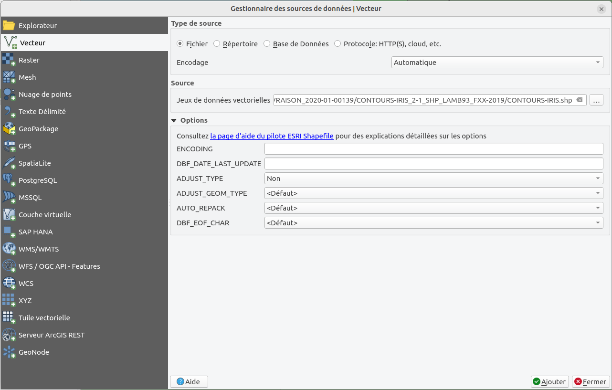
]

---

## Importer des données dans QGIS (2)

Dans la plupart des cas, il ne sera pas nécessaire de toucher aux options proposées (et donc dans la plupart des cas, le glisser-déposer est suffisant).


Certains jeux de données nécessitent toutefois une attention particulière, c'est par exemple le cas lors de l'import d'un jeu de données au format CSV quand ses colonnes contiennent des coordonnées.

.center.border[
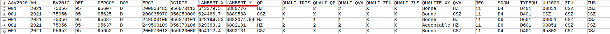
]

---

## Importer des données dans QGIS (3)

.center.w80.border[
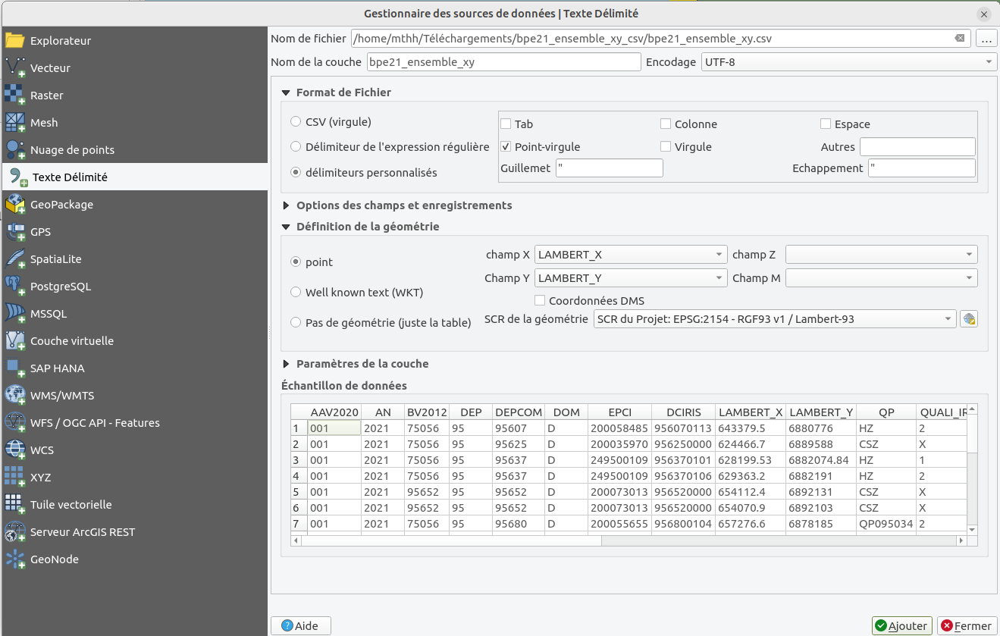
]

---

## Importer des données dans QGIS (4)

Une fois les données ajoutées, elles apparaissent dans le composant **couches** généralement situé sur la partie droite de l'interface.

--

.right-column.w100.border[
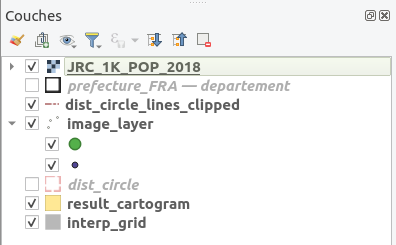
]

--

.left-column[
Ce gestionnaire de couche permet notamment :
- de **réorganiser l'ordre des couches** (les couches apparaissent sur la carte dans le même ordre que dans le gestionnaire de coucher),
- de **contrôler la visibilité** de chacune des couches,
- de **gérer le style** de chacune des couches,
- de **renommer** chacune des couches,
- de **sauvegarder** chacune des couches,
- etc...
]

--

Le pictogramme, à gauche du nom de chaque couche, nous renseigne sur son type (vecteur ou raster) et sur la symbologie actuellement appliquée à la couche.

---

## Propriété des couches

Le gestionnaire de couches permet d'accéder aux propriétés de chacune des couches.

Pour cela, faire un *clic-droit* sur la couche choisie et cliquer sur *"Propriétés"*, ou simplement faire un *double-clic* sur la couche choisie.

La fenêtre qui s'ouvre permet de gérer de nombreuses propriétés relatives à la couche choisie : informations diverses (chemin du fichier, emprise, encodage, SCR détecté, etc.), symbologie, labels, jointure, etc.

.center.border.w40[
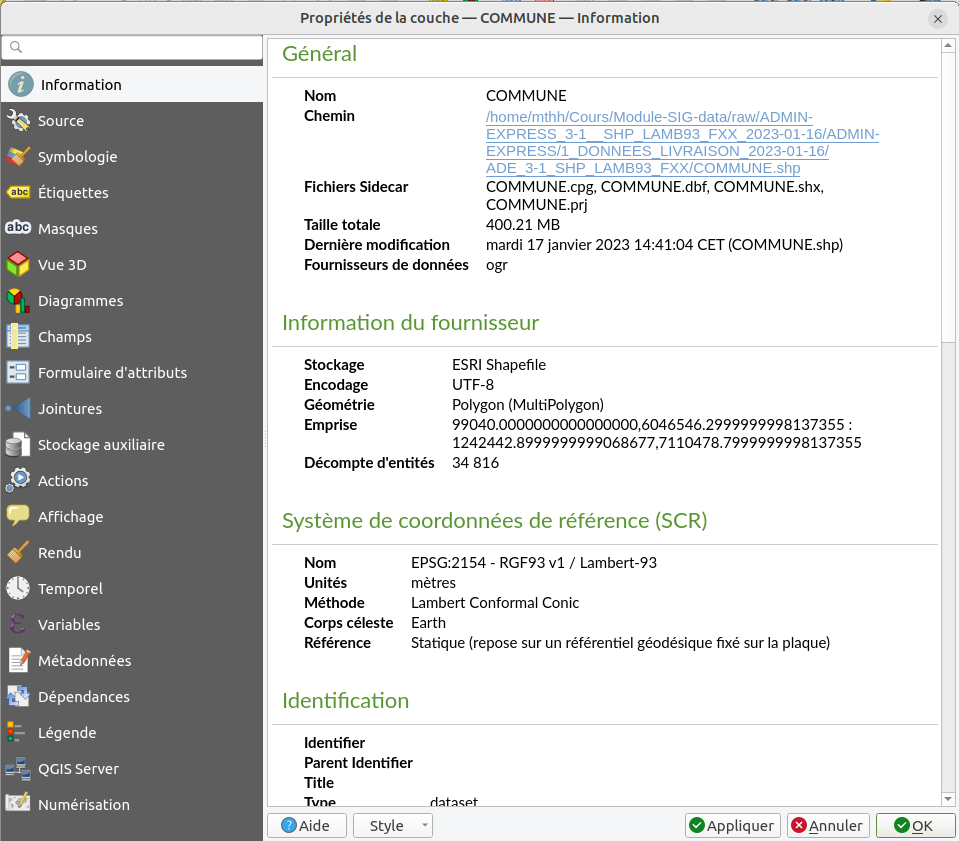
]

---

## Exercice 1 - 1) Importer l'ensemble des données dans QGIS

⇒ **Vous devez importer dans QGIS chacun des jeux de données présent dans l'archive `data-seance2.zip`**.

Si la plupart des jeux de données s'ouvrent facilement, vous allez devoir spécifier différentes options afin de réussir à ouvrir et à afficher le jeu de données `bpe21_ensemble_xy.csv`.

Une fois cette opération réalisée, vous devriez avoir 4 couches dans le gestionnaire de couches et sur le canvas de la carte : 

.center.w60.border[
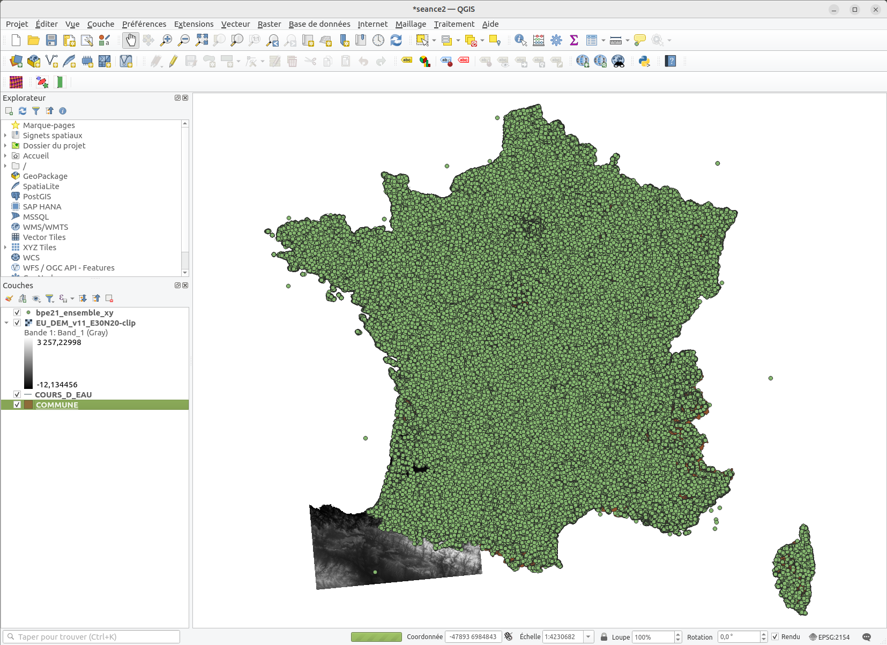
]

<p class="duration">10 min</p>


---

## Exercice 1 - 2) Questions

<br>

**⇒ Quel est le type de géométries de la couche** `COURS_D_EAU` ?

<br>

**⇒ Quel est le type de géométries de la couche** `JRC_1k_POP_2018` ?

<br>

**⇒ Quel est le SCR de la couche** `COURS_D_EAU` ?

<br>

**⇒ Quel est le SCR de la couche** `EU_DEM_v11_E20N20-clip` ?


<p class="duration">3 min</p>

---

## Exercice 1 - 2) Questions

<br>

**⇒ Quel est le type de géométries de la couche** `COURS_D_EAU` ? &nbsp;&nbsp;&nbsp;&nbsp; *Vecteur (lignes)*

<br>

**⇒ Quel est le type de géométries de la couche** `JRC_1k_POP_2018` ? &nbsp;&nbsp;&nbsp;&nbsp; *Raster*

<br>

**⇒ Quel est le SCR de la couche** `COURS_D_EAU` ? &nbsp;&nbsp;&nbsp;&nbsp; *EPSG:2154 - RGF93 v1 / Lambert-93*

<br>

**⇒ Quel est le SCR de la couche** `EU_DEM_v11_E20N20` ? &nbsp;&nbsp;&nbsp;&nbsp; *EPSG:3035 - ETRS89-extended / LAEA Europe*


---

## Sélection par attributs

.left-column-33[
Il est possible de sélectionner des objets géographiques à partir de leur **table attributaire** :

1. Clic droit sur la couche souhaitée
2. Ouvrir la table d'attribut
]

.right-column-66.w120.border[
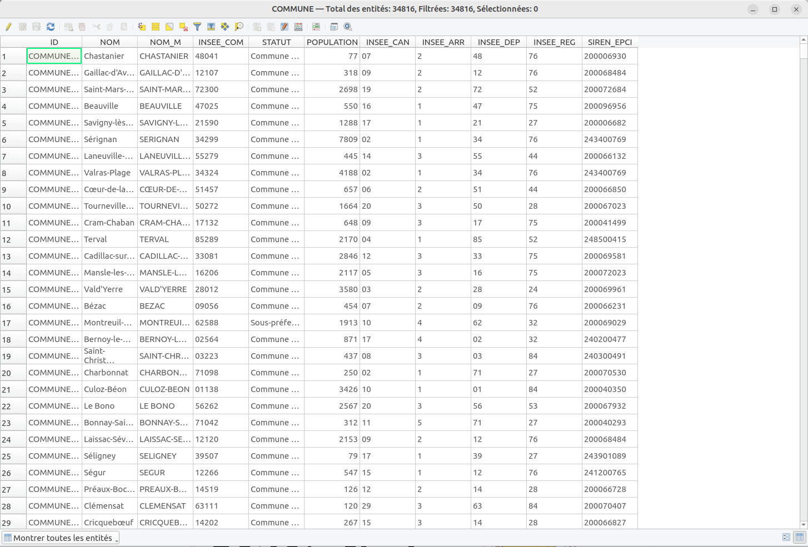
]

---

## Sélection par attributs

.left-column-33[
Il est possible de sélectionner des objets géographiques à partir de leur **table attributaire** :

1. Clic droit sur la couche souhaitée
2. Ouvrir la table d'attribut
3. Ouvrir la fenêtre "*Sélection par expression*"
]

.right-column-66.w120.border[
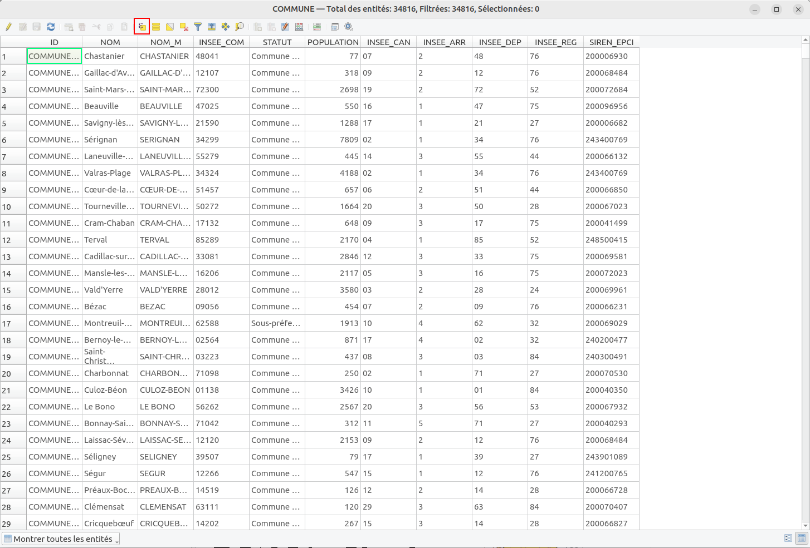
]

---

## Sélection par attributs

.left-column-33[
Il est possible de sélectionner des objets géographiques à partir de leur **table attributaire** :

1. Clic droit sur la couche souhaitée
2. Ouvrir la table d'attribut
3. Ouvrir la fenêtre "*Sélection par expression*"
4. Saisir une expression et valider avec le bouton "*Sélectionner des entités*"

]

.right-column-66.w120.border[
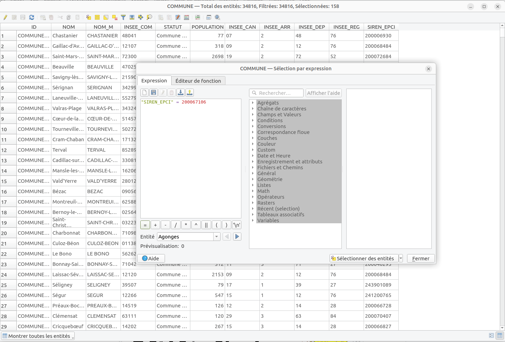
]

--

.left-column-33[
**Les entités sélectionnées apparaissent en jaune sur la carte** et en surbrillance dans la table attributaire.
]

---

## Sélection par attributs - alternative

La méthode indiquée précédemment nécessite d'ouvrir la table attributaire de la couche sur laquelle vous travaillez. Ceci peut parfois être source de ralentissement.
Si vous souhaitez ouvrir la fenêtre de sélection par expression sans ouvrir la table attributaire, il est également possible d'y accéder par le biais de la boite à outils de géotraitements :

1. Ouvrir la boite à outils de géotraitements (Menu *Traitement* > *Boîte à outils* / raccourci en forme de roue).

2. Éventuellement, filter ce qui est affiché en saisissant "expre".

3. Double-clic sur l'item "*Sélectionner à l'aide d'une expression...*".

4. Saisir une expression et valider avec le bouton "*Sélectionner des entités*"

.center.w80.border[
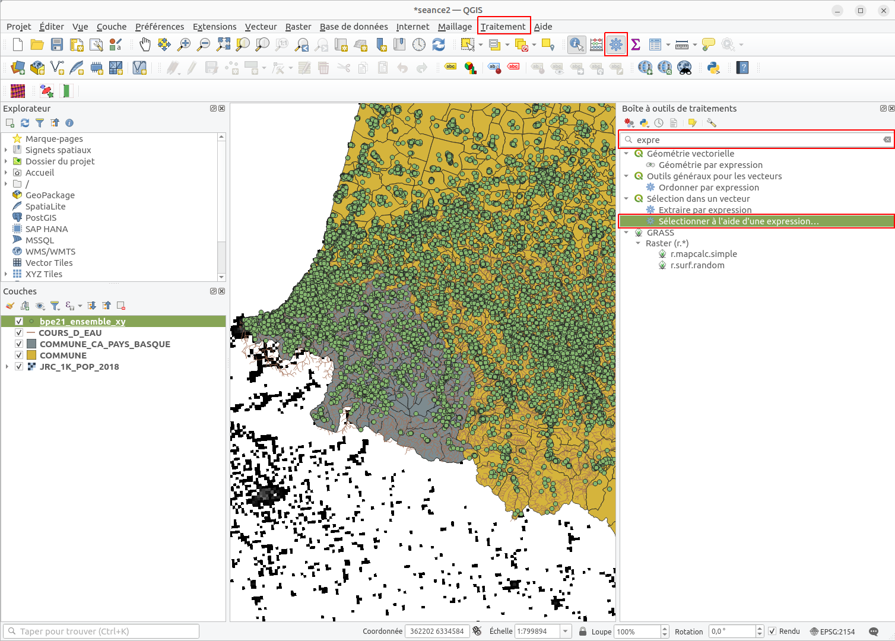
]

---

## Export d'une couche de données et export d'une sélection

.left-column-33[
1. Clic-droit sur la couche dont vous voulez exporter les entités.

2. Sélectionner
    * *Exporter > Sauvegarder les entités sous...* pour exporter toutes les entités
    * *Exporter > Sauvegarder les entités sélectionnées sous...* pour exporter seulement les entités sélectionnées actuellement.

3. Sélectionner l'**emplacement de votre dossier de travail** et **choisir un nom** pour la couche. Choisir également le format (ESRI Shapefile ou GML par exemple).
]

.right-column-66[
.w80.center.border[
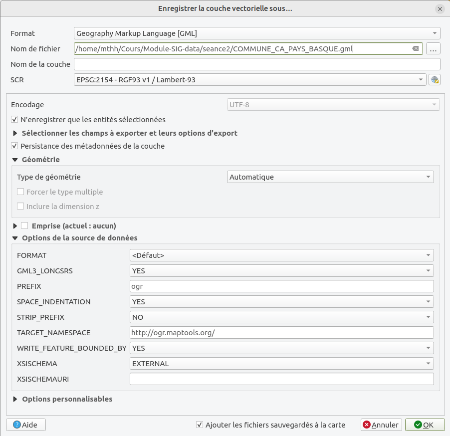
]
]

---

## Exercice 2 - Sélection par attributs et sauvegarde

⇒ **Sélectionnez les communes ayant pour valeur** `200067106` **dans le champ `SIREN_EPCI`**.

⇒ **Sauvegardez les communes sélectionnées dans un nouveau fichier au format ESRI Shapefile**<br>&nbsp;&nbsp;&nbsp;&nbsp;(nommé par exemple `COMMUNE_CA_PAYS_BASQUE.shp`).

<br>

⇒ **Sélectionnez les équipements du jeu de données BPE ayant pour valeur** `F117` **dans le champ `TYPEQU`**<br>&nbsp;&nbsp;&nbsp;&nbsp;(il s'agit des équipements pour skate/roller/bmx).

⇒ **Sauvegardez les communes sélectionnées dans un nouveau fichier au format ESRI Shapefile**<br>&nbsp;&nbsp;&nbsp;&nbsp;(nommé par exemple `BPE_F117.shp` ou `BPE_skatepark.shp`).

<br>

⇒ **Sélectionnez les équipements du jeu de données BPE ayant pour valeur** `C201`, `C301`, `C302` **ou** `C303` **dans le champ `TYPEQU`** (il s'agit respectivement des collèges, des lycées généraux, pro. et agricoles).

⇒ **Sauvegardez les communes sélectionnées dans un nouveau fichier au format ESRI Shapefile**<br>&nbsp;&nbsp;&nbsp;&nbsp;(nommé par exemple `BPE_C201_C301_C302_C303.shp` ou `BPE_college_lycee.shp`).

<p class="duration">15 min</p>

---

## Exercice 2 - Sélection par attributs et sauvegarde


.pull-left[

<br><br><br><br>

Vous avez désormais 7 couches dans le gestionnaire de couches. 

<br>

Deux d'entre-elles ne sont plus nécessaires.

Après vous être assuré que vos sélections puis vos exports sont corrects, supprimez les couches `COMMUNES` et `bpe21_ensemble_xy` du gestionnaire de couches (*clic droit* puis *Supprimer la couche*).
]

.pull-right[
.center.border[
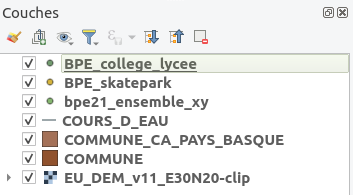

⇓

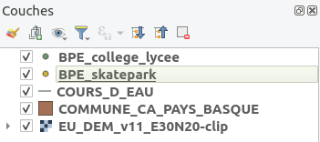
]
]

<p class="duration">1 min</p>

---

## Sélection par localisation

.left-column-33[
Il est possible de sélectionner des objets géographiques en fonction de leur localisation, ou, plus précisément, en fonction de si les objets géographiques satisfont un critère de sélection spatial (*un prédicat géométrique*).

1. Menu *Vecteur > Outils de recherche > Sélection par localisation...*
2. Sélectionner la couche depuis laquelle doivent être sélectionnées les entités
3. Sélectionner le **prédicat géométrique** devant être vrai pour sélectionner les entités 
4. Exécuter la recherche puis fermer la fenêtre.

Les entités sélectionnées apparaissent en jaune carte.
]

.right-column-66.w110.border[
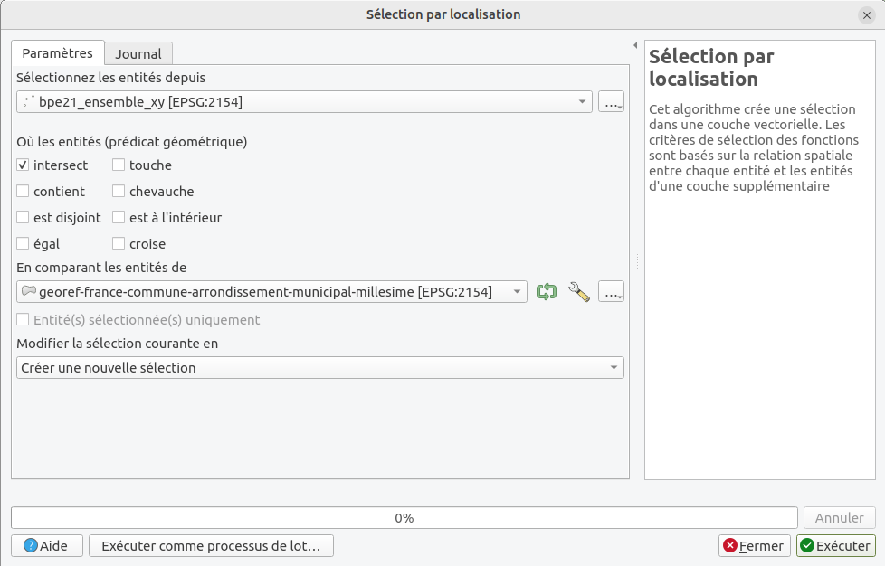
]

---

## Les prédicats géométriques

Il s'agit d'une question dont la réponse peut-être vraie ou fausses (*Est-ce que l'entité A contient l'entité B ?*).

---

## Les prédicats géométriques


.medium[
- **Intersecte** : Teste si une géométrie intersecte une autre. Renvoie *vrai* si les géométries se croisent spatialement (partagent n’importe quelle partie de l’espace - se chevauchent ou se touchent) et *faux* *si ce n’est pas le cas.

- **Contient** : Renvoie *vrai* si et seulement si aucun point de b ne se trouve à l’extérieur de a, et au moins un point de l’intérieur de b ne se trouve à l’intérieur de a. C’est l’opposé de *sont à l’intérieur de*.

- **Disjoint** (*est disjoint* dans QGIS) : Renvoie *vrai* si les géométries ne partagent aucune portion d’espace (pas de chevauchement, pas de contact).

- **Égal** : Renvoie *vrai* si et seulement si les géométries sont exactement les mêmes. Aucun cercle ne sera sélectionné.

- **Touche** : Teste si une géométrie en touche une autre. Renvoie *vrai* si les géométries ont au moins un point en commun, mais que leurs intérieurs ne se coupent pas.

- **Chevauchement** : Teste si une géométrie en chevauche une autre. Renvoie *vrai* si les géométries partagent l’espace, sont de la même dimension, mais ne sont pas complètement contenues les unes par les autres.

- **Sont à l'intérieur de** : Teste si une géométrie est à l’intérieur d’une autre. Retourne *vrai* si la géométrie a est entièrement comprise dans la géométrie b.

- **Croise** : Retourne *vrai* si la géométrie concernée comporte certains points intérieurs, mais pas tous, en commun et si le croisement concerné est d’une dimension inférieure à la plus grande géométrie fournie. Par exemple, une ligne traversant un polygone le traversera en tant que ligne (sélectionnée). Le croisement entre deux lignes sera considéré comme un point (sélectionné). Deux polygones s’entrecroiseront en tant que polygone (non sélectionné).
]

---

## Les prédicats géométriques : Exercice

.left-column-66[
.center.w90[
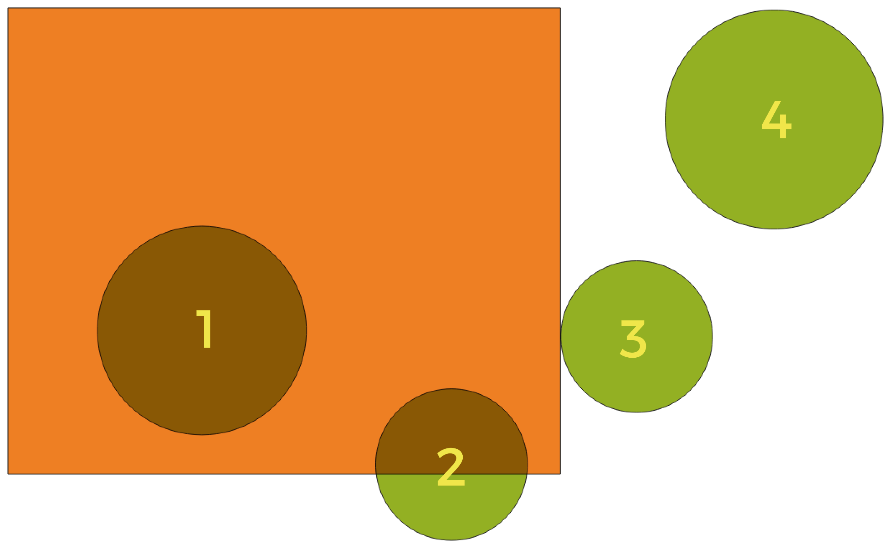
]
]

.right-column-33.table-mleft45[

Quels cercles sont sélectionnés si on utilise le prédicat ...

| - | 1 | 2 | 3 | 4 |
|-----------------|---|---|---|---|
| Intersecte | | | | |
| Contient | | | | |
| Disjoint | | | | |
| Égal     | | | | |
| Touche   | | | | |
| Chevauche | | | | |
| à l'intéreur de | | | | |
| croise | | | | | |


<br>

]

Dans cet exemple, l’ensemble de données à partir duquel nous voulons sélectionner (*la couche vecteur source*) se compose des cercles verts, le rectangle orange est l’ensemble des données auquel il est comparé (*la couche vecteur d’intersection*).

---

## Les prédicats géométriques : Solution

.left-column-66[
.center.w90[

]
]

.right-column-33.table-mleft45[

Quels cercles sont sélectionnés si on utilise le prédicat ...

| - | 1 | 2 | 3 | 4 |
|-----------------|---|---|---|---|
| Intersecte | x | x | x | |
| Contient | | | | |
| Disjoint | | | | x |
| Égal     | | | | |
| Touche   | | | x | |
| Chevauche | | x | | |
| à l'intéreur de | x | | | |
| croise | | | | | |


<br>

]

Dans cet exemple, l’ensemble de données à partir duquel nous voulons sélectionner (*la couche vecteur source*) se compose des cercles verts, le rectangle orange est l’ensemble de données auquel il est comparé (*la couche vecteur d’intersection*).

---

## Exercice 3 - Sélection par localisation et sauvegarde


⇒ **Sélectionnez les équipements collèges/lycées présents sur la CA Pays Basque**. *(choix du prédicat géométrique, choix des couches, etc.)*
<br>

⇒ **Sauvegardez cette sélection dans un nouveau fichier au format ESRI Shapefile** (nommé par exemple `BPE_CA_PB_college_lycee.shp`).
<br><br><br>

⇒ **Sélectionnez les équipements de type skatepark présents sur la CA Pays Basque**. *(choix du prédicat géométrique, choix des couches, etc.)*
<br>

⇒ **Sauvegardez cette sélection dans un nouveau fichier au format ESRI Shapefile** (nommé par exemple `BPE_CA_PB_skatepark.shp`).
<br><br><br>

⇒ **Sélectionnez les cours d'eau présents sur la CA Pays Basque**. *(choix du prédicat géométrique, choix des couches, etc.)*
<br>

⇒ **Sauvegardez cette sélection dans un nouveau fichier au format ESRI Shapefile** (nommé par exemple `COURS_D_EAU_CA_PB.shp`).


<p class="duration">15 min</p>

---

## Exercice 3 - Sélection par localisation et sauvegarde

.pull-left[

<br><br><br><br>

Vous avez désormais 8 couches dans le gestionnaire de couches. 

<br>

Trois d'entre-elles ne sont plus nécessaires.

Après vous être assuré que vos sélections puis vos exports sont corrects, supprimez les couches `BPE_college_lycee`, `BPE_skatepark` et `COURS_D_EAU` du gestionnaire de couches (*clic droit* puis *Supprimer la couche*).
]

<p class="duration">1 min</p>

---

## Reprojection d'un raster

Il est possible de **reprojeter une couche raster dans un autre SCR**.

Pour cela : Menu *Raster > Projections > Projection (warp)...*

.left-column-33[
1. Sélectionner la couche raster à reprojeter.

2. Sélectionner le SRC d'origine (optionnel s'il est renseigné correctement dans les propriétés de la couche).

3. Sélectionner le SRC cible.

4. Vérifier les autres paramètres *(méthode de ré-échantillonnage, résolution, etc.)* si besoin.

5. Choisir un nom de fichier ou laisser vide pour la création d'une couche temporaire.

6. Appuyer sur *Exécuter*.
]

.right-column-66.w90[
.center.border[
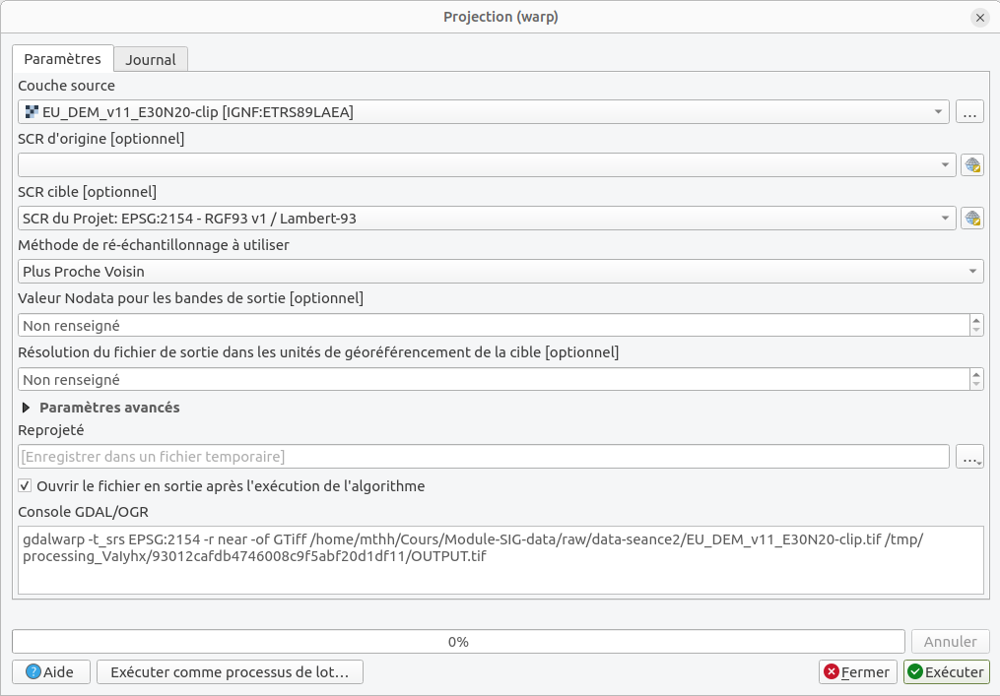
]
]

---

## Découpage d'un raster

Il est possible d'**extraire** seulement **certaines cellules d'une couche raster** (i.e. le **découper**).

Pour cela : Menu *Raster > Extraction > Découper un raster selon une emprise...*

.left-column-33[
1. Sélectionner la couche raster cible.

2. Sélectionner l'étendue de découpage (possibilité de choisir l'emprise d'une couche du projet en cliquant sur le bouton `...` au bout de la ligne.

3. Choisir un nom de fichier ou laisser vide pour la création d'une couche temporaire.

4. Appuyer sur *Exécuter*.
]

.right-column-66.w90[
.center.border[

]
]

---

## Exercice 4 - Reprojection et découpage de la grille de population

<br><br>

⇒ **Reprojeter la couche `EU_DEM_v11_E30N20-clip` vers le SCR *EPSG 2154 - RGF93 v1 / Lambert-93*** (vous obtiendrez une couche temporaire nommée *Reprojeté*)

<br><br>

⇒ **Extraire la zone de cette nouvelle couche correspondant à l'emprise des communes de la CA du Pays Basque**

<br><br>

⇒ **Sauvegarder cette extraction dans un nouveau fichier** (nommé par exemple `EU_DEM_v11_E30N20-CA_PB.tif`)

<br><br>

⇒ **Supprimer la couche nommée `Reprojeté` et la couche nommée `EU_DEM_v11_E30N20-clip`**.

<p class="duration">5 min</p>

---

## Gestion des styles des couches

<br>

**Un style par défaut a été donné aux différentes couches lors de leur import dans QGIS**.

Il est toutefois possible de modifier l'apparence de chacune des couches, et ce de manière complexe et entièrement paramétrable.

Nous verrons dans un prochain cours les règles de sémiologie graphique propres à l'information géographique.
Voyons tout d'abord les principales options proposées par QGIS.

???

La symbologie d’une couche correspond à son apparence visuelle sur la carte. La force de base des SIG par rapport aux autres façons de représenter des données spatiales est qu’avec les SIG, il est possible d’avoir une représentation visuelle des données avec lesquelles vous travaillez.

Ainsi, l’apparence visuelle de la carte (qui dépend de la symbologie individuelle des couches) est très importante. L’utilisateur final des cartes que vous produisez a besoin d’être capable de voir facilement ce que la carte représente. Un aspect tout aussi important est le fait que vous devez être en mesure d’explorer les données avec lesquelles vous travaillez, et une bonne symbologie aide beaucoup.

En d’autres mots, posséder sa propre symbologie n’est pas un luxe ou tout simplement quelque chose d’agréable à avoir. En fait, c’est essentiel pour vous d’utiliser un SIG proprement et produire des cartes et informations que les gens seront en mesure d’utiliser.

---

## Gestion des styles des couches

<br>

**Un style par défaut a été donné aux différentes couches lors de leur import dans QGIS**.

Il est toutefois possible de modifier l'apparence de chacune des couches, et ce de manière complexe et entièrement paramétrable.

Nous verrons dans un prochain cours les règles de sémiologie graphique propres à l'information géographique.
Voyons tout d'abord les principales options proposées par QGIS.

<br>

Pour accéder aux options de style :

- *Double-clic* ou *Clic droit > Propriétés...* sur la couche ciblée dans le gestionnaire de couche.

- Aller dans le menu *Symbologie*.

---

## Style (données vectorielles)

Plusieurs types de symbologie peuvent être définis pour les données vectorielles : 

- **Symbole unique** (un symbole ou une pile de symboles, identique pour toutes les entités)

- **Catégorisé** (un attribut ou une expression sert de catégorie - autant de classes de symbole que de valeurs distinctes pour cet attribut)

- **Gradué** (un attribut ou une expression sert a la délimitation de bornes de classes - tous les objets dont la valeur est comprise entre ces bornes auront le même symbole)

- **Ensemble de règles**

- **2.5D** (rendu pseudo-3D avec effet de perspective)

- Etc.

---

## Style (données vectorielles) - catégorisé

.center.border.w70[
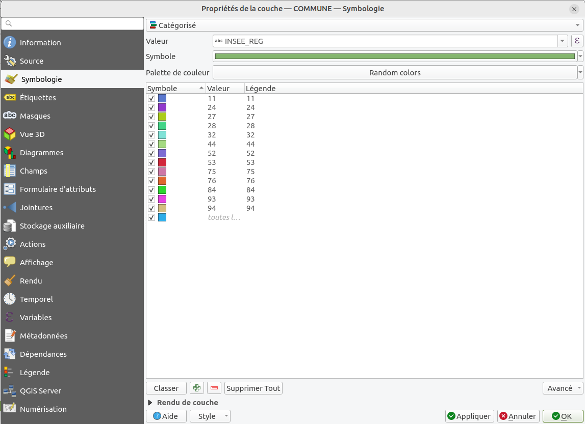
]

---

## Style (données vectorielles) - catégorisé

.center.border.w60[
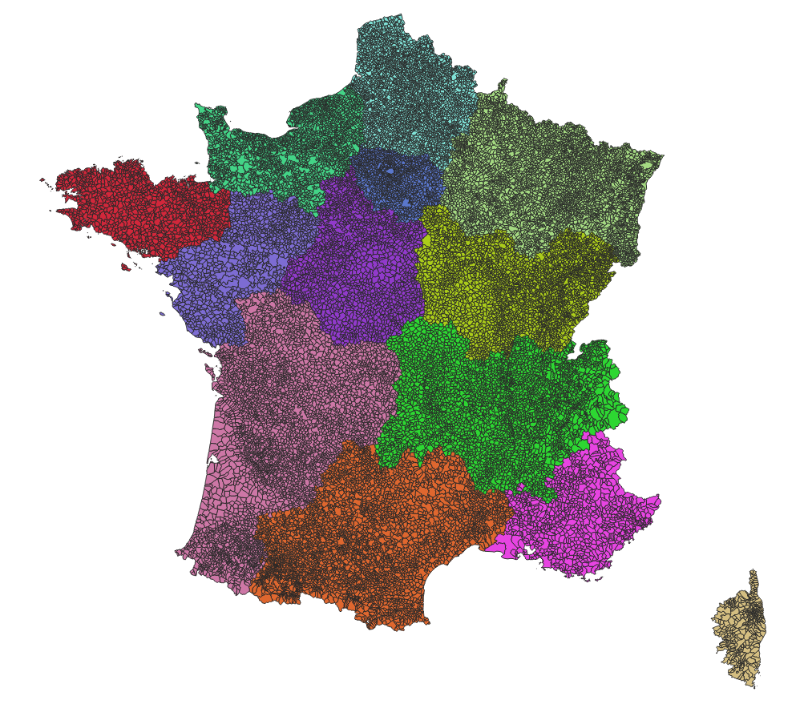
]

---

## Style (données vectorielles) - gradué

.center.border.w70[
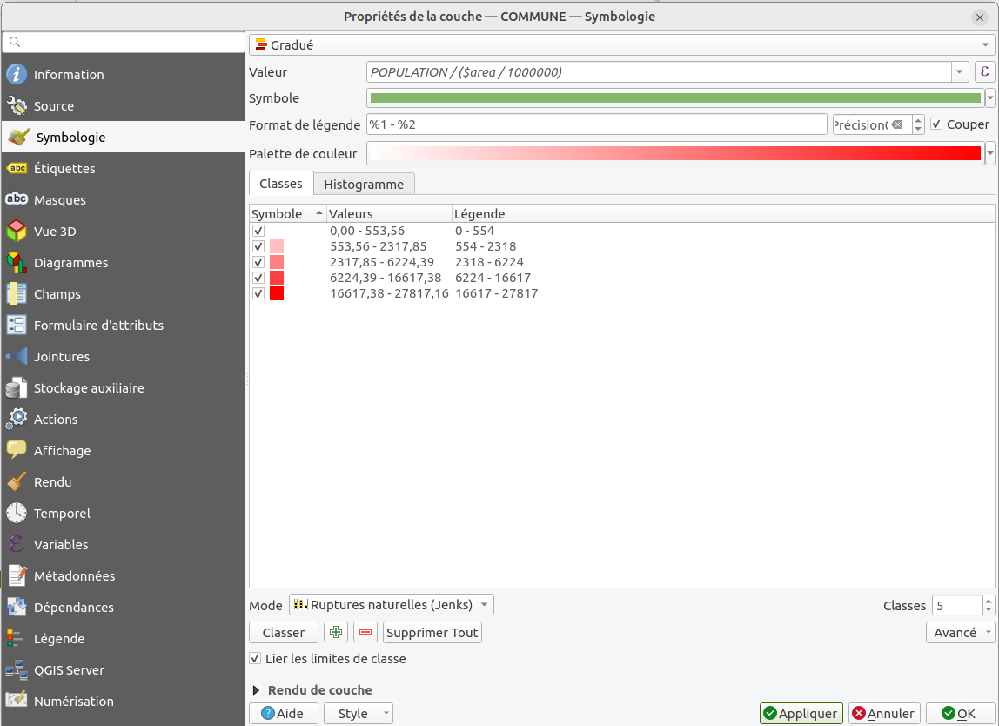
]

---

## Style (données vectorielles) - gradué

.center.border.w55[
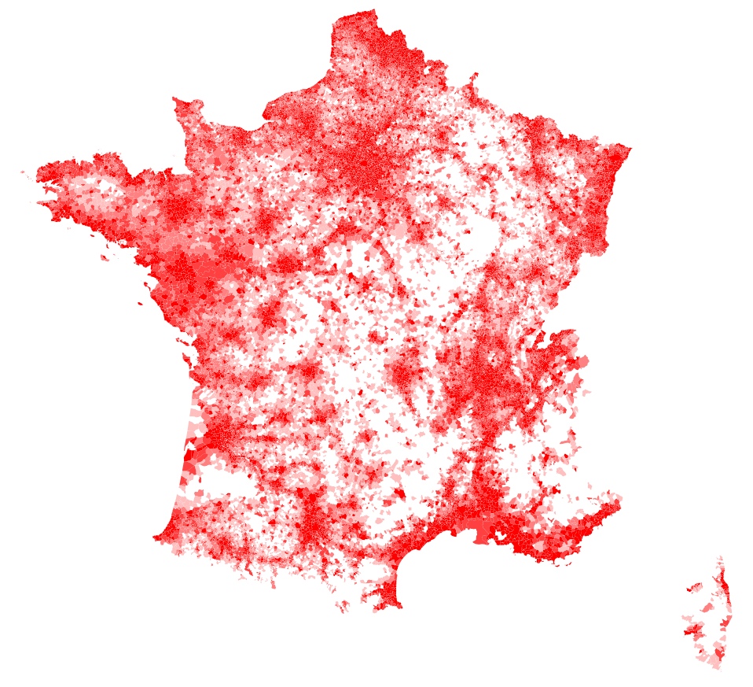
]

---

## Style (données vectorielles) - discrétisation

.pull-left.w90.border[
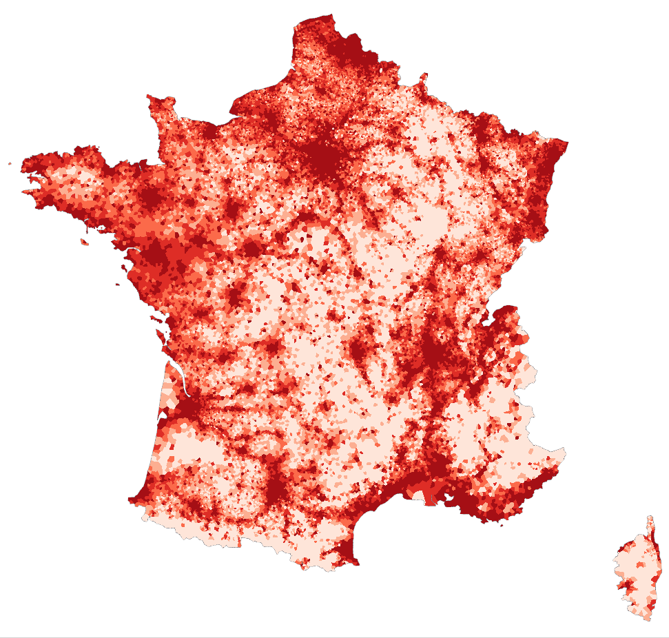
]

.pull-right.w90.border[
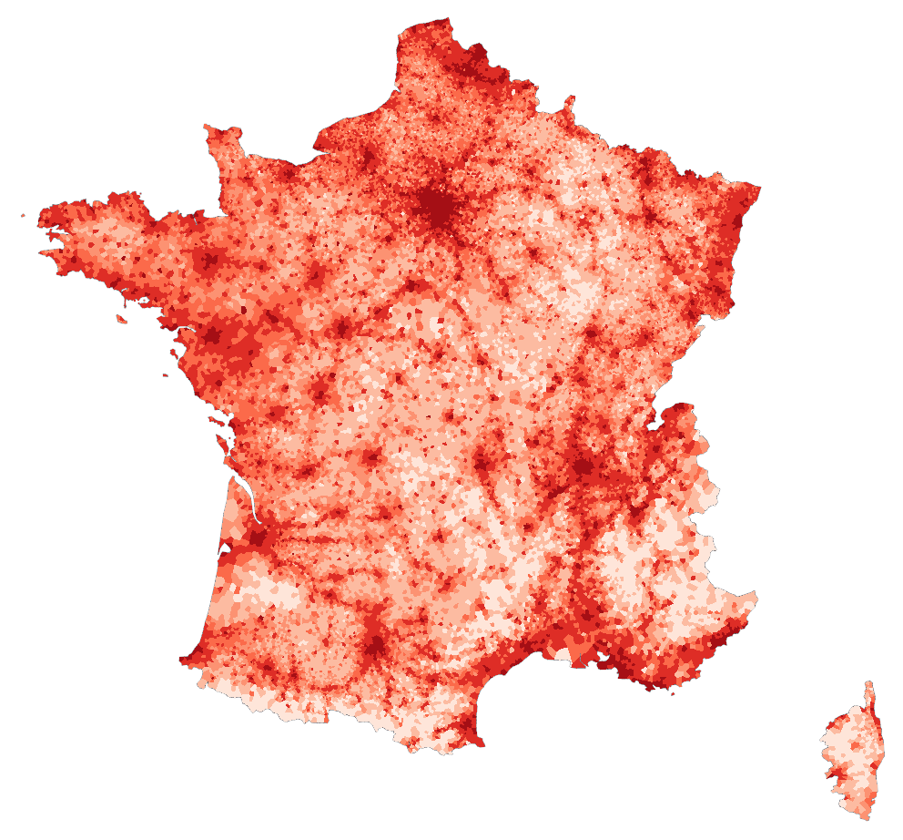
]

.center.clear[
Attention au choix du *mode de discrétisation* (intervalles égaux, quantiles, Jenks, etc.).<br>Cf. cours de la séance 4.
]

---

## Style (données matricielles)

Plusieurs types de symbologie peuvent être définis pour les données matricielles : 

- **Couleur à bandes multiples** (pour un raster multibande comme une image satellite)

- **Palette / Valeurs uniques** (pour représenter un nombre fini de catégories, sur une seule bande, comme des classes d'occupation du sol)

- **Bande grise unique** (rendu en niveau de gris, pour des valeurs continues, sur une seule bande)

- **Pseudo-couleur à bande unique** (rendu en utilisant une palette de couleur, sur une seule bande, par exemple pour un raster d'altitude)

- **Ombrage**

- **Contours**


---

## Style (données matricielles) - Pseudo-couleur à bande unique

.center.border.w70[
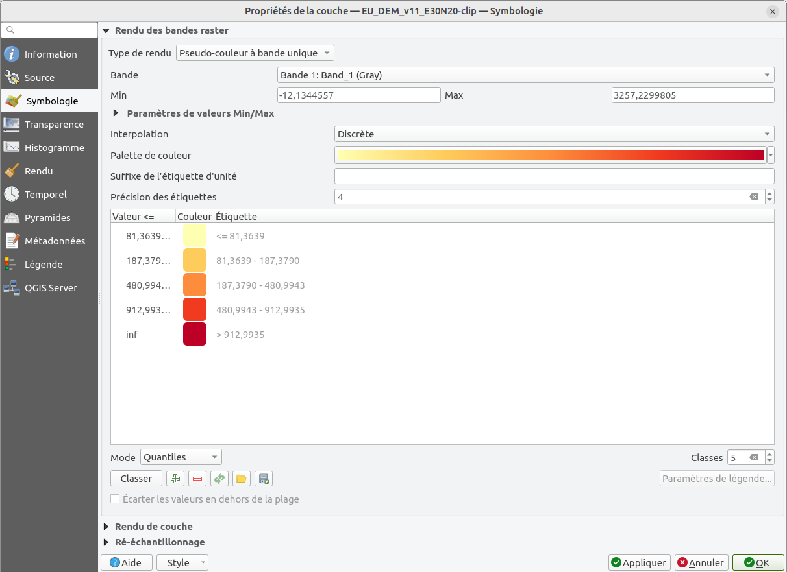
]

---

## Style (données matricielles) - Pseudo-couleur à bande unique

.center.border.w80.left-column-66[
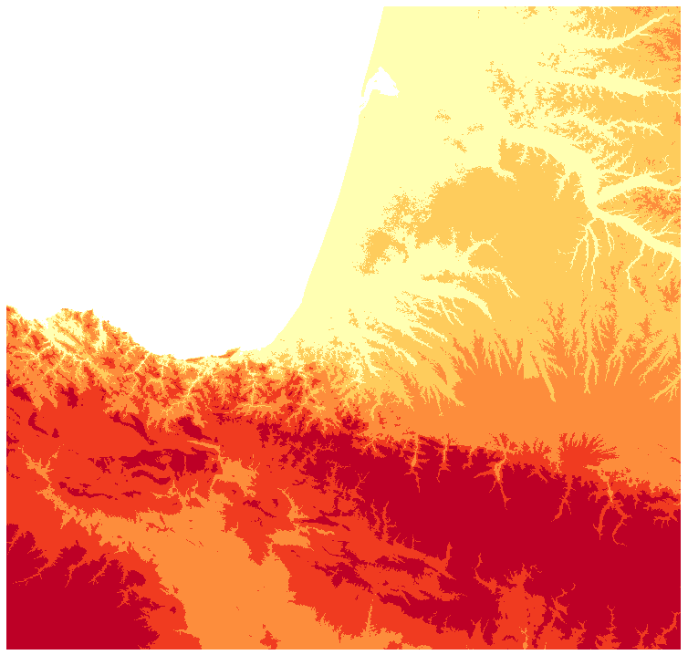
]

.center.border.w80.right-column-33[
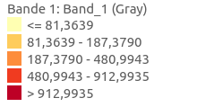
]


---

## Style (données matricielles) - Pseudo-couleur à bande unique

.center.border.w80[

]

---

## Style (données matricielles) - Palette / Valeurs uniques

.center.border.w80.left-column-66[
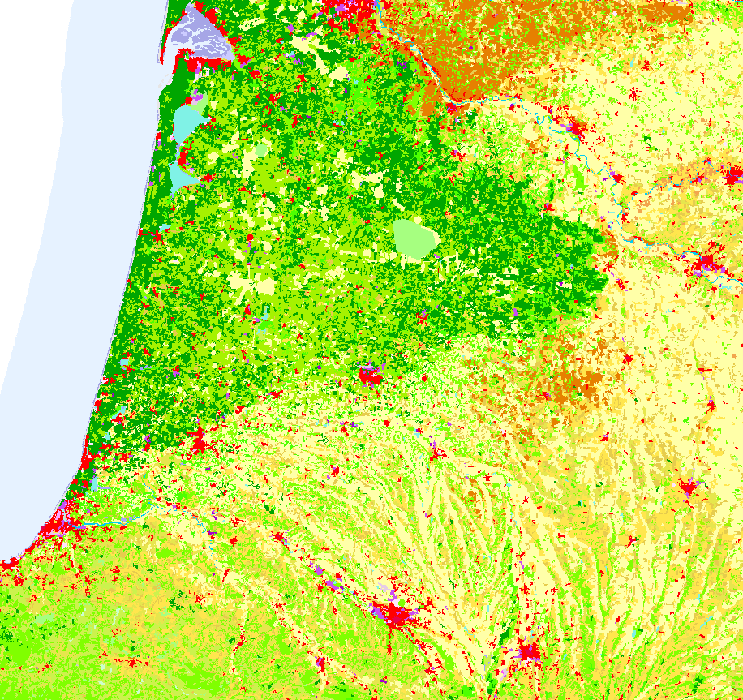
]

.center.border.w110.right-column-33[

<br><br><br>
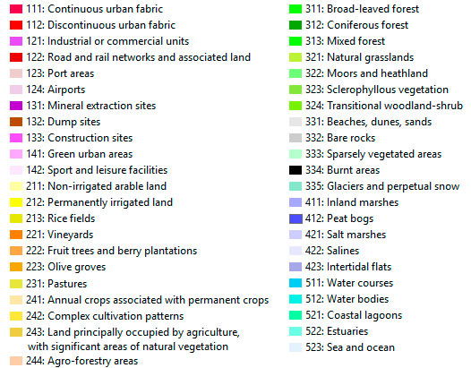
]

---

## Exercice 5 - Style des couches


⇒ **Changez le style de la couche `COURS_D_EAU` afin que les cours d'eau apparaissent désormais en bleu**.


⇒ **Changez le style de la couche `EU_DEM_v11_E30N20-CA_PB` afin de représenter les valeurs des cellules par leur couleur, en utilisant 5 classes et une palette telle que *Viridis* ou *Cividis***.

⇒ **Changez le style de la couche `BPE_college_lycee` afin de représenter d'une couleur différente les collèges d'une part et les lycées d'autre part**.


⇒ **Changez le style de la couche `BPE_skatepark` afin d'utiliser un symbole SVG**<br>&nbsp;&nbsp;&nbsp;&nbsp;&nbsp;(parmi ceux de QGIS ou en en cherchant un sur le Web).

⇒ **Ajoutez des étiquettes à la couche `COMMUNE_CA_PAYS_BASQUE`**<br>&nbsp;&nbsp;&nbsp;&nbsp;&nbsp;(pensez à mettre un tampon blanc de 4px autour des labels afin d'améliorer la lisibilité)

.pull-left[
.center.w60.border[
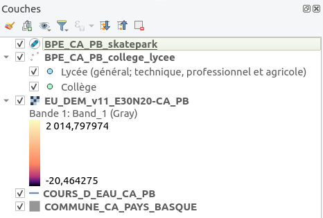
]
]

.pull-right[
.center.w50.border[
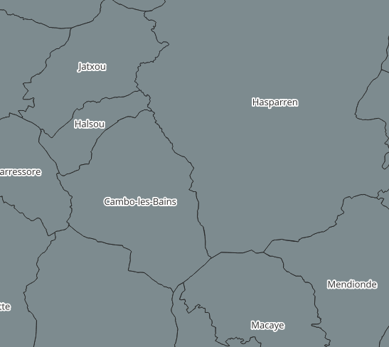
]
]


<p class="duration">20 min</p>

---

## Éditer les attributs d'une couche vectorielle

.left-column-33[
QGIS permet d'**éditer les attributs d'une couche vectorielle** de plusieurs façons :

- **manuellement**, en passant la couche en mode édition puis en cliquant sur la valeur à changer dans la table attributaire,

]


.right-column-66.w100.center.border[
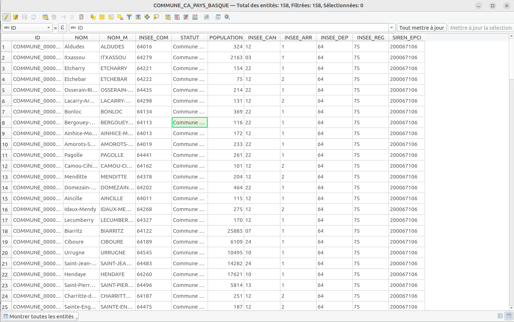
]

---

## Éditer les attributs d'une couche vectorielle

.left-column-33[
QGIS permet d'**éditer les attributs d'une couche vectorielle** de plusieurs façons :

- **manuellement**, en passant la couche en mode édition puis en cliquant sur la valeur à changer dans la table attributaire,

- **à l'aide de la calculatrice de champs**, qui permet de calculer la valeur d'un attribut (existant ou nouveau) en saisissant une *expression* (dans la même syntaxe que les expressions utilisées pour faire des sélections) ; attention à bien sélectionner le type de champ et à regarder la section *prévisualisation*.

]

.right-column-66.w90.center.border[
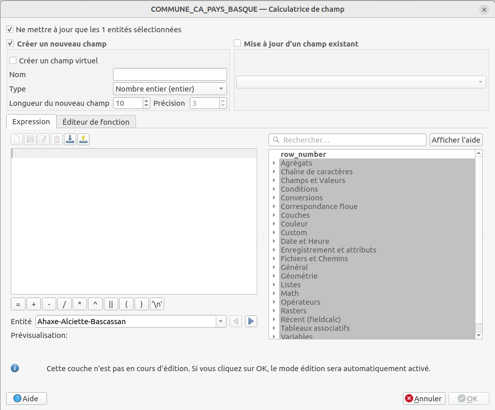
]

---

## Exercice 6 - Édition des attributs

<br>

Les données de l'IGN comportaient jusqu'ici généralement un champ "superficie". Celui-ci n'est plus présent sur les communes dans le jeu de données ADMIN EXPRESS.

<br>

⇒ **Ouvrez la calculatrice de champs pour la couche `COMMUNE`**.

⇒ **Créez un nouveau champ nommé "superficie" et remplissez le afin qu'il contienne la superficie de chaque entité en kilomètre carré.**. Nous utiliserons cette information dans un prochain exercice. Pensez à quitter le mode édition pour la couche `COMMUNE` lorsque vous avez terminé.

<br>

⇒ Quelle est la superficie de la plus grande commune ? Quelle est cette commune ?

⇒ Avez-vous vu une fonctionnalité pour calculer des statistiques sur les valeurs d'un champ ? Si oui, quelle est la superficie moyenne des communes de la CA du Pays Basque ?

<p class="duration">10 min</p>

---

class: center, middle
## Avant de partir...


**_Ne pas oublier de sauvegarder votre projet QGIS !_**
