class: center, middle, first

# Module SIG
# Séance 3 - TD - QGIS

### LP Programmation Avancée

 
 

.author[
    Matthieu Viry (UAR RIATE / CNRS)
     
    🖂 <a href="mailto:matthieu.viry@cnrs.fr">matthieu.viry@cnrs.fr</a>
]

.date[
     
    07/02/2023
]

---

## Introduction

Hier nous avons vu :

- comment importer des couches (Shapefile, CSV avec coordonnées) dans QGIS

- comment effectuer des **sélections attributaires** *(sélectionner des entités d'un jeu de données en fonction de la valeur d'un attribut)*

- comment effectuer des **sélections spatiales** *(sélectionner des entités d'un jeu de données en fonction du résultat d'un prédicat spatial lorsqu'on le croise avec un autre jeu de données)*

--

Nous disposons donc maintenant pour notre zone d'étude (la CA du Pays Basque) :

- des polygones représentant les communes

- de la localisation (sous forme de points) des skatepark et des collèges / lycée

- du tracé des cours d'eau (lignes)

- du MNT (Modèle Numérique de Terrain)

--

Aujourd'hui nous voulons répondre à nos premières questions d'analyse spatiales.
À la fin de ce TD, vous devriez par exemple pouvoir savoir quels quels habitants de la CA du Pays Basque doivent parcourir plus de 30 min de voiture pour accéder à un skatepark.

---

## Géotraitements

.medium[
**QGIS offre un large choix de géotraitements**. Une partie d'entre eux est accessible depuis les menus *Vecteur* et *Raster* et on peut retrouver l'intégralité dans la __*Boite à outils de géotraitements*__ (on y retrouve également les différentes fonctionnalités utilisées jusqu'ici : sélection par localisation, sélection par attribut, etc.).
]

--

.pull-left.medium[

- **intersection** (l’intersection entre deux couches crée une troisième couche, avec uniquement les parties communes aux deux couches)

- **difference** (la différence entre deux couches crée une troisième couche avec uniquement les parties de la couche en entrée qui ne sont pas situées à l’intérieur de la couche de différence)

- **union** (l'union de deux couches créé une troisième couche réunissant les entités communes aux deux couches)

- **buffer** (créé une zone tampon à la distance voulue)

- **regroupement** (fusionne les entités au sein d'une couche, si besoin en fonction d'un champ)

- **centroïde** (retourne le point qui est approximativement au centre de la masse - le barycentre - de la géométrie passée en paramètre)

- etc.
]

.pull-right.medium[

.w110[]

.center.w50[
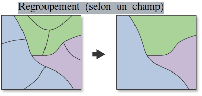
]

.small[Sources : https://geopandas.org/en/stable/docs/user_guide/set_operations.html ; https://desktop.arcgis.com/fr/arcmap/10.3/tools/coverage-toolbox/dissolve.htm]
]

???

- Une zone tampon peut servir par exemple à modéliser une zone inondable, un périmètre de sécurité, une zone d’achalandage, ...

---

## Géotraitements et analyse (vecteur)

.medium[
**QGIS offre un large choix de géotraitements**. Une partie d'entre eux est accessible depuis les menus *Vecteur* et *Raster* et on peut retrouver l'intégralité dans la __*Boite à outils de géotraitements*__ (on y retrouve également les différentes fonctionnalités utilisées jusqu'ici : sélection par localisation, sélection par attribut, etc.).
]

.pull-left.medium[

- **intersection** (l’intersection entre deux couches crée une troisième couche, avec uniquement les parties communes aux deux couches)

- **difference** (la différence entre deux couches crée une troisième couche avec uniquement les parties de la couche en entrée qui ne sont pas situées à l’intérieur de la couche de différence)

- **union** (l'union de deux couches créé une troisième couche réunissant les entités communes aux deux couches)

- **buffer** (créé une zone tampon à la distance indiquée)

- **regroupement** (fusionne les entités au sein d'une couche, si besoin en fonction d'un champ)

- **centroïde** (retourne le point qui est approximativement au centre de la masse - le barycentre - de la géométrie passée en paramètre)

- etc.
]

.pull-right.medium[
Ainsi que des outils d'analyse classiques : 

- **résumé statistique d'un champ d'une couche**

- **compter les points dans un polygone**

- **matrice de distance entre deux couches de points**

- etc.
]

---

## Géotraitements et analyse (vecteur)

QGIS offre aussi de nombreux géotraitements plus avancés (qui offrent une abstraction faisant appel à une succession de géotraitements plus élémentaires) :

.pull-left.medium[

- **Somme des longueur des lignes** (va faire appel à une intersection entre la couche de polygone et la couche de ligne à mesurer)

- **Distance au plus proche centre (ligne vers centre)** (va faire appel à un calcul du plus proche voisin entre 2 couches de points avant de générer des lignes)

- etc.

]

.pull-right.center.border.w100[
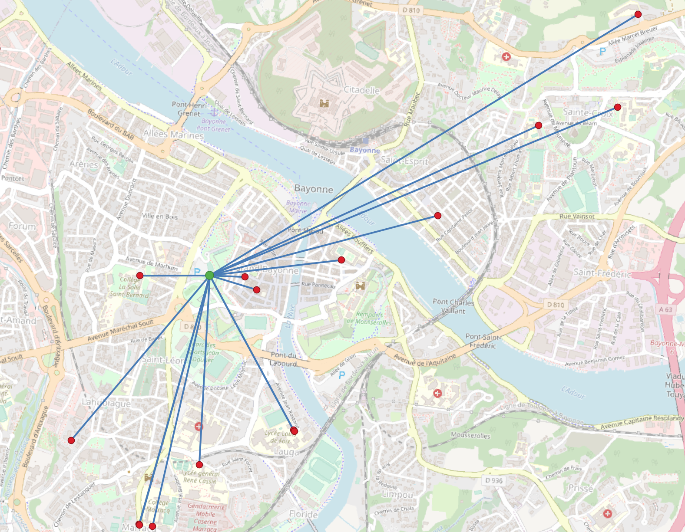
]

???

---

## Géotraitements et analyse (raster)

Il est également possible de réaliser des traitements et des analyses sur les couches raster :

- **Statistiques** (résumé statistique des valeurs rencontrées dans la couche)

- **Calcul de pente**

--

- **Algèbre spatial (ou algèbre de carte)** (application d'opérations mathématiques à une ou plusieurs couches  raster pour produire une nouvelle couche)

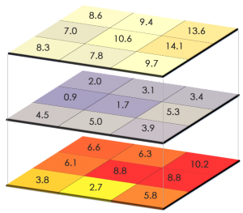

Soustraction de la température d'avril 2014 de la température d'avril 2015 pour voir la différence entre les 2 périodes. Source : https://gisgeography.com/map-algebra-global-zonal-focal-local/.

--

- **Calcul de champ de vision / bassin de visibilité** *(viewshed)*

--

- **Délimitation de bassin versant**

- Etc.

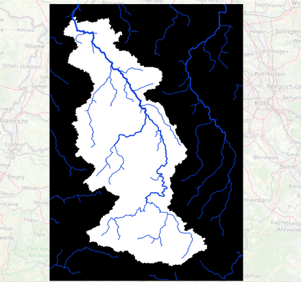

Source : https://courses.gisopencourseware.org/mod/book/view.php?id=336&chapterid=995.

???

L'algèbre de carte est une algèbre développée par le Dr Dana Tomlin et d'autres à la fin des années 1970, il s'agit d'un ensemble d'opérations primitives qui permet à une ou plusieurs couches raster ("cartes") de dimensions similaires pour produire une nouvelle couche raster à l'aide d'opérations mathématiques ou autres telles que l'addition, la soustraction, le ET/OU booléen, etc.

---

## Géotraitements et analyse (raster et vecteur)

Il est également possible de mobiliser conjointement des couches vectorielles et des couches raster :

- **Statistiques par zone** (utilise une couche de polygones et calcul un résumé statistique des valeurs rencontrées, par polygone, dans le raster choisi)

--

- **Prélèvement / échantillonnage** (utilise une couche de points et lui affecte la valeur lue à cet endroit dans le raster choisi)

--

- **Rasterisation d'un couche vectorielle**

Rasterisation. Source : https://desktop.arcgis.com/fr/arcmap/latest/manage-data/geodatabases/raster-basics.htm.

--

- **Création de contours vectoriels à partir d'une couche raster**

- Etc.

---

## Exercice 1 - Géotraitements et analyse (vecteur)

Il est temps d'explorer les géotraitements possibles par vous même. Essayer de répondre aux questions suivantes en mobilisant un ou plusieurs géotraitements et/ou outils d'analyse (pensez à utiliser la barre de recherche de la boite à outils de géotraitements) :

 

⇒ **Quel est le linéaire de cours d'eau dans chaque commune de la CA du Pays Basque ?**

⇒ **Combien de collèges / lycées sont présents par commune ?**

⇒ **Combien de communes ne possèdent pas de skatepark ?**

⇒ **Combien de skatepark sont à moins de 200m d'un cours d'eau ?**

⇒ **Combien de collèges et lycées sont situés à plus de 10km d'un skatepark ?**

⇒ **Quelle commune** (pensez à utiliser son centroïde pour cette question) **est la plus éloignée, à vol d'oiseau, d'un skatepark ? Combien de kilomètres faut-il parcourir, à vol d'oiseau, depuis le centre de la commune pour y accéder ?**

 

.center[
*Pensez à renommez vos couches temporaires en sortie des géotraitements (Centroide -> Centroide_COMMUNE, etc.) ou à les sauvegarder sur le disque.*
]

45 min

---

## Exercice 2 - Géotraitements et analyse (raster et vecteur)

Il est temps d'explorer les géotraitements possibles par vous même. Essayer de répondre aux questions suivantes en mobilisant un ou plusieurs géotraitements et/ou outils d'analyse (pensez à utiliser la barre de recherche de la boite à outils de géotraitements) :

 

⇒ **Quelle est la commune ayant l'altitude moyenne la plus élevée ?**

⇒ **Quel skatepark est situé à la plus haute altitude dans la CA du Pays Basque ?**

10 min

---

## Jointures attributaires

.pull-left[
Une **jointure attributaire** permet de joindre **deux tables attributaires décrivant des entités communes et partageant un champ commun**. L'opération produit **une seule table** juxtaposant les champs de la table à joindre à ceux de la table d'origine.

Dans un SIG la table d'origine est souvent celle associée aux entités localisées d'**une couche géographique**, ce qui permet par exemple de cartographier les **données d'un tableau statistique sans dimension spatiale**.

Les jointures attributaires sont utilisées lorsque l'on souhaite introduire des informations nouvelles dans une couche géographique, par exemple des données décrivant le nombre de commerces que l'on souhaite joindre à une couche de communes.
]

.pull-right.center.w90[

  

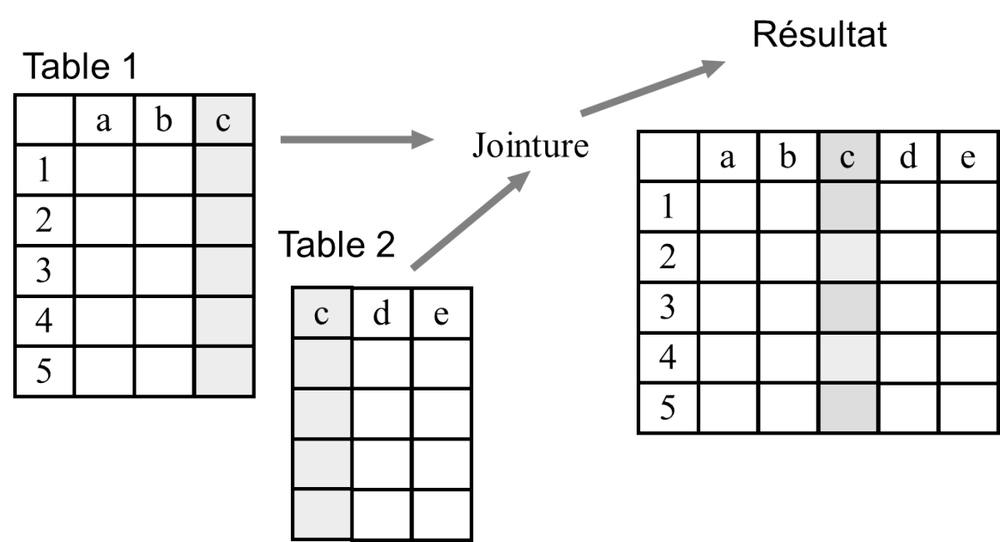
.small[Source : Université Virtuelle Environnement et Développement durable, glossaire des SIG.]
]
---

## Jointures attributaires

Dans QGIS, cela s'effectue au niveau des propriétés de la couche à laquelle on veut joindre des données, dans l'onglet *Jointures*. Il est possible de choisir la couche devant être jointe, le nom des champs contenant les identifiants communs, et les champs à ajouter (tous le sont par défaut).

.center.w65.border[
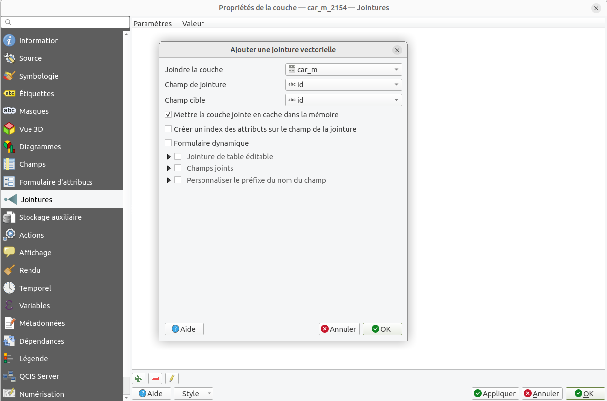
]

---

## Jointures attributaires

L'onglet *Jointures* indique également si des jointures sont déjà en oeuvre sur la couche en question.

.center.w70.border[
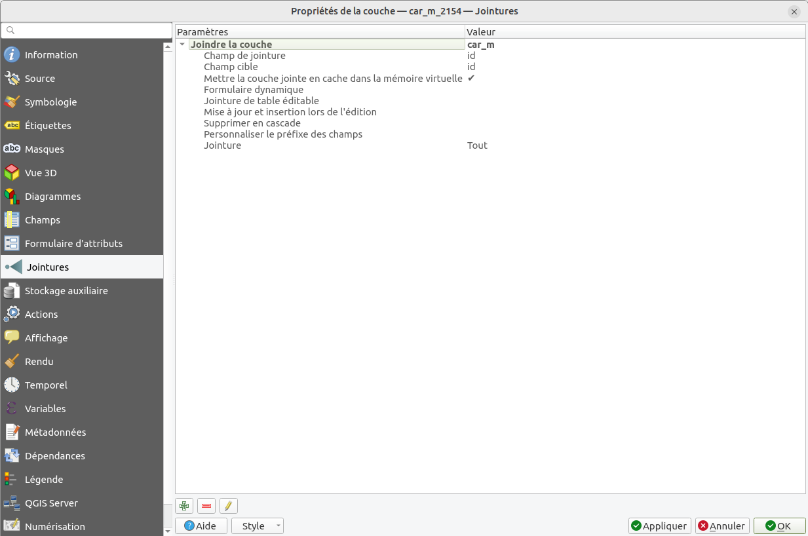
]

---

## Jointures spatiales

  
.pull-left[

Une **jointure spatiale** permet de caractériser le **positionnement relatif d'entités issues de deux couches géographiques différentes**.

Par exemple, une table des écoles pourra être jointe à une table des communes en fonction d'une **relation spatiale de type inclusion géométrique**.

Si le point de l'école se trouve dans le polygone correspondant à la commune, les attributs de la table commune deviendront des attributs de la table école. Par définition, une jointure ne peut donc être effectuée qu'entre des données géographiques et non des tables attributaires.

]

.pull-right.center.w90[

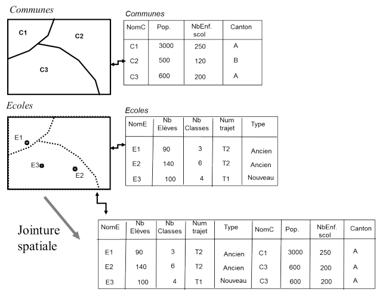
.small[Source : Université Virtuelle Environnement et Développement durable, glossaire des SIG.]
]

---

## Reprojeter un jeu de données vecteur

Dans le TD précédent nous avons vu qu'il est possible de reprojeter une couche raster pour qu'elle soit dans un autre SCR.

Il est également possible de **reprojeter une couche vecteur**  en allant dans le menu *Vecteur > Outils de gestion des données > Reprojeter une couche...*

.center.border.w70[
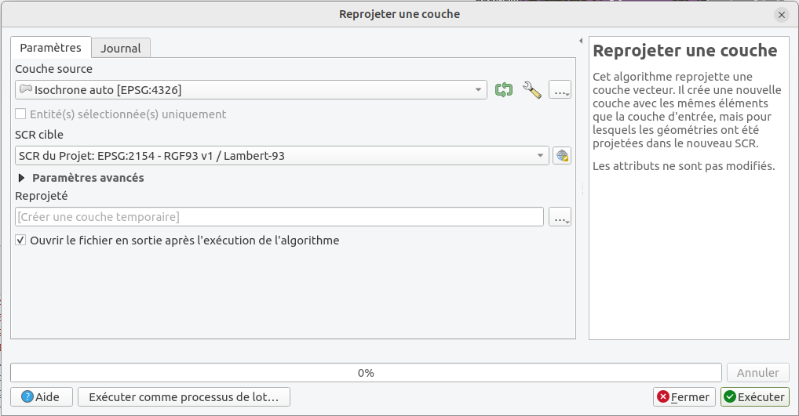
]

---

## De nouvelles données ...

Le jeux de données sur les communes contient un champ "POPULATION", toutefois, étant donné la taille des communes (parfois grande) et la taille de notre espace d'étude (relativement restreint), cela ne nous permet pas de connaître avec précision la répartition de la population dans la CA du Pays Basque.

Nous allons donc utiliser le jeu de données "**Données carroyées à 200 mètres**" de l'INSEE (https://www.insee.fr/fr/statistiques/2520034).

  

Celui-ci présente plusieurs particularités :
- il est au format *MapInfo (MIF/MID)* (il faudra ainsi importer d'une part les géométries et d'autres part les données attributaires avant de faire une *jointure attributaire* entre ces deux jeux de données),
- il n'est pas dans le SCR `EPSG 2154 - RGF93 v1 / Lambert-93` (il faudra le reprojeter dans un autre SCR avant de pouvoir l'utiliser dans des géotraitements),
- il est relativement volumineux et lourd à afficher en entier.

???

Cette base comprend 18 variables sur la structure par âge des individus, les caractéristiques des ménages (locataire/propriétaire, etc.) et les revenus au 31 décembre 2010.

Afin de respecter la règle de diffusion des données sur les revenus fiscaux des ménages, aucune information statistique (à l'exception du nombre total d'individus) n'est diffusée sur des carreaux de moins de 11 ménages. Ces carreaux de faibles effectifs sont donc regroupés en rectangles de taille plus importante et satisfaisant à cette règle des 11 ménages minimum.

Par ailleurs, un certain nombre de variables considérées comme « à risque » ont été traitées afin que tout risque de rupture de confidentialité soit évité (par ex. winsorisation des revenus fiscaux par unité de consommation)

---

## Exercice 3 - Sélection spatiale et jointure attributaire

⇒ **Téléchargez le jeu de données "Données carroyées à 200 mètres" de l'INSEE** (https://www.insee.fr/fr/statistiques/fichier/2520034/200m-carreaux-metropole.zip).

⇒ **Ajouter le fichier** `car_m.mid` (il contient les géométries), **et reprojeter ce jeu de données en `EPSG 2154 - RGF93 v1 / Lambert-93` (utilisez une couche temporaire en mémoire) puis effectuez une sélection spatiale pour ne sélectionner que les carreaux qui intersectent les communes de l'espace d'étude. Sauvegardez cette dernière couche** (en utilisant un nom explicite, par exemple `carreaux_pop.shp`)

⇒ **Effectuez une jointure attributaire entre cette nouvelle couche et les données attributaires contenues dans le fichier `car_m.dbf`** (le champ `ind_c` de cette table contient le nombre de personnes vivant dans chaque carreau).

⇒ **Choisissez un style pour vos données** (en utilisant le champ `ind_c` nouvellement joint à votre couche de carreaux) **afin d'obtenir un rendu similaire à celui ci-dessous.**

.center.w60.border[
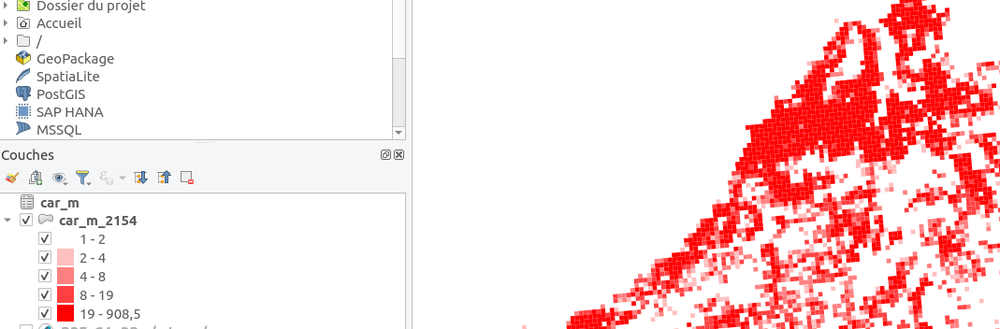
]

15 min

---

## Géotraitements, suite...

Lorsqu'il est question d'accessibilité, la distance à vol d'oiseau n'est pas la donnée la plus pertinente. En effet, **l'existence ou non d'un réseau de transport** (routier, pédestre, etc.) **influe fortement sur l'accessibilité des lieux**.

 

.left-column-33[

Il existe différentes **API de calcul d'itinéraire** open source (OSRM, Valhalla, GraphHopper, etc.) ou non (Google Direction, etc.).

Ces API permettent généralement de calculer *un* itinéraire (chemin à suivre, temps de parcours, distance, etc.) ou des matrices de temps de parcours (entre un ensemble de points et un autre ensemble de point).

]

.center.w30[
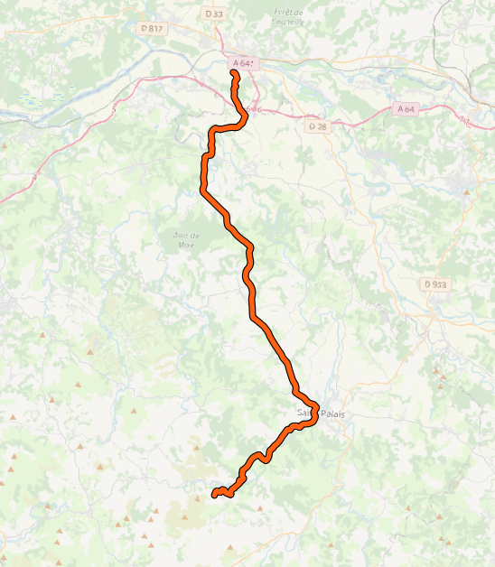
]

---

## Géotraitements, suite...

Lorsqu'il est question d'accessibilité, la distance à vol d'oiseau n'est pas la donnée la plus pertinente. En effet, **l'existence ou non d'un réseau de transport** (routier, pédestre, etc.) **influe fortement sur l'accessibilité des lieux**.

 

.left-column-33[

Il existe différentes **API de calcul d'itinéraire** open source (OSRM, Valhalla, GraphHopper, etc.) ou non (Google Direction, etc.).

Ces API permettent généralement de calculer *un* itinéraire (chemin à suivre, temps de parcours, distance, etc.) ou des matrices de temps de parcours (entre un ensemble de points et un autre ensemble de point).

]

.right-column-66.center.w80.border[
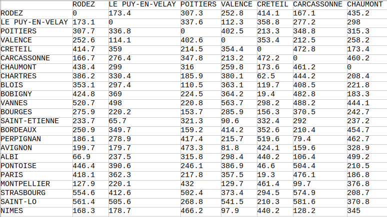
]

---

## Géotraitements, suite...

Lorsqu'il est question d'accessibilité, la distance à vol d'oiseau n'est pas la donnée la plus pertinente. En effet, **l'existence ou non d'un réseau de transport** (routier, pédestre, etc.) **influe fortement sur l'accessibilité des lieux**.

 

.left-column-33[

Il existe différentes **API de calcul d'itinéraire** open source (OSRM, Valhalla, GraphHopper, etc.) ou non (Google Direction, etc.).

Ces API permettent généralement de calculer *un* itinéraire (chemin à suivre, temps de parcours, distance, etc.) ou des matrices de temps de parcours (entre un ensemble de points et un autre ensemble de point).

Ces API permettent également souvent de calculer des **isochrones d'accessibilité** à partir d'un lieu...

]

.center.w45[
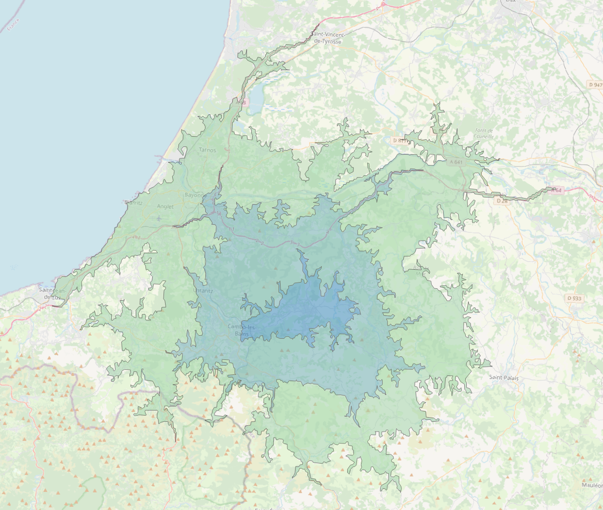
]

---

## Exercice 4 - Temps de transport routier et accessibilité des skateparks

⇒ **Installez l'extension nommée `Valhalla`**.

 

⇒ **Testez la possibilité de créer une route et de créer des isochrones** (avec un seul pas de temps, avec plusieurs pas de temps, etc.).

 

⇒ **Après avoir tester ces possibilités, pensez-vous qu'il soit possible de créer une couche correspondant à la zone accessible en moins de 30min de n'importe quel skatepark ?** Et/ou quelle difficulté rencontrez-vous ?

15 min

---

## Pourquoi utiliser PyQGIS ?

QGIS dispose d’une puissante interface de programmation qui permet d’étendre ses fonctionnalités notamment en écrivant des scripts pour automatiser les traitements. Cette API Python est généralement désignée sous le nom de **PyQGIS**.

Même en étant débutant, en apprenant un peu de Python, l’interface de programmation de QGIS permet d’être plus productif :

- **Automatiser des actions répétitives**

- **Effectuer des traitements spécifiques** (non disponibles dans les outils, pourtant nombreux, de QGIS)

- **Garder une trace (sous forme de code) d'une chaîne de traitement complexe** (d'autres solutions, sans écrire de code, existent toutefois)

- **Développer ses propre plugins**

- **Développer ses propres applications utilisant les composants de QGIS** (canvas de la carte, gestionnaire de couche, etc.)

 

.medium[
Documentation de l'API PyQGIS : https://qgis.org/pyqgis/3.28/

Quelques exemples de traitements possibles avec PyQGIS : https://mthh.github.io/TP_PythonQGIS/
]

---

## Présentation de la console Python

QGIS fournit une console interactive Python. Elle peut être ouverte depuis le menu *Extension > Console* Python, en pressant <kbd>CTRL</kbd> + <kbd>ALT</kbd> + <kbd>P</kbd> ou en appuyant sur l’icône qui lui est dédiée.

Il est également possible d'ouvrir un éditeur de code (rudimentaire par rapport aux IDE habituels) pour écrire vos scripts, les sauvegarder, etc.

.center.border.w100[
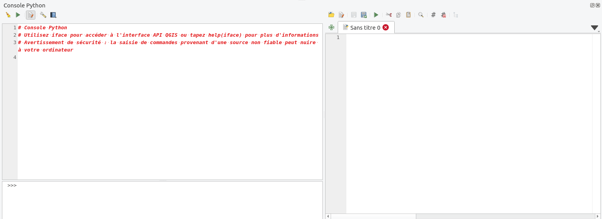
]

---

## Exercice 5 - Temps de transport routier et accessibilité des skateparks (suite)

⇒ **Téléchargez le script Python suivant** ([ici](./script.py)) **et le lancez le dans la console Python**. N'hésitez pas à changer le nom de la couche ciblée si elle ne s'appelle pas `BPE_CA_PB_skatepark` chez vous. Vous devriez voir une liste de coordonnées s'imprimer dans la console : il s'agit des coordonnées géographique de chacun des skateparks.

.medium[
Dans notre cas, l'utilisation de PyQGIS permet de facilement reprojeter une couche, sans l'ajouter à la carte, et d'extraire les coordonnées de ses points pour les formater dans le format attendu par le plugin Valhalla.
]

 

⇒ **Utilisez les informations imprimées dans la console pour alimenter les points à utiliser pour créer un isochrone dans Valhalla : vous voulez créez une zone accessible autour de chaque skatepark en 30 min** (attention à ne cliquer qu'une seule fois sur "Apply" puis à attendre que les résultats arrivent, cela peut prendre quelques dizaines de secondes).

 

Faites les manipulations nécessaires pour répondre aux questions suivantes :

⇒ **Quelle sont les communes** (toujours en utilisant le centroide) **qui peuvent accéder à un skatepark en 30min ?**

⇒ **Quel stock de population de la CA du Pays Basque a accès à un skatepark en moins de 30min ?**

30 min

---

## Pour aller plus loin...

Si vous voulez **découvrir les possibilités offertes par PyQGIS** vous pouvez essayer d'adapter le TP suivant à un des cours d'eau de la zone d'étude pour afficher un graphique de son profil longitudinal :
 

https://mthh.github.io/TP_PythonQGIS/ex4.html  (et https://mthh.github.io/TP_PythonQGIS/solutions/s_ex4.html)

.center.w40[

]