class: center, middle, first

# Module SIG
# Séance 4 - Cours - Représenter l'information géographique

### LP Programmation Avancée

 
 

.author[
    Matthieu Viry (UAR RIATE / CNRS)
     
    🖂 <a href="maito:matthieu.viry@cnrs.fr">matthieu.viry@cnrs.fr</a>
]

.date[
     
    07/02/2023
]

---

class: section-change

# Introduction

---
## Deux grandes catégories de cartes

Il existe une **multitude de constructions cartographiques** : *cartes météo, géologique, de végétation, climatique, touristique, d'inventaire, routière, animée, interactive*.... **Deux grandes catégories se dégagent** :

.pull-left.center[
### Cartes topographiques

.w100[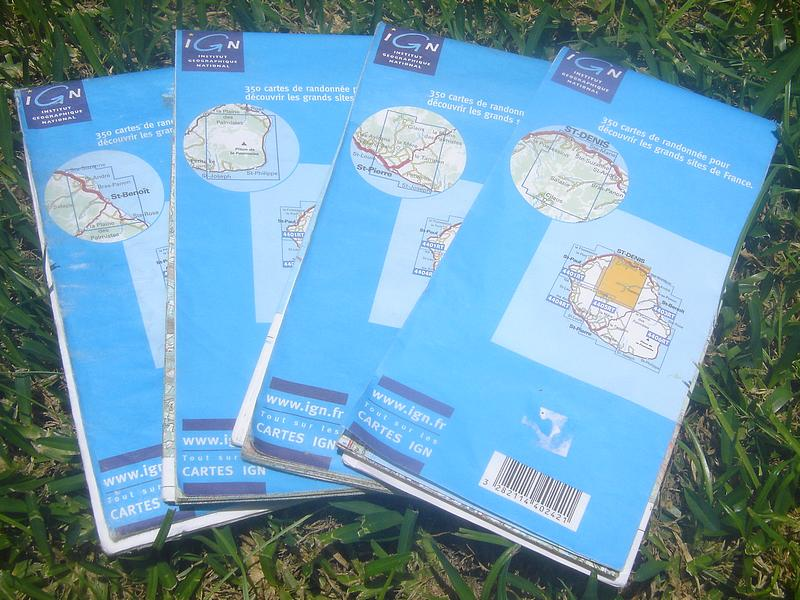]
]

.pull-right.center[
### Cartes thématiques
.w90[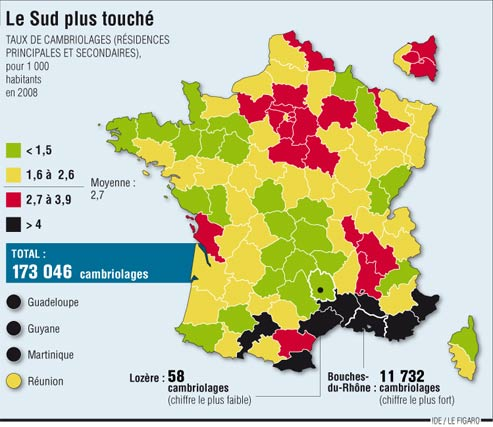]
]

---
## La cartographie

**La cartographie est une discipline**, composante de la géomatique, qui rassemble les opérations ayant pour objet l'élaboration, la rédaction et l'édition de cartes. Elle repose sur des bases  **scientifiques**, **techniques** et **artistiques**.

.pull-left[
### Une science 
Les **bases sont mathématiques** (systèmes géodésiques de référence et projections). 

La chaîne de traitement qu'elle mobilise en amont nécessite **précision et fiabilité**.    

La représentation cartographique est régie par des **règles de sémiologie graphique** et un **socle méthodologique fort**. 

L'objet de la carte donne lieu à de nombreuses recherches : efficacité communicationnelle, cartographie animée, optimisation de la représentation des flux...

]

.pull-right[
.w100[]
]

---

## La cartographie

**La cartographie est une discipline**, composante de la géomatique, qui rassemble les opérations ayant pour objet l'élaboration, la rédaction et l'édition de cartes. Elle repose sur des bases  **scientifiques**, **techniques** et **artistiques**.

.pull-left[
### Une technique
Sa maîtrise repose sur l'acquisition de données, la préparation et le traitement de données, et la mobilisation de **logiciels** (tableurs, SIG, cartographie thématique, voire construction et requête de bases de données spatiales).
spécialisés... 
]

.pull-right[
.w100[]
]

---

## La cartographie

**La cartographie est une discipline**, composante de la géomatique, qui rassemble les opérations ayant pour objet l'élaboration, la rédaction et l'édition de cartes. Elle repose sur des bases  **scientifiques**, **techniques** et **artistiques**.

.pull-left[
### Un art  

Recherche d'**esthétisme**, de la **&quot;touche graphique&quot;** et d'une certaine **mise en perspective** de phénomènes spatialisés.

Comme pour tout objet de communication, le graphisme d'une carte à un impact sur la transmission du message.

   
.leg-fig[
Frontière États-Unis / Mexique : une fracture humaine et économique (Source : [Rekacewicz, 2009](https://www.monde-diplomatique.fr/cartes/maquiladoras))

]
]

.pull-right[
.w95[]
]
---

## La cartographie

**La cartographie est une discipline**, composante de la géomatique, qui rassemble les opérations ayant pour objet l'élaboration, la rédaction et l'édition de cartes. Elle repose sur des bases  **scientifiques**, **techniques** et **artistiques**.

.pull-left[
### Un art  

Recherche d'**esthétisme**, de la **&quot;touche graphique&quot;** et d'une certaine **mise en perspective** de phénomènes spatialisés.

Comme pour tout objet de communication, le graphisme d'une carte à un impact sur la transmission du message.

   

]

.pull-right[
.w95[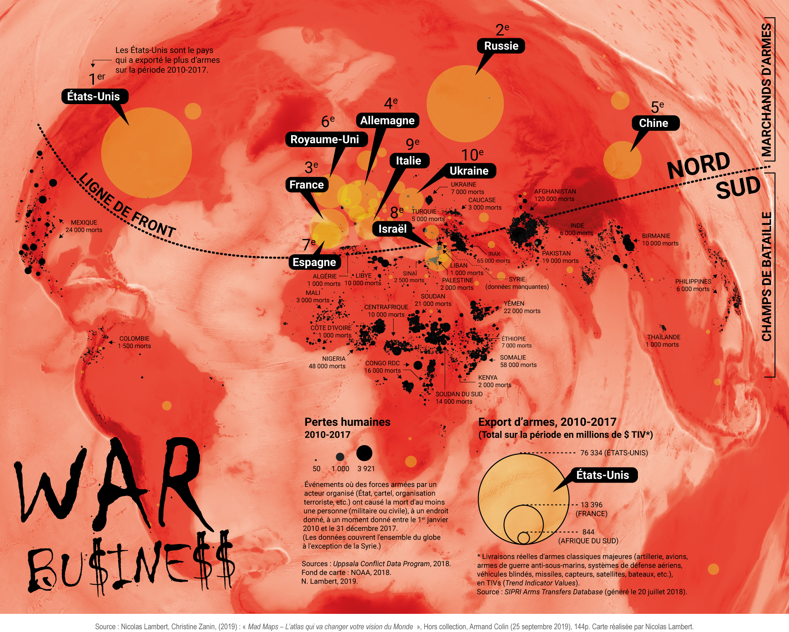]

.leg-fig[
War Business 
(Source : [Lambert, Zainin, Mad Maps, 2019](http://www.cartolycee.net/spip.php?article152))
]
]
---

.pull-left[
## Un public, un objectif et un message

On distingue souvent ([Jégou, 2021](https://rawcdn.githack.com/transcarto/presentation_images/20d4feabc6bf2c18278efa0457b302e2e7b39419/Pr%C3%A9sentation_LJegou.html#1)) :

- La carte **performative**, qui vise à faire réagir, de propagande, rhétorique (vision *post-moderniste*, B. Harley). 
.w95[]
.leg-fig[
Region of Rat-Bitten Babies (Source : Bunge W., Bordessa R., 1975, the Canadian Alternative)
]
]

.pull-right[

.w95[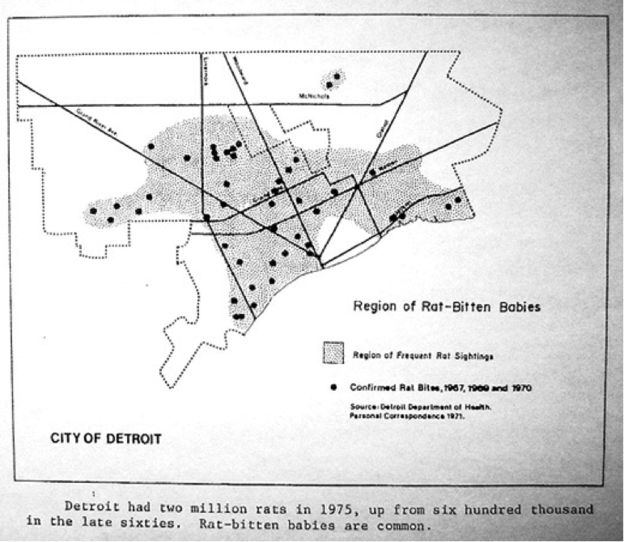]
.leg-fig[
Geography of Revolution (Source : Bunge W., 1971)
Pour en savoir plus, allez [ici](https://jacket2.org/commentary/william-bunge-dgei-radical-cartography) 
]
]

---

.pull-left[
## Un public, un objectif et un message

On distingue souvent ([Jégou, 2021](https://rawcdn.githack.com/transcarto/presentation_images/20d4feabc6bf2c18278efa0457b302e2e7b39419/Pr%C3%A9sentation_LJegou.html#1)) :

- La carte **performative**, qui vise à faire réagir, de propagande, rhétorique (vision *post-moderniste*, B. Harley). 

- La carte comme **outil d'analyse**, moyen de faire découvrir des phénomènes et des relations, dans un processus d'exploration et de transformation (paradigme *analytique*, W. Tobler et K. Clarke)

.w95[]
.leg-fig.center[Three presentations of geographical analysis and modeling (Source : [Tobler, 1993](http://www.lukatela.com/hrvoje/papers/tobler93.html))]
]

.pull-right[
.center[
.w95[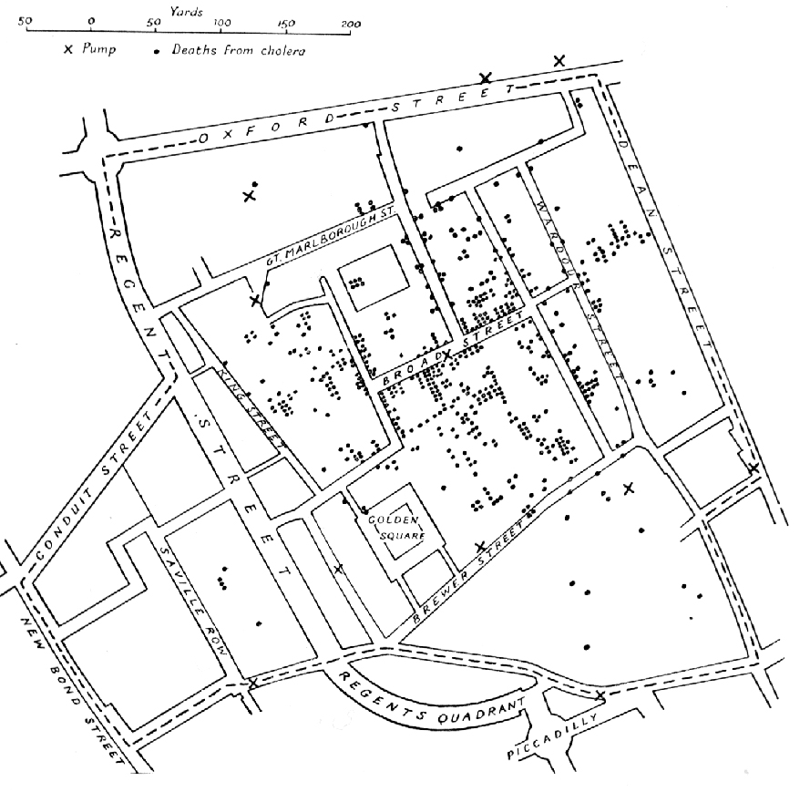]
.leg-fig[Adaptation de la carte de John Snow sur l'épidémie de choléra à Londres en 1854 (Source : Gilbert W, 1958)
]]
]

---

.pull-left[
## Un public, un objectif et un message

On distingue souvent ([Jégou, 2021](https://rawcdn.githack.com/transcarto/presentation_images/20d4feabc6bf2c18278efa0457b302e2e7b39419/Pr%C3%A9sentation_LJegou.html#1)) :

- La carte **performative**, qui vise à faire réagir, de propagande, rhétorique (vision *post-moderniste*, B. Harley). 

- La carte comme **outil d'analyse**, moyen de faire découvrir des phénomènes et des relations, dans un processus d'exploration et de transformation (paradigme *analytique*, W. Tobler et K. Clarke)

- La carte comme **outil d'organisation** d'une communauté sur son territoire (paradigme *participatif*, M. Noucher, T. Jolliveau).

]

.pull-right[
.center[
     
.w95[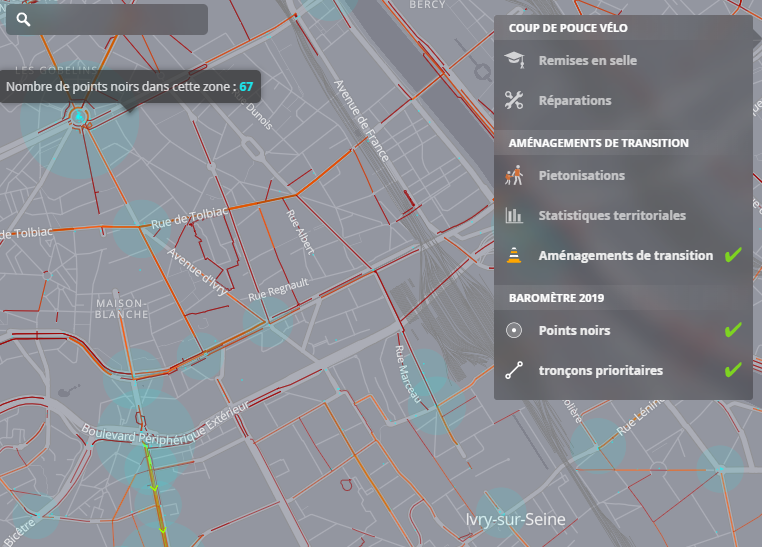]
.medium[
Cartographie des points noirs et des tronçons à aménager de façon prioritaire (18 300 contributions). Source : [Fédération des Usagers de la Bicyclette, 2019](https://carto.parlons-velo.fr/)
]
]
]

---

.pull-left[
## Un public, un objectif et un message

On distingue souvent ([Jégou, 2021](https://rawcdn.githack.com/transcarto/presentation_images/20d4feabc6bf2c18278efa0457b302e2e7b39419/Pr%C3%A9sentation_LJegou.html#1)) :

- La carte comme **outil de visualisation de son propre territoire et de navigation**, adaptée et centrée sur sa position actuelle (paradigme de l'*égo-cartographie*) 

  
.leg-fig[
Google Timeline,  votre mobilité restituée par Google depuis... 2009 !
]
]

.pull-right[

.center[
.w95[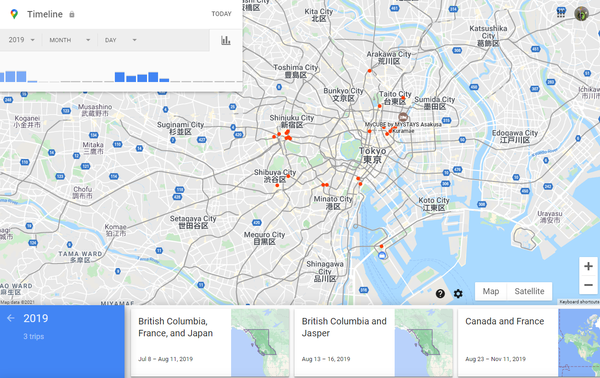]
.w95[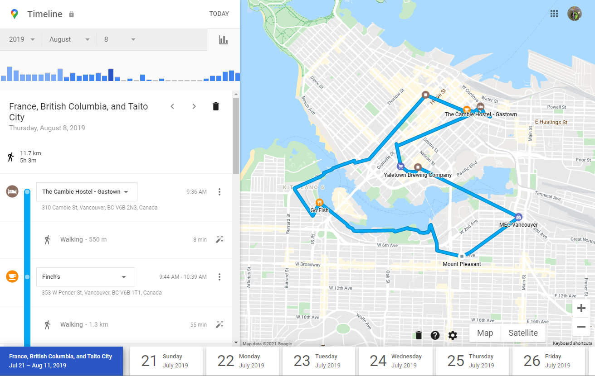]
]
]

---
 
.pull-left[
## Un public, un objectif et un message

On distingue souvent ([Jégou, 2021](https://rawcdn.githack.com/transcarto/presentation_images/20d4feabc6bf2c18278efa0457b302e2e7b39419/Pr%C3%A9sentation_LJegou.html#1)) :

- La carte comme **outil de visualisation de son propre territoire et de navigation**, adaptée et centrée sur sa position actuelle (paradigme de l'*égo-cartographie*) 

- La carte **décorative**, à valeur esthétique, historique, émotive.
]

.pull-right[
.center[
     
.w95[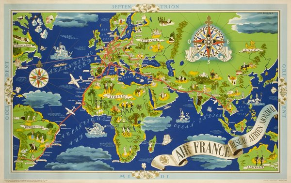]
.leg-fig[
Affiche publicitaire Air France (Source : Boucher, 1937)
]]]

---

 
.pull-left[
## Un public, un objectif et un message

On distingue souvent ([Jégou, 2021](https://rawcdn.githack.com/transcarto/presentation_images/20d4feabc6bf2c18278efa0457b302e2e7b39419/Pr%C3%A9sentation_LJegou.html#1)) :

- La carte comme **outil de visualisation de son propre territoire et de navigation**, adaptée et centrée sur sa position actuelle (paradigme de l'*égo-cartographie*) 

- La carte **décorative**, à valeur esthétique, historique, émotive.

- La carte **imaginaire ou poétique**, qui vise à faire réfléchir.
]

.pull-right[
.center[
     
.w75[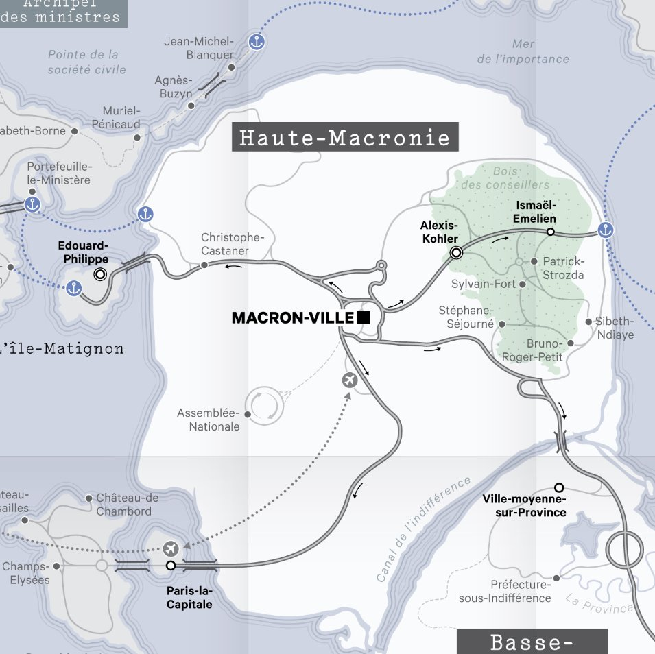]
.leg-fig[
Source : [Grandin, 2018](https://twitter.com/julesgrandin/status/987316047874273282)
]]]

---

## Prendre du recul

Le contexte de production compte, pour mieux appréhender les questions de lisibilité et de transmission du message cartographique (Jégou, 2021) :

- Quel ***rôle*** j'endosse quand je produis une carte ?

- À quoi doit ***servir*** ma carte, comment doit-on y réagir ? 

- À quel ***public*** est-elle destinée ? Que doit-il savoir pour la comprendre ?

- Au final, comment ***fonctionne*** ma carte ? 

 

Efficacité et lisibilité de la carte (communication) + design (message véhiculé par la carte)

Cela influence directement l'**emprise géographique** et la **projection utilisée**, la **généralisation du fond de carte**, les choix graphiques (fontes, couleurs, format de diffusion), le vocabulaire utilisé. 

---

## La carte thématique / statistique

Un outil d’**analyse**, d’**aide à la décision** et de **communication** largement apprécié et utilisé.

Un document graphique basé sur la **communication par les signes**. Elle relève du **langage visuel** et nécessite d'être appréhendée comme tel.

.w50.center[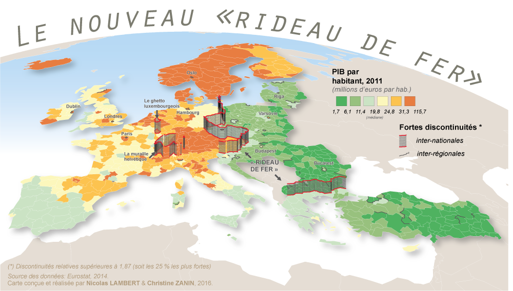]

.leg-fig[
Source : [Lambert, 2021](https://neocarto.hypotheses.org/3239)]

Nécessité d'**identifier les moyens graphiques** qui permettent de passer d'une **information statistique spatialisée** à une **représentation graphique efficace**.

---

class: section-change

# Les fondamentaux

---

## Les fondamentaux

   

L’efficacité graphique d'une carte thématique peut s'évaluer par le **temps nécessaire** pour mémoriser correctement l’information qui veut être transmise. Pour cela, il ne faut jamais oublier : 
  
1 - L’**objectif** de la carte et le **public visé**

2 - Les **codes** et **conventions** de la cartographie

3 - Les règles de la **sémiologie graphique**

---
.pull-left[

## Codes et conventions cartographiques : Aider à la mise en contexte
### Des éléments obligatoires

.medium[
- Un **titre** 
- Une **date**
- Une **légende**  
- Une **source** (un **auteur**)
- Une **échelle** 
- Une **orientation** (optionnel).  
 ]

### Couleurs et projections

.medium[
Le choix des couleurs n'est pas anodin (considérations thématiques, statistiques, culturelles, etc.)

L'usage de la projection doit être maîtrisé. Il est parfois soumise à des normes, comme vu lors des précédentes séances.
]
]
 
.pull-right[
.w80.center[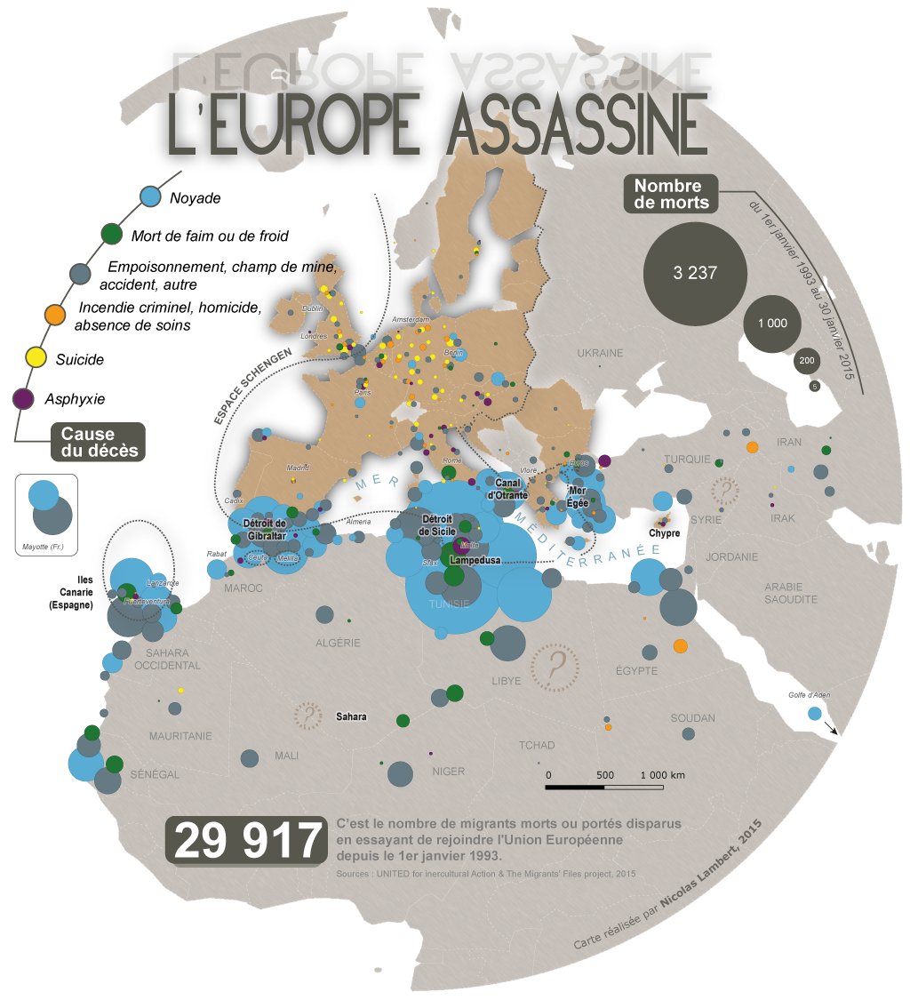]
 .leg-fig[
 Des morts par milliers aux portes de l'Europe (Source : [Lambert, 2015](https://neocarto.hypotheses.org/1370))
 ]
 ]

---

## Les Règles de la sémiologie graphique

.center[
Le **langage cartographique** a été théorisé par **Jacques Bertin** (1967).

.pull-left[
.w70.center[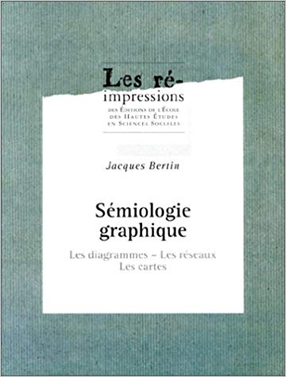]
]

.pull-right[
.w50.center[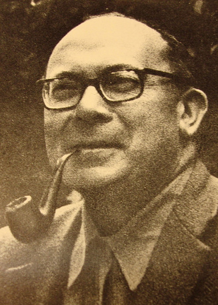]
]

« ***La graphique*** *utilise les propriétés de l'image visuelle pour faire apparaître les* ***relations*** *de* ***différence***, ***d'ordre*** et de ***proportionnalité*** entre les données ».
]

---

## Sémiologie graphique : implantation et variable visuelle

.pull-left[
**L'implantation** est la transcription graphique d'un objet géographique (points, lignes ou polygones).

Trois types d'implantation existent : **ponctuel**, **linéaire** et **zonale** (surfacique).

 

**Les variables visuelles** (ou rétiniennes) sont les **moyens graphiques pour retranscrire visuellement une information**.

Elles possèdent des propriétés différentes qui permettent de **différencier**, **ordonner** et **mesurer les données**.
]

.pull-right[
.center[
.w90.center[]
   
.w60.center[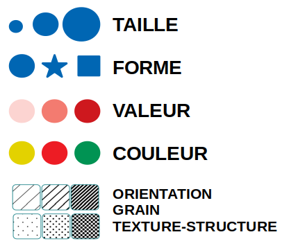]

.leg-fig[Source : Manuel de cartographie : principes, méthodes, applications (Lambert, Zanin, 2016)]
]
]
---

## Les variables visuelles (6 + 1)

.pull-left[
.w90.center[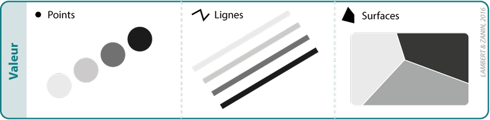]
.w90.center[]
.w90.center[]
.w90.center[]
]

.pull-right[
.w90.center[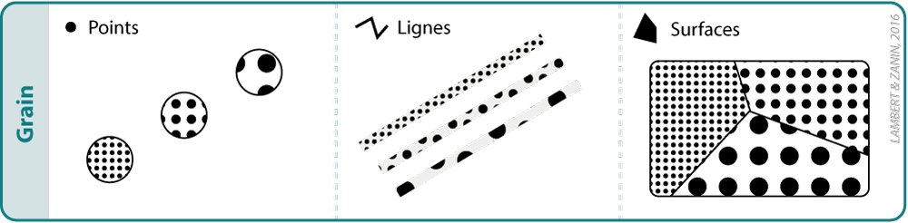]
.w90.center[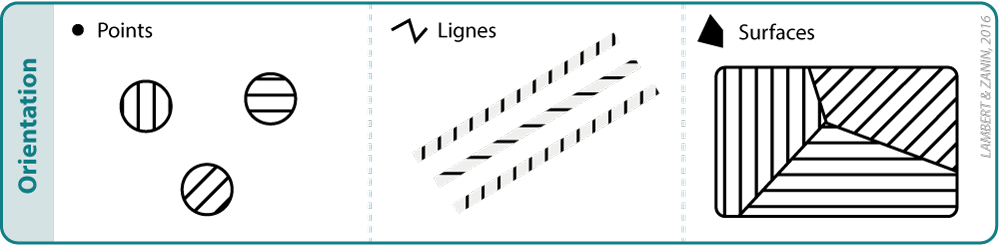]
.w90.center[]

.leg-fig.center[Source : Manuel de cartographie : principes, méthodes, applications (Lambert, Zanin, 2016)]
]

---

## Les 3 propriétés des variables visuelles

.center[
.w70.center[]

.leg-fig[Source : Manuel de cartographie : principes, méthodes, applications (Lambert, Zanin, 2016)]
]

---
## Les types de données qui caractérisent les objets géographiques

.center[
.w90.center[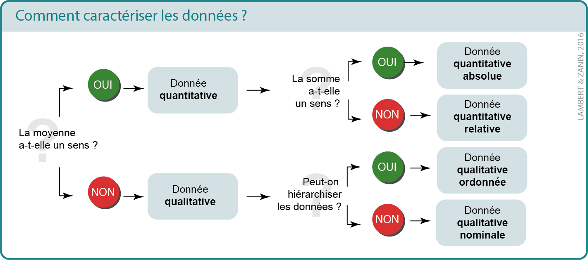]
.leg-fig[Source : Manuel de cartographie : principes, méthodes, applications (Lambert, Zanin, 2016)]
]

---

## Le lien entre données statistiques et variables visuelles

.center[
.w80.center[]

.leg-fig[Source : Manuel de cartographie : principes, méthodes, applications (Lambert, Zanin, 2016)
]
]

---
## Le lien entre données statistiques et variables visuelles

.center[
.w70.center[]
]

---

## Une erreur à éviter absolument ! 

.center[
.w90.center[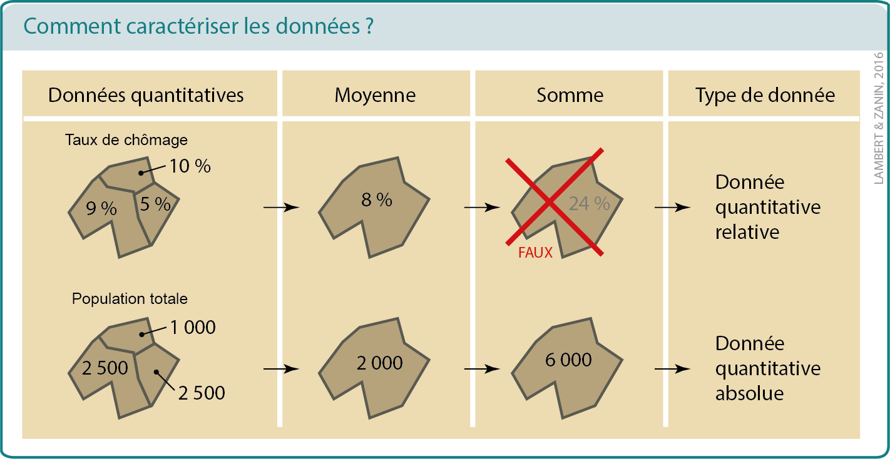]

.leg-fig[Source : Manuel de cartographie : principes, méthodes, applications (Lambert, Zanin, 2016)]
]

---

## Données, variables visuelles et implantation

.center[

.w70.center[]

.leg-fig[Source : Manuel de cartographie : principes, méthodes, applications (Lambert, Zanin, 2016)]
]

---

class: section-change

# Représenter des données quantitatives absolues

---

## Représenter des données quantitatives absolues

**UNE SEULE variable visuelle** peut être utilisée pour représenter des données **quantitatives absolues** : la variable visuelle **TAILLE**.

 

.center[
.w80.center[]

.leg-fig[Source : Manuel de cartographie : principes, méthodes, applications (Lambert, Zanin, 2016)]

 

C'est la seule variable visuelle qui permet de retranscrire correctement ***des différences***, ***une hiérarchie*** et surtout ***la proportionnalité***.
]

---

## Données quantitatives absolues - *implantation ponctuelle*

.center[

.w55.center[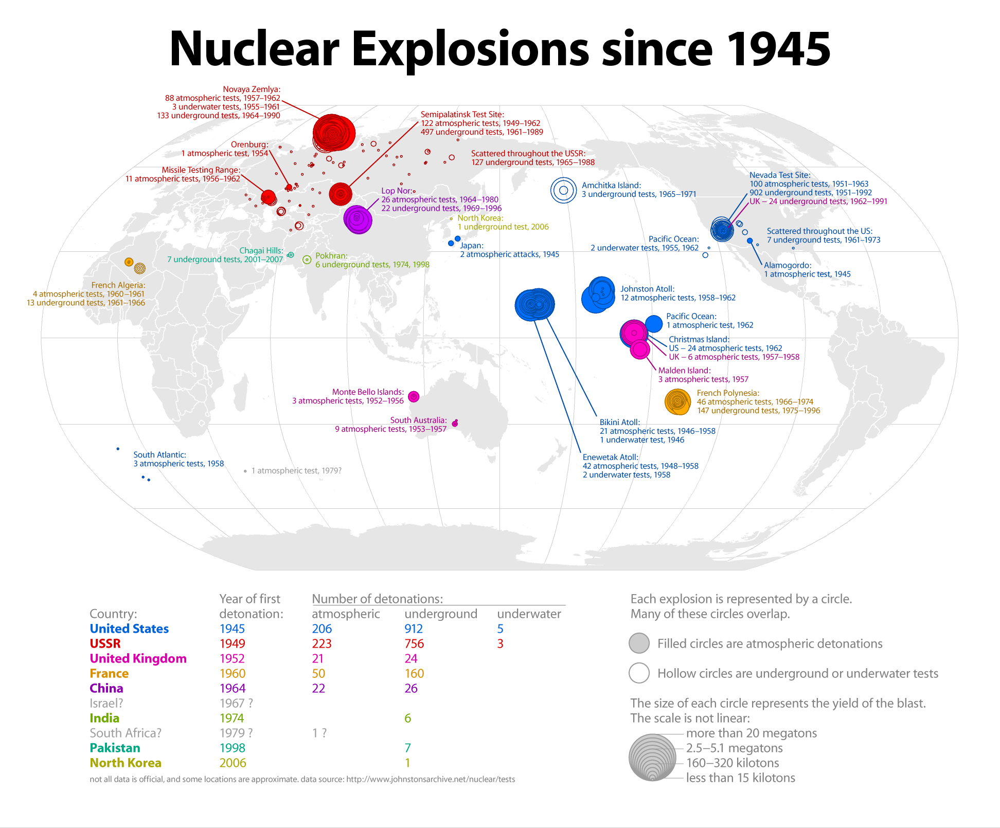]

.leg-fig[
Source : [Bill Rankin, 2007](http://www.radicalcartography.net/)
]
]

---

## Données quantitatives absolues - *implantation linéaire*

.center[
.w65.center[]

.leg-fig[
Source : Les émigrants du Globe (Minard, 1858)
]
]

---

## Données quantitatives absolues - *implantation linéaire*

.center[
.pull-left[
.w80.center[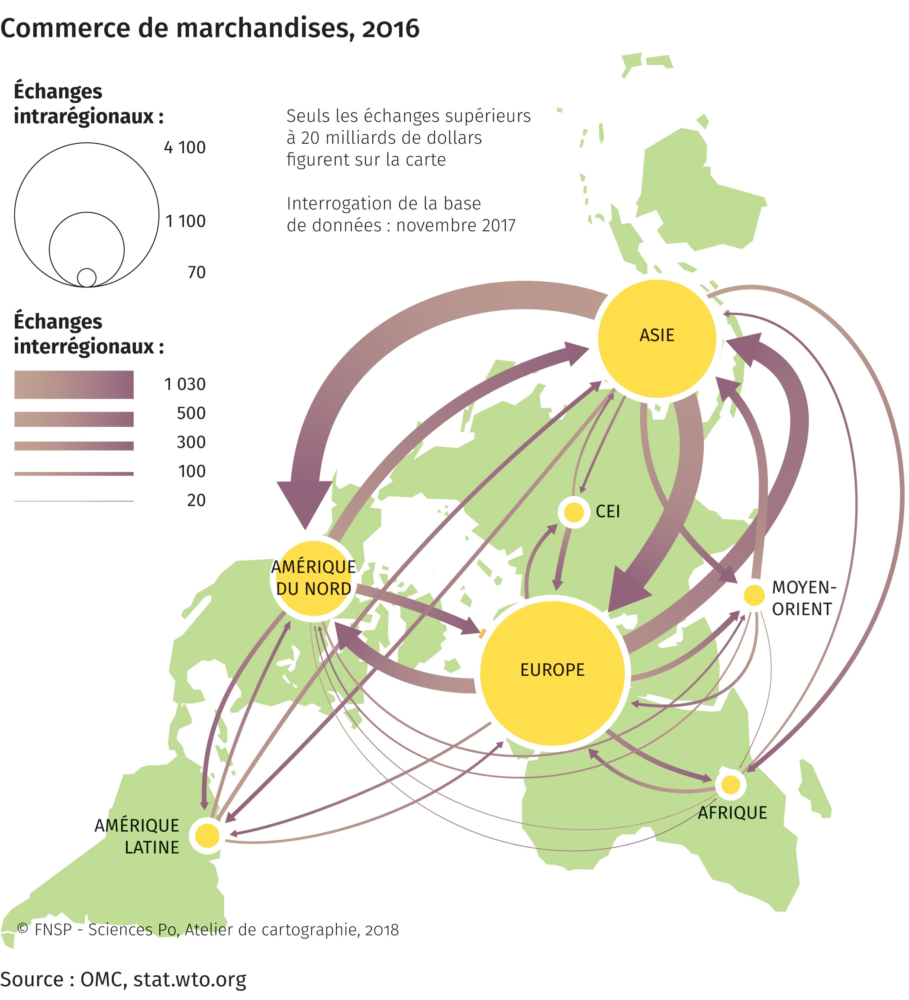]
.leg-fig[
Source : [Atlas de l'espace mondial contemporain](https://espace-mondial-atlas.sciencespo.fr/fr/), Sciences Po, Atelier de cartographie, 2018]
]

.pull-right[
.w65.center[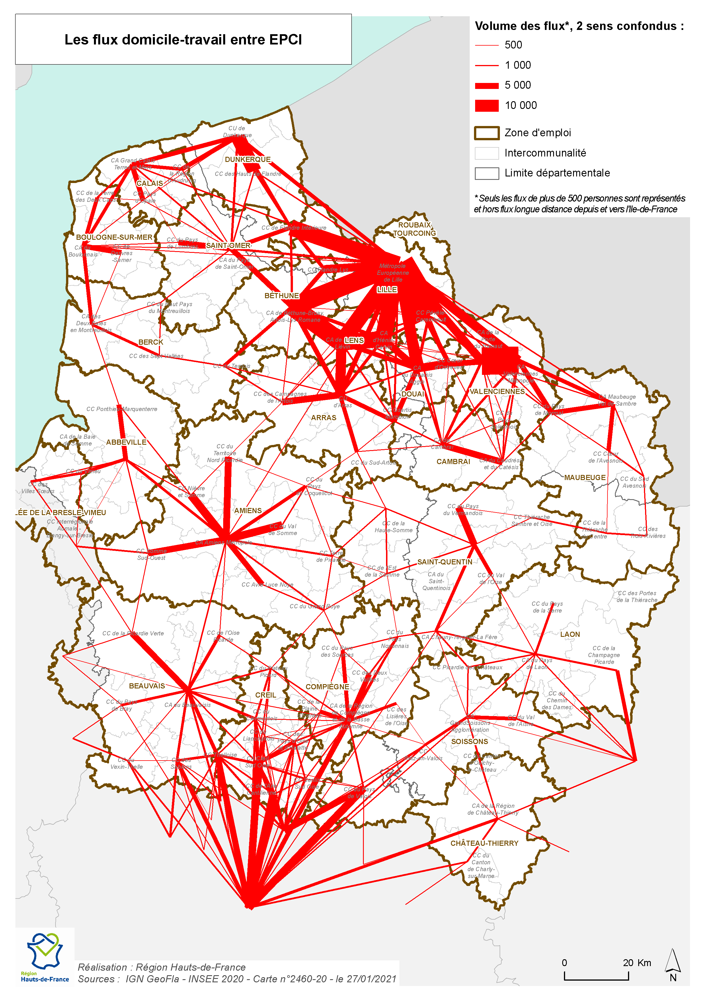]
.leg-fig[
Source : [Cartothèque de la région Hauts-de-France, 2021](https://cartes.hautsdefrance.fr/)
]
]
]

---

## Données quantitatives absolues - *implantation surfacique*

.left-column[
     

Pas de solution graphique simple pour utiliser la variable visuelle taille sur une surface. Il est généralement nécessaire d'extraire un figuré ponctuel de l'implantation surfacique

Les logiciels de cartographie placent généralement le figuré ponctuel sur le barycentre des polygones (centroide).
]

.right-column[

.center[
.w90.center[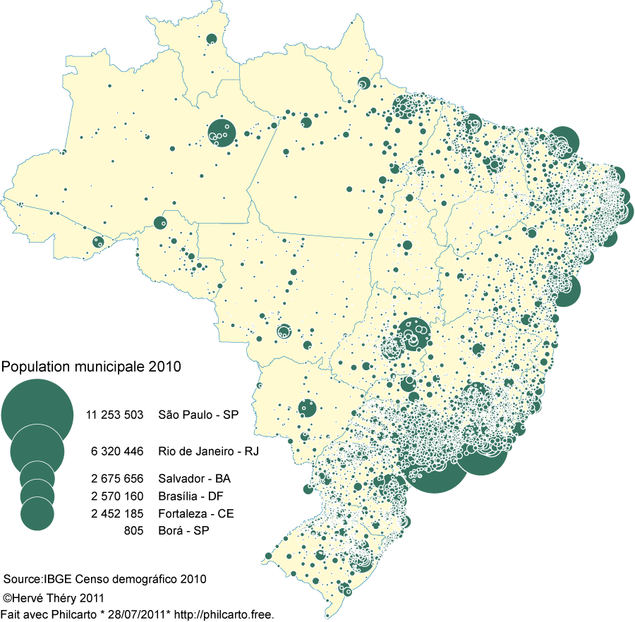]

.leg-fig[
La population brésilienne par municipio en 2010,

(Source : [Théry, 2011](https://braises.hypotheses.org/76))
]
]
]

---

## Données quantitatives absolues - *implantation surfacique*

.center[
.w45.center[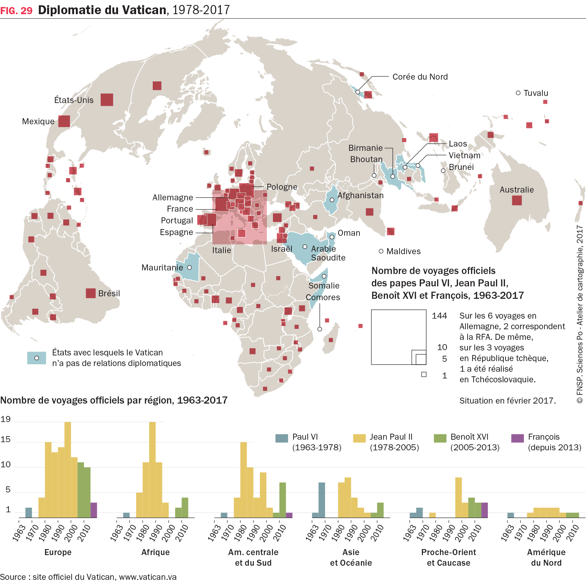]
 
.leg-fig[
Source : [L'enjeu mondial](https://www.sciencespo.fr/enjeumondial/fr/media/diplomatie-du-vatican-1978-2017.html), Sciences Po, 2017
]
]
---

## Données quantitatives absolues - *variante : carte en proportion*

.center[ 

.w60.center[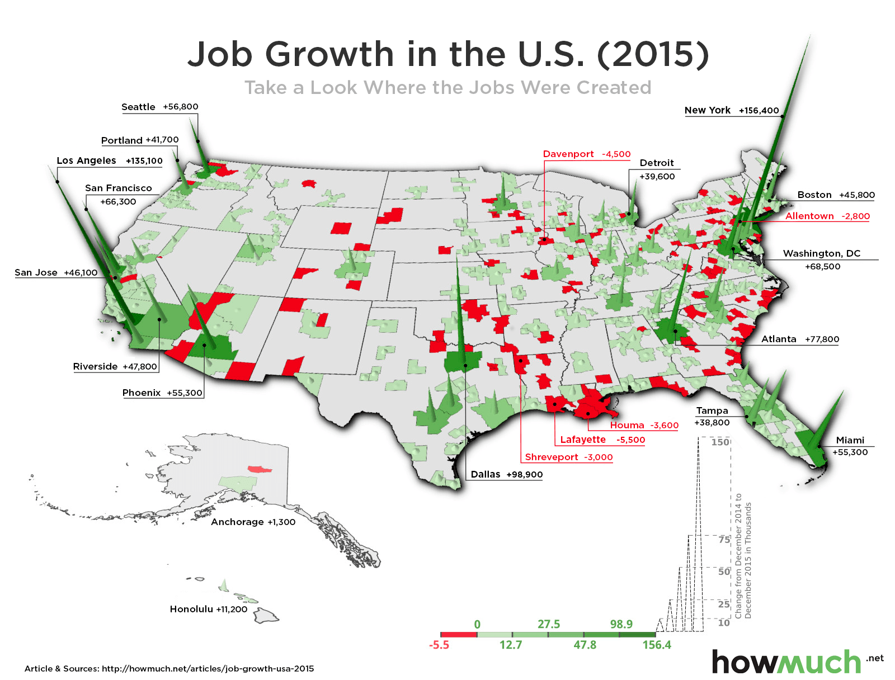]

.leg-fig[
Source : [HowMuch.net](https://twitter.com/howmuch_net/status/702133591241834496), 2016
]
]

---

## Données quantitatives absolues - *variante : diagramme et camembert*

.center[
.pull-left[

.w90.center[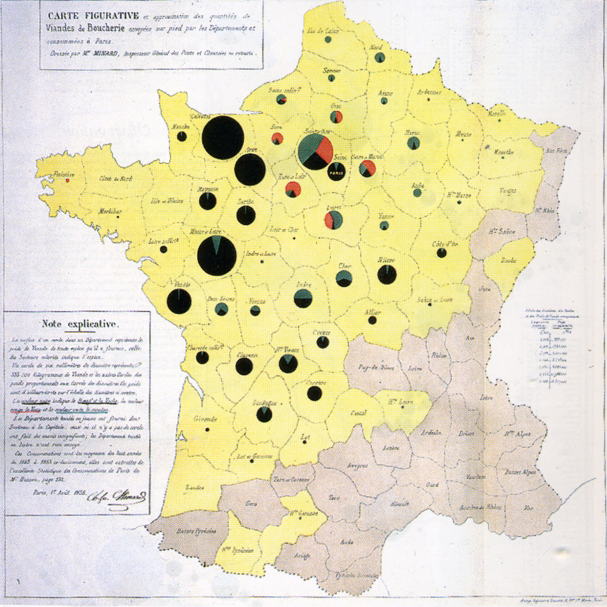]

.leg-fig[
Source : Carte figurative des viandes de boucherie, Minard, 1858
]
]

.pull-right[
.w100.center[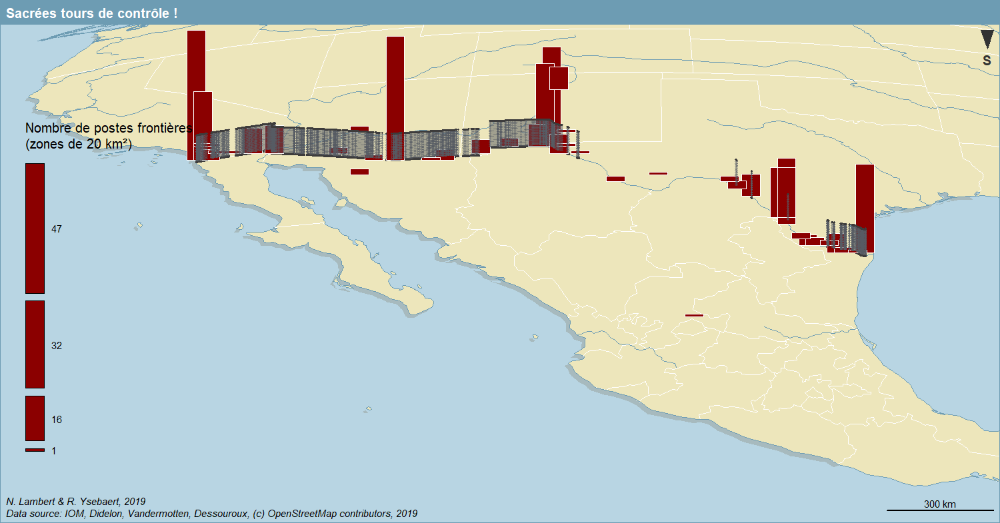]
.leg-fig[
Source : [Faire des cartes avec R, la frontière États-Unis - Mexique](https://riatelab.github.io/mexusaborder), Lambert, Ysebaert, 2019
]
]   
]

---

## Données quantitatives absolues - *variante : cartogramme / anamorphose*

.center[
.pull-left[

.w85.center[]

.leg-fig[
Source : [Courrier International, 2019](https://www.courrierinternational.com/article/2013/10/10/allo-l-afrique)
]
]

.pull-right[
.w85.center[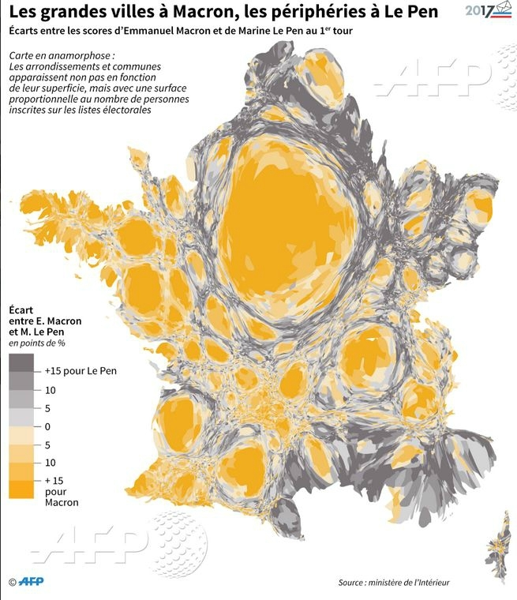]
.leg-fig[
Source : [Agence France Presse, 2017](https://twitter.com/afpfr/status/856951951656988672)
]
]
]

---

## Données quantitatives absolues - *variante : carte en point*

.center[
.pull-left[
.w70.center[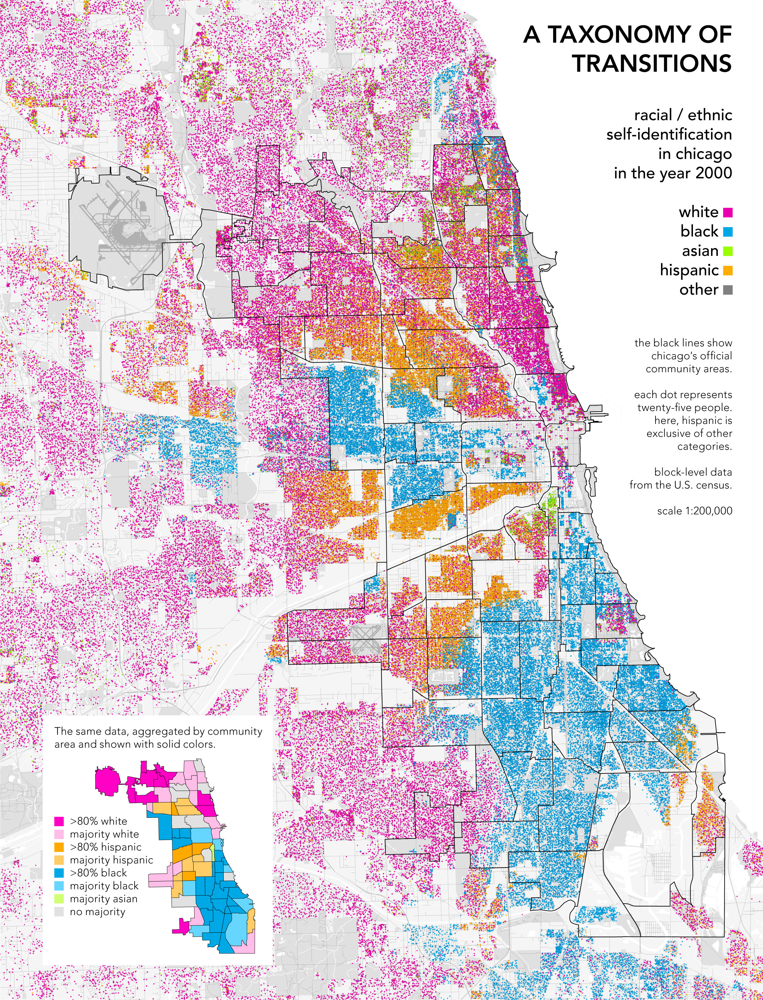]
.leg-fig[
Source : [Bill Rankin, 2009](http://www.radicalcartography.net/index.html?chicagodots)
]
]

.pull-right[
.w95.center[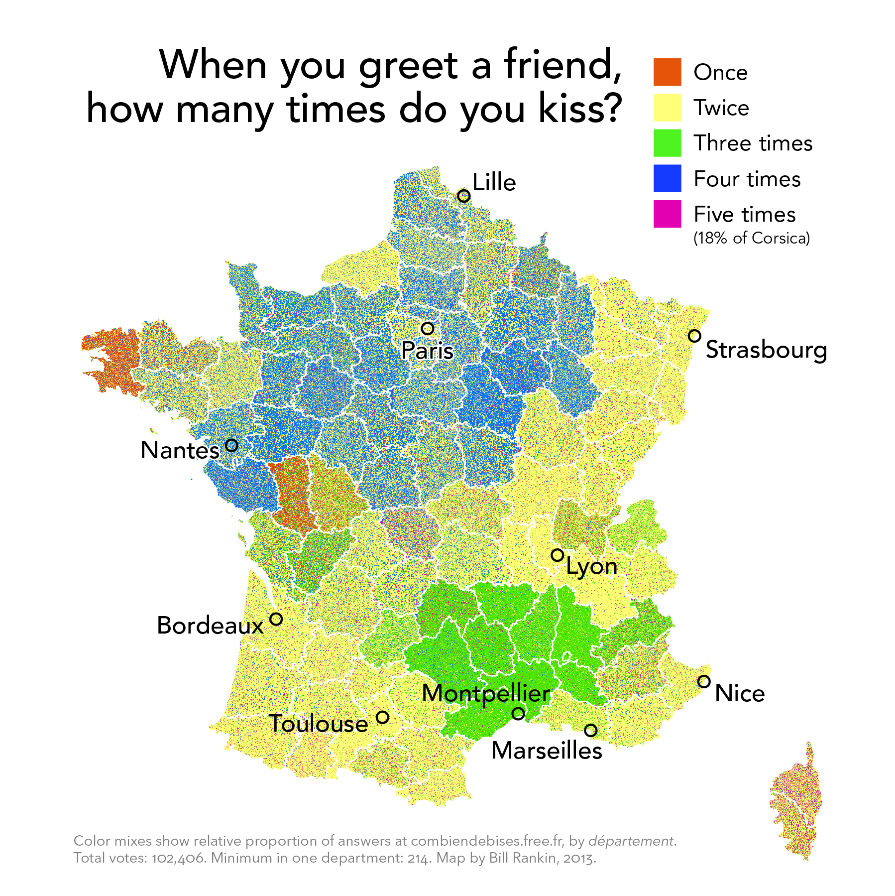]
.leg-fig[
Source : [Bill Rankin, 2013](http://www.radicalcartography.net/index.html?france)
]
]
]

---

class: section-change

# Représenter des données quantitatives relatives

---

## Représenter des données quantitatives relatives

Les variables visuelles adaptées à la représentation de données quantitatives relatives sont la **VALEUR**, la **COULEUR** (intensité/dégradé), le **GRAIN** ou la **TEXTURE-STRUCTURE**.
Elles retranscrivent visuellement **différences** et **hiérarchies**.

.pull-left[
.w100.center[]
.w100.center[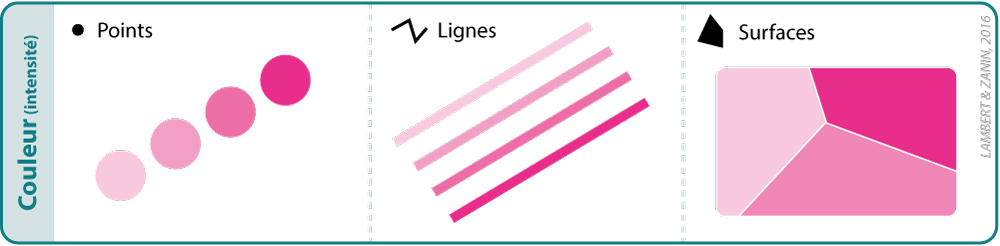]
.w100.center[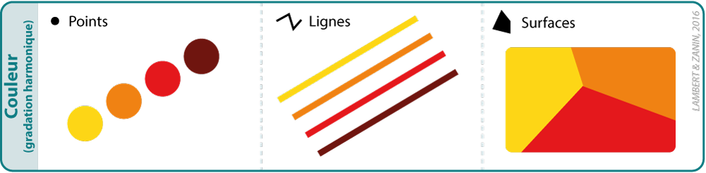]

]

.pull-right[
.w100.center[]

.w100.center[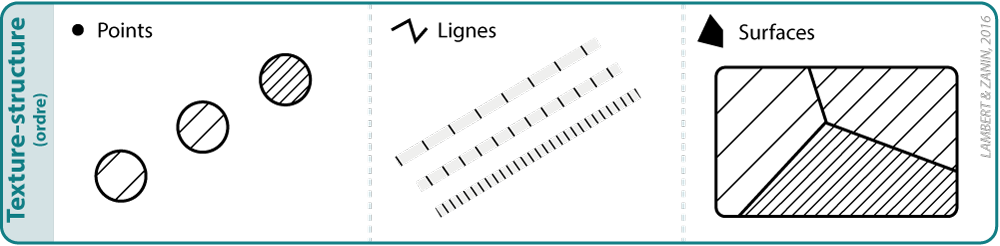]

.center[
**➔ N'utilisez jamais la TAILLE**
]

]

---

## Discrétiser des données quantitatives relatives

.pull-left[

Un préalable à la représentation consiste à convertir la variable aux caractéristiques continues en variable discrète : **discrétisation**.

Plusieurs méthodes existent. Leur choix dépend :

- de la **forme de la distribution statistique**
- des **valeurs centrales** (moyenne, médiane) 
- des **paramètres de dispersion statistique** (écart-type)         

Ce choix à un **impact important** sur l'information représentée...

   
.leg-fig[Source : Manuel de cartographie : principes, méthodes, applications (Lambert, Zanin, 2016)] &gt;&gt;
]

.pull-right[
.center[
.w100[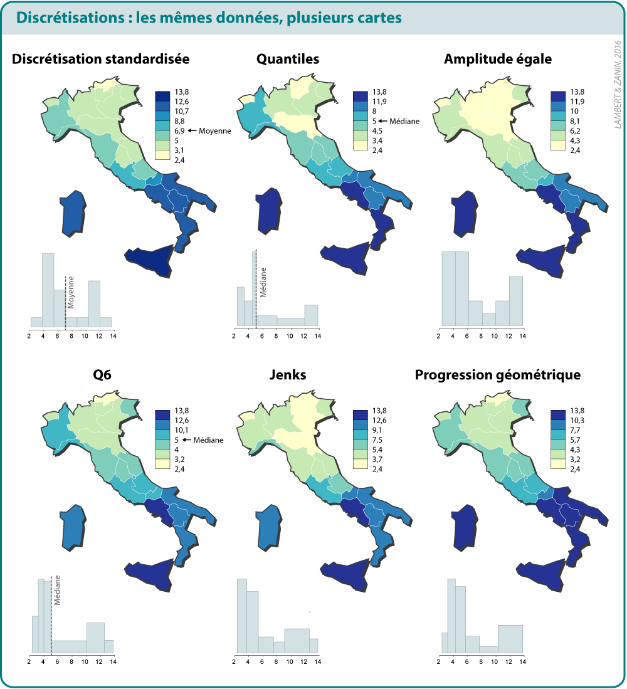]
]
]

---
.left-column[
## Données quantitatives relatives - *implantation surfacique*

Conçue par Charles Dupin et réalisée par le lithographe Jean-Baptiste Collon, cette carte est considérée comme une des toutes premières cartes thématiques jamais réalisée. Elle représente le taux d'élèves masculins scolarisés par département. 
]

.right-column[
.center[
.w90[]

.leg-fig[
Carte figurative de l'instruction populaire de France (Source : Dupin, 1826)
]
]
]

---

## Données quantitatives relatives - *implantation surfacique*

.center[

.w60[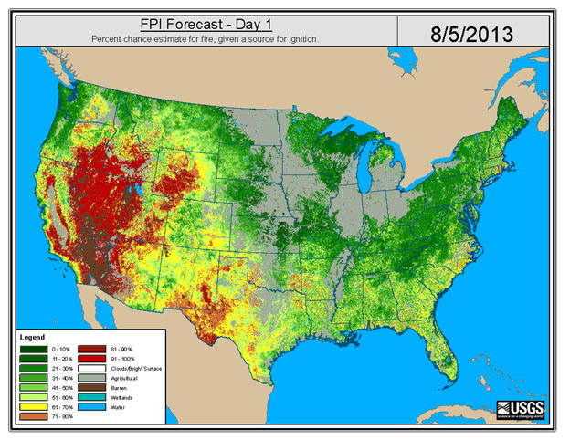]

.leg-fig[
Potentiel d'incendie (Source : [USGS, 2013](https://www.usgs.gov/ecosystems/lcsp/fire-danger-forecast/legacy-fire-danger-forecast-products))
]
]

---

## Données quantitatives relatives - *implantation surfacique*

.center[

.w70[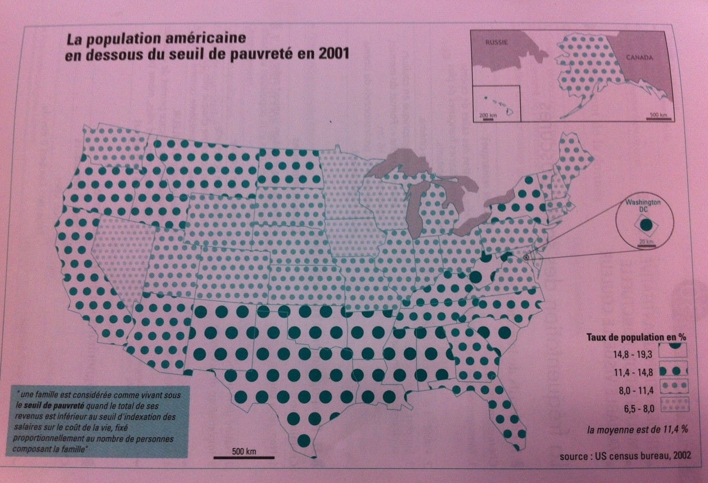]

]

---

## Données quantitatives relatives - *implantation surfacique*

.center[

.pull-left[

.w85.center[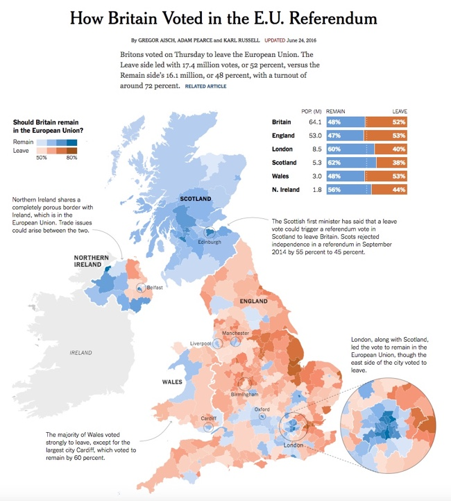]

.leg-fig[
Source : [New York Times, 2016](https://www.nytimes.com/interactive/2016/06/24/world/europe/how-britain-voted-brexit-referendum.html)
]
]

.pull-right[

.w70.center[]

.leg-fig[
Source : [Chroniques Cartographiques, 2015](https://www.chroniques-cartographiques.fr/2015/08/carte-de-france-de-la-couverture-mobile-4g.html)
]
]
]

---

## Données quantitatives relatives - *implantation ponctuelle*

.center[

.w65.center[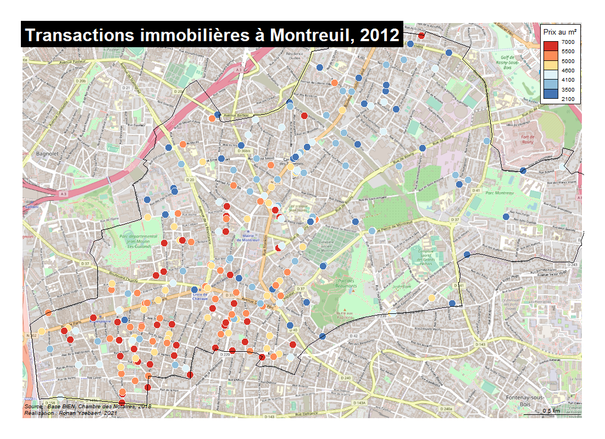]

.leg-fig[
Source : Ronan Ysebaert (2021)
]

]

---

## Données quantitatives relatives - *implantation linéaire*

.center[
.w65.center[]
.leg-fig[
High Speed rail in Europe, 2016 (Source : [Wikipedia](https://en.wikipedia.org/wiki/High-speed_rail_in_Europe))
]
]

---

class: section-change

# Représenter des données qualitatives

---

## Représenter des données qualitatives

.pull-left[

.center[
**Qualitative NOMINALE**

.w85[]
.w85[]
.w85[]

Exprime la **différence** entre les modalités
]
]

.pull-right[
.center[
**Qualitative ORDINALE**

.w85[]
.w85[]
.w85[]
.w85[]

Exprime l'**ordre** et la **hiérarchie** entre les modalités.
]
]

---

## Donnée qualitative nominale - *implantation ponctuelle*

.center[
.pull-left[
.w110[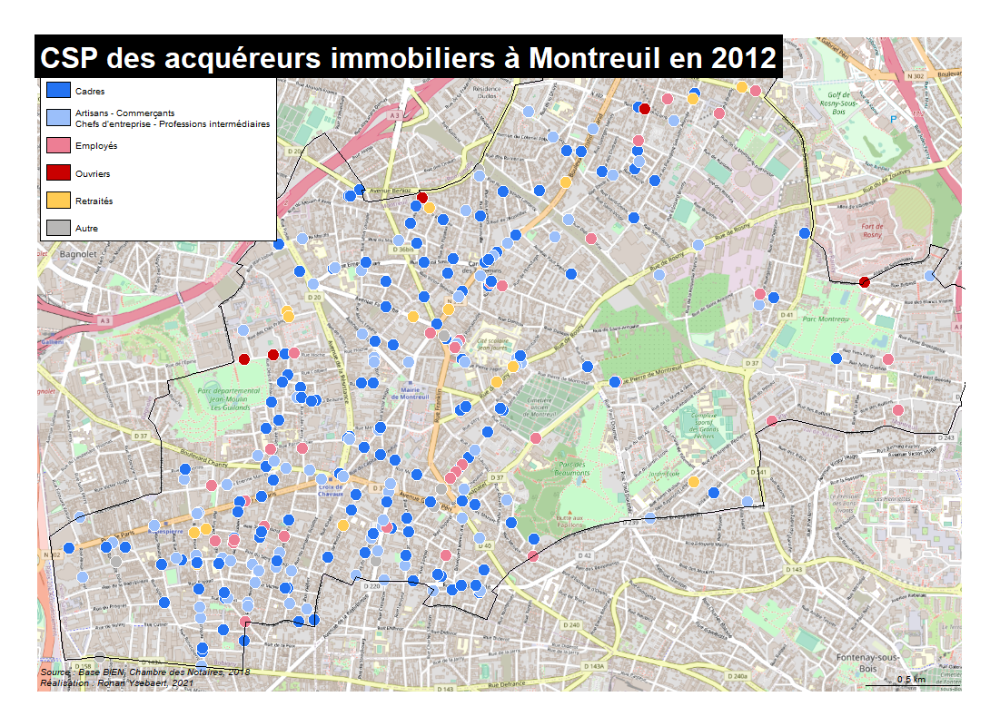]
]
.pull-right[
.w110[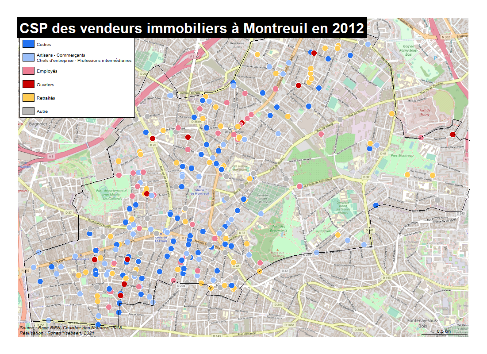]
]

.leg-fig[
Source : Ronan Ysebaert (2021)
]
]

---
## Donnée qualitative nominale - *implantation ponctuelle*

.center[
.w60[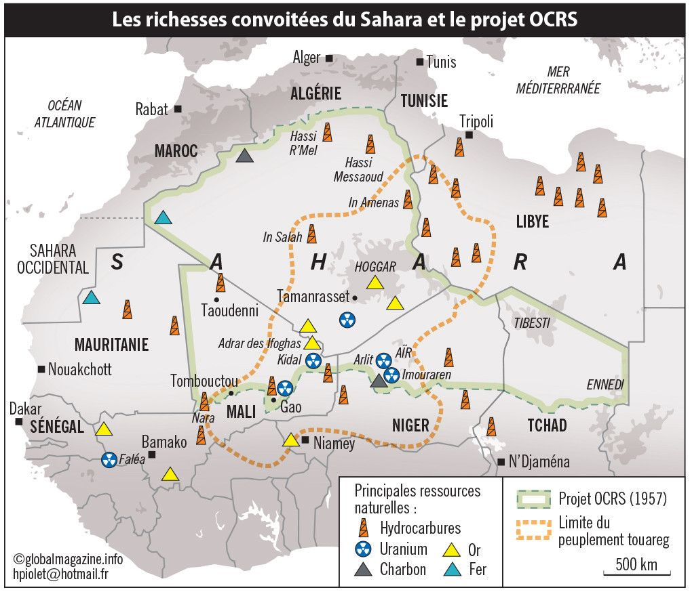]
]

---

## Donnée qualitative nominale - *implantation ponctuelle*

.center[
.w70[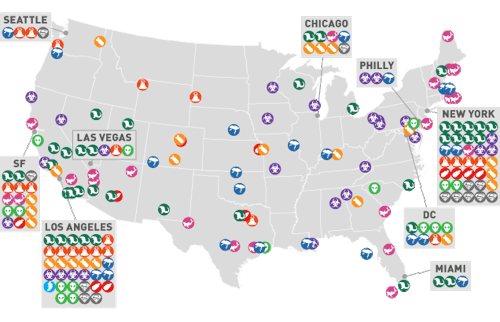]

.leg-fig[
How Hollywood destroyed America (Source : [theconcourse.deadspin.com, 2014](https://deadspin.com/map-how-hollywood-has-destroyed-america-1542969906))
]
]

---
## Donnée qualitative nominale - *implantation linéaire*

.center[
.w50[]
]

---

## Donnée qualitative nominale - *implantation surfacique*

.center[
.w80[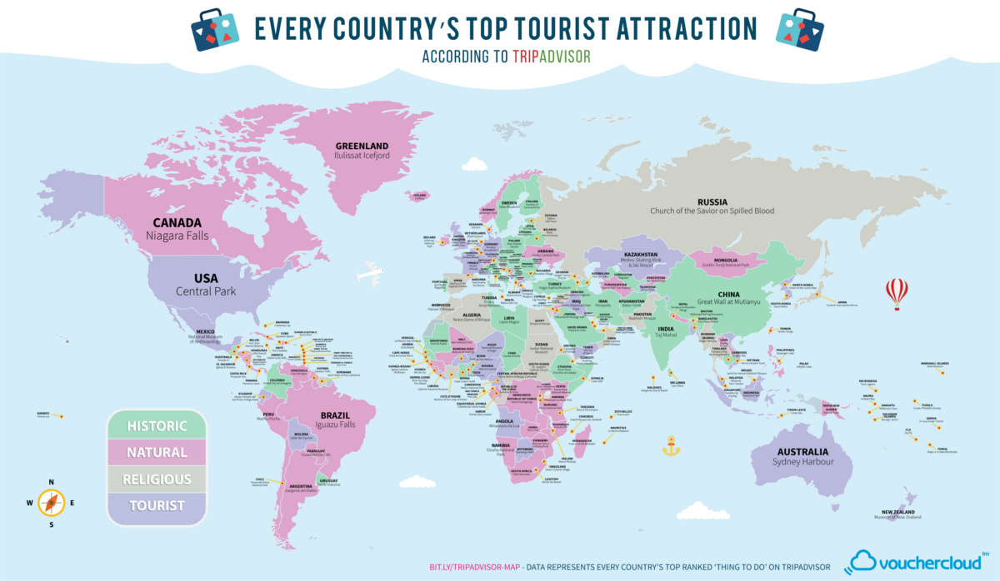]
]

---

## Donnée qualitative nominale - *implantation surfacique*

.center[
.w45[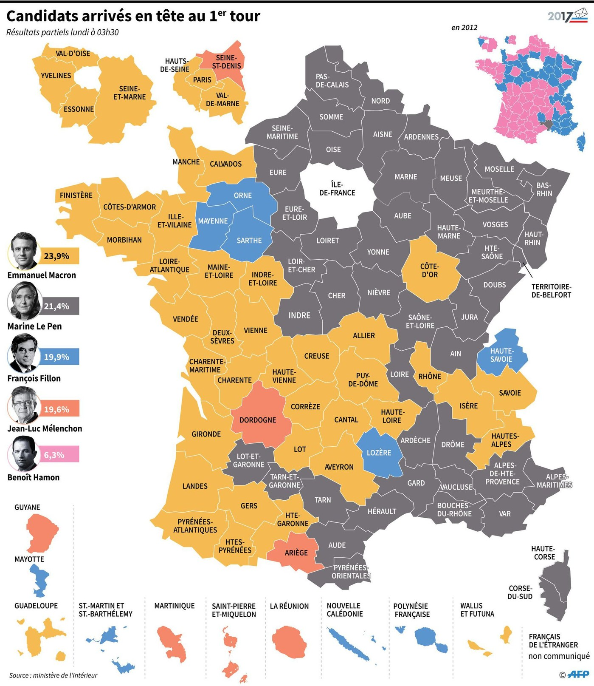]
]

---

## Donnée qualitative ordinale - *implantation ponctuelle*

.center[
.w45[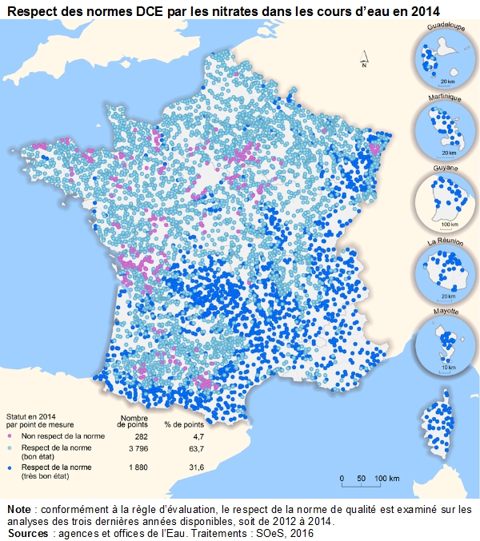]
.leg-fig[
Source : [Ministère de la transition écologique et solidaire](http://www.donnees.statistiques.developpement-durable.gouv.fr/lesessentiels/essentiels/nitrates-dce-cours-eau.html)
]
]

---

## Donnée qualitative ordinale - *implantation linéaire*

.center[
.w30[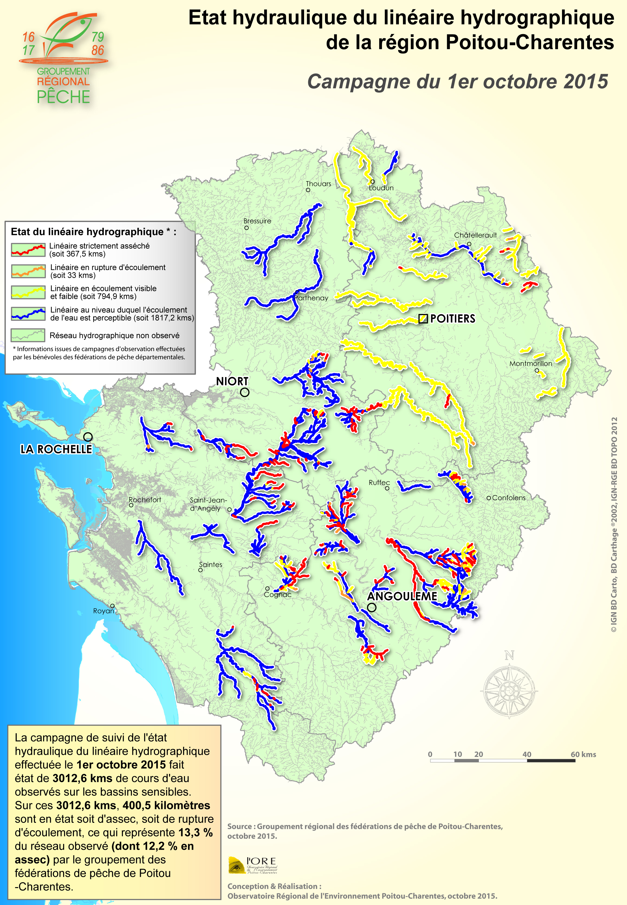]
.leg-fig[
Source : [Ministère de la transition écologique et solidaire](http://www.donnees.statistiques.developpement-durable.gouv.fr/lesessentiels/essentiels/nitrates-dce-cours-eau.html)
]
]

---

## Donnée qualitative ordinale - *implantation linéaire*
.center[
.w70[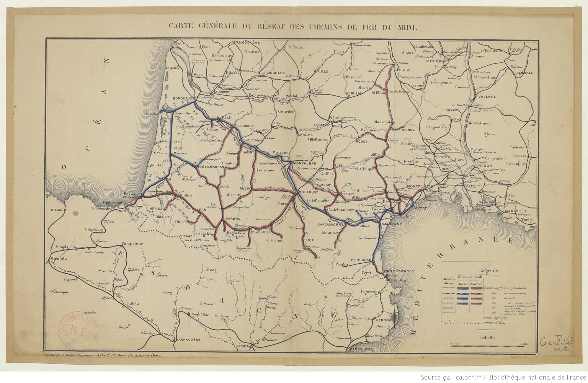]
.leg-fig[
Source : Regnier et Dourdet, 1882 
]
]

---

## Donnée qualitative ordinale - *implantation surfacique*

.center[
.w60[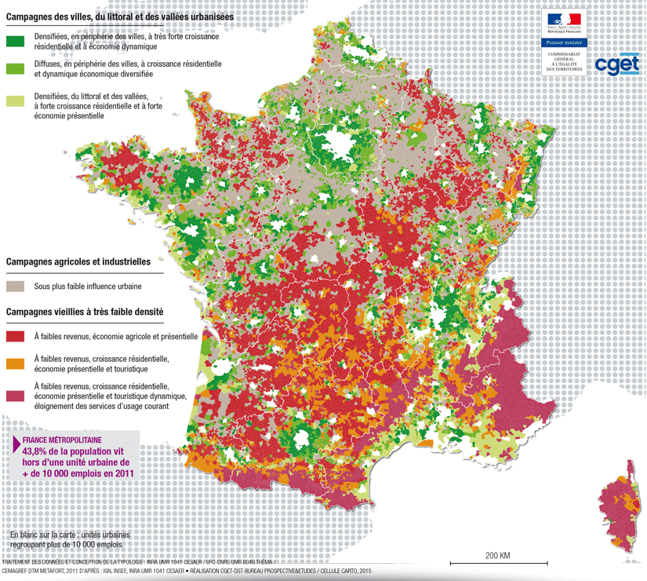]
]

---
## Donnée qualitative ordinale - *implantation surfacique*

.center[
.w40[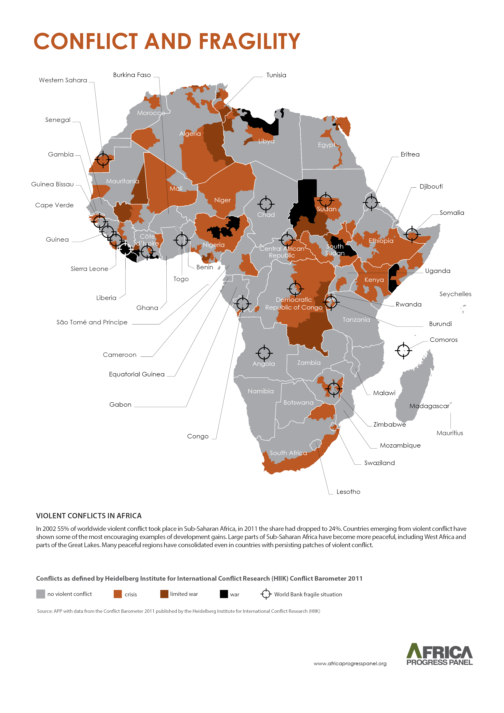]
]

---

## Composition de données qualitatives en cartographie d'édition
 
.center[
.w75[]
]

---

class: section-change

# [#Map failed](https://twitter.com/i/events/1100700507620950017?lang=en)

---

## Cherchez l'erreur...

.center[
.w60[]
]

---

## Cherchez l'erreur...

.pull-left[
.w90[]
]

--

.pull-right[
.w90[]
]

---

## Cherchez l'erreur...

.center[
.w100[]
]

---

## Cherchez l'erreur...

.center[
.w45[]
]

---

## Cherchez l'erreur...

.center[
.w80[]
]

---

## Cherchez l'erreur...

.center[
.w50[]
]

---

## Cherchez l'erreur...

.center[
.w60[]
]
