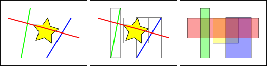
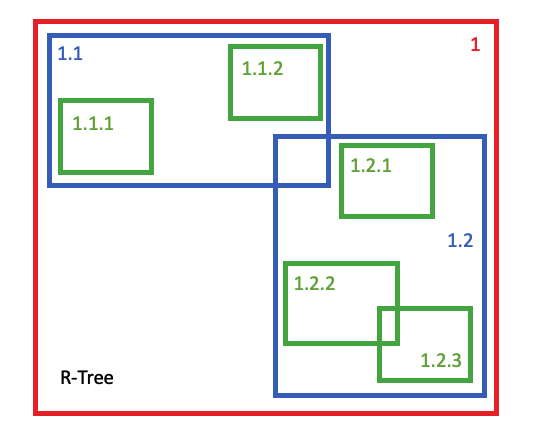
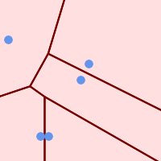
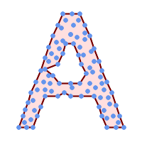
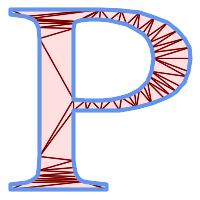
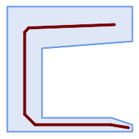

class: center, middle, first

# Module SIG
# Séance 5 - Cours - Les SGBD-R spatiaux

### LP Programmation Avancée

<br>
<br>

.author[
    Matthieu Viry (UAR RIATE / CNRS)
    <br>
    🖂 <a href="mailto:matthieu.viry@cnrs.fr">matthieu.viry@cnrs.fr</a>
]

.date[
    <br>
    08/02/2023
]

---

class: section-change

# SGBD Spatial ?


---

## Qu'est-ce qu'une BD spatiale ?

<br><br>

**Les bases de données spatiales permettent le stockage et la manipulation des objets spatiaux comme les autres objets de la base de données.**

--

<br><br>

Trois principaux éléments caractérisent les bases de données spatiales :

- **Type de données spatiales**

- **Indexation spatiale** (pour améliorer les performances d'exécution des opérations spatiales)

- **Fonctions spatiales** (utilisées pour accéder à des propriétés ou à des relations spatiales)

---

## Types de données spatiales


BD classique : `CHAR`, `NUMERIC`, `BOOLEAN`, `DATE`, etc.

BD spatiale : ajout d'un type de données pour représenter l'information géographique.

<br>

--

Dans **PostGIS** (et Microsoft SQL Server) :
- type **_geometry_** : le type représentant les entités spatiales avec des systèmes de coordonnées planaires,
- type **_geography_** : le type représentant les entités spatiales avec des systèmes de coordonnées géodésiques (ellipsoïdales).

.center[
*(le choix entre les deux dépend de l'emprise spatiale de travail et des usages de la BD)*
]

<br>

--

Ce sont des types _**opaques**_ (l'accès aux données de ces champs se fait au travers de fonctions dédiées) et _**abstraits**_ (les valeurs géométriques utilisent les sous-types _concrets_, qui représentent les diverses formes géométriques).

--

Sous-types concrets : *Point*, *MultiPoint*, *LineString*, *MultiLineString*, *Polygon*, *MultiPolygon*, *GeometryCollection*, mais également d'autres types définis par l'OGC dans le standard [Simple Feature Access](https://www.ogc.org/standards/sfa), *LinearRing*, *PolyhedralSurface*, *Triangle* et *TIN*.


???

Une base de données classique propose par exemple les types chaînes de caractères et date. Une base
de données spatiales ajoute les types de données (spatiales) pour représenter les entités géographiques.
Ces types de données spatiales permettent d’accéder à des propriétés de l’entité géographique comme
ses contours ou sa dimension. Pour bien des aspects, les types de données spatiales peuvent être vus
simplement comme des formes.

geometry — Le type représentant les caractéristiques spatiales avec des systèmes de coordonnées planaires.

geography — Le type représentant les entités spatiales avec des systèmes de coordonnées géodésiques (ellipsoïdales).


Les géographies ont des coordonnées universellement acceptées - chacun peut comprendre que représente la latitude et la longitude, mais peu de personne comprennent ce que les coordonnées UTM signifient. Pourquoi ne pas tout le temps utiliser des géographies ?

Premièrement, comme indiqué précédemment, il n’y a que quelques fonctions qui supportent ce type de données. Vous risquez de perdre beaucoup de temps à contourner les problèmes liés à la non-disponibilité de certaines fonctions.
Deuxièmement, les calculs sur une sphère sont plus consommateurs en ressource que les mêmes calculs dans un système cartésien. Par exemple, la formule de calcul de distance (Pythagore) entraîne un seul appel à la fonction racine carré (sqrt()). La formule de calcul de distance sphérique (Haversine) utilise deux appels à la fonction racine carré, et un appel à arctan(), quatre appels à sin() et deux à cos(). Les fonctions trigonométriques sont très coûteuses, et les calculs sphériques les utilisent massivement.
Quel conclusion en tirer ?

Si vos données sont géographiquement compactes (contenu à l’intérieur d’un état, d’un pays ou d’une ville), utilisez le type geometry avec une projection cartésienne qui est pertinente pour votre localisation. Consultez le site http://spatialreference.org et tapez le nom de votre région pour visualiser la liste des systèmes de projection applicables dans votre cas.

Si, d’un autre coté, vous avez besoin de calculer des distances qui sont géographiquement éparses (recouvrant la plupart du monde), utilisez le type geography. La complexité de l’application évitée en travaillant avec des objets de type geography dépassera les problèmes de performances. La conversion de type en géométrie permettra de dépasser les limites des fonctionnalités proposées pour ce type.


---

## Index spatiaux et étendue

L'**index spatial** est une forme d'indexation utilisée pour **optimiser les calculs impliquant des positionnements ou des distances**.

--

.center[

*"Quel objet se trouve dans une étendue spécifique ?"*


]

--

.center.w30[

.small[Index spatial de type **R-Tree** par défaut dans PostGIS]


]

???

Une base de données ordinaire fournit des “méthodes d’accès” – connues sous le nom d’index – pour
permettre un accès efficace et non séquentiel à un sous ensemble de données. L’indexation des types
non géographiques (nombre, chaînes de caractères, dates) est habituellement faite à l’aide des index de
type arbres binaires. Un arbre binaire est un partitionnement des données utilisant l’ordre naturel pour
stocker les données hiérarchiquement.

L’ordre naturel des nombres, des chaînes de caractères et des dates est assez simple à déterminer –
chaque valeur est inférieure, plus grande ou égale à toutes les autres valeurs. Mais, étant donné que les
polygones peuvent se chevaucher, peuvent être contenus dans un autre et sont représentés par un tableau
en deux dimensions (ou plus), un arbre binaire ne convient pas pour indexer les valeurs. Les vraies bases
de données spatiales fournissent un “index spatial” qui répond plutôt à la question : “quel objet se trouve
dans une étendue spécifique ?”

Les étendues sont utilisées car répondre à la question : “est-ce que A se trouve à l’intérieur de B ? ” est
une opération coûteuse pour les polygones mais rapide dans le cas ou ce sont des rectangles. Même des
polygones et des lignes complexes peuvent être représentés par une simple étendue.

Les index spatiaux doivent réaliser leur ordonnancement rapidement afin d’être utiles. Donc au lieu de
fournir des résultats exacts, comme le font les arbres binaires, les index spatiaux fournissent des résultats
approximatifs. La question “quelles lignes sont à l’intérieur de ce polygone” sera interprétée par un index
spatial comme : “quelles lignes ont une étendue qui est contenue dans l’étendue de ce polygone ?”

Les incréments spatiaux réels mis en application par diverses bases de données varient considérablement.
Les index spatiaux actuellement utilisés par les différents systèmes de gestion de bases de données
varient aussi considérablement. L’implémentation la plus commune est l’arbre R (utilisé dans PostGIS),
mais il existe aussi des implémentations de type Quadtrees, et des index basés sur une grille.

xxx

Les index standards de bases de données créent un arbre hiérarchique basé sur les valeurs de la colonne indexée. Les index spatiaux sont un peu différents : ils sont incapables d'indexer les caractéristiques géométriques elles-mêmes et indexent plutôt les boîtes englobantes des caractéristiques.

Dans la figure ci-dessus, le nombre de lignes qui croisent l'étoile jaune est de un, la ligne rouge. Mais les boîtes englobantes des caractéristiques qui coupent la boîte jaune sont au nombre de deux, les rouges et les bleues.

La façon dont la base de données répond efficacement à la question "quelles lignes coupent l'étoile jaune" est de répondre d'abord à la question "quelles boîtes coupent la boîte jaune" en utilisant l'index (ce qui est très rapide) et ensuite de faire un calcul exact de "quelles lignes coupent l'étoile jaune" seulement pour les caractéristiques retournées par le premier test.

Pour une grande table, ce système à "deux passes" consistant à évaluer d'abord l'index approximatif, puis à effectuer un test exact peut réduire radicalement la quantité de calculs nécessaires pour répondre à une requête.

PostGIS et Oracle Spatial partagent tous deux la même structure d'index spatial "R-Tree" 1. Les R-Trees décomposent les données en rectangles, en sous-rectangles, en sous-sous-rectangles, etc. Il s'agit d'une structure d'indexation auto-adaptative qui gère automatiquement la densité variable des données, les différentes quantités de chevauchement des objets et la taille des objets.

---

## Fonctions spatiales


<br>

**Permettre de manipuler les objets géographiques, d'analyser les composants
géographiques et de déterminer les relations spatiales.**

--

<br>

L'essentiel des fonctions spatiales peut être regroupé dans l'une des 5 catégories suivantes :

- **Conversion** (convertir les données géographiques dans une autre représentation)

- **Gestion** (gérer les informations relatives aux tables spatiales)

- **Récupération** (récupérer les propriétés et les mesures d'une géométrie)

- **Comparaison** (comparer deux géométries au regard de leurs relations spatiales)

- **Construction** (construire de nouvelles géométries à partir d'autres)

???

Pour manipuler les données lors d’une requête, une base de données classique fournit des fonctions
comme la concaténation de chaînes de caractères, le calcul de la clef md5 d’une chaîne, la réalisation
d’opérations mathématiques sur les nombres ou l’extraction d’informations spécifiques sur une date.

Une base de données spatiales fournit un ensemble complet de fonctions pour analyser les composants
géographiques, déterminer les relations spatiales et manipuler les objets géographiques.


---

## Pourquoi un SGBD spatial plutôt que des fichiers ?

<br><br>

- **Exploitation de modèle de données complexes**

- **Gestion fine possible des droits d'accès**

- **Accès concurrents aux données**

- **Requêtes complexes spécifiques**

- **Performance sur de grands jeux de données**

- **Possibilité de disposer de ‘vues'**

???

De manière générale, les mêmes avantages que les SGBD (non spatiaux) vs. des fichiers.

Les fichiers shapefile (et les autres formats) ont été la manière standard de stocker et d’interagir avec les données spatiales depuis l’origine des SIG. Néanmoins, ces fichiers “plats” ont les inconvénients suivants :

Les fichier au formats SIG requièrent un logiciel spécifique pour les lire et les écrire. Le langage SQL est une abstraction de l’accès aléatoire aux données et à leur analyse. Sans cette abstraction, vous devrez développer l’accès et l’analyse par vos propre moyens.
L’accès concurrent aux données peut parfois entraîner un stockage de données corrompues. Alors qu’il est possible d’écrire du code supplémentaire afin de garantir la cohérence des données, une fois ce problème solutionné et celui de la performance associée, vous aurez re-écrit la partie la plus importante d’un système de base de données. Pourquoi ne pas simplement utiliser une base de données standard dans ce cas ?
Les questions compliquées nécessitent des logiciels compliqués pour y répondre. Les question intéressantes et compliquées (jointures spatiales, aggrégations, etc) qui sont exprimables en une ligne de SQL grâce à la base de données, nécessitent une centaine de lignes de code spécifiques pour y répondre dans le cas de fichiers.
La plupart des utilisateurs de PostGIS ont mis en place des systèmes où diverses applications sont susceptibles d’accéder aux données, et donc d’avoir les méthodes d’accès SQL standard, qui simplifient le déploiement et le développement. Certains utilisateurs travaillent avec de grands jeux de données sous forme de fichiers, qui peuvent être segmentés en plusieurs fichiers, mais dans une base de données ces données peuvent être stockées dans une seule grande table.

En résumé, la combinaison du support de l’accès concurrent, des requêtes complexes spécifiques et de la performance sur de grands jeux de données différencient les bases de données spatiales des systèmes utilisant des fichiers.

+ Journalisation 

---

class: section-change

# Solutions existantes

---

## Quelles solutions ?

<br>

- PostgreSQL et son extension PostGIS

- Oracle et son extension Oracle Spatial and Graph

- SQLite et son extension SpatiaLite

- Microsoft SQL Server

- MySQL

- MariaDB

---

## Quelles solutions ?

<br>

- **PostgreSQL et son extension PostGIS**

- Oracle et son extension Oracle Spatial and Graph

- SQLite et son extension SpatiaLite

- Microsoft SQL Server

- MySQL

- MariaDB

.pull-right.w40[


]

---

## PostgreSQL + PostGIS

.pull-left[
**PostgreSQL**

- SGDB relationnel

- Logiciel libre (licence type BSD)

- Types de données modernes (composés / enrichis)

- Stabilité / robustesse / fiabilité

- Possibilités d'extension

- Pas vraiment de limite de taille (max. 32 To par table - cf [Wiki](https://wiki.postgresql.org/wiki/FAQ#What_is_the_maximum_size_for_a_row.2C_a_table.2C_and_a_database.3F))

]

.pull-right[

**PostGIS**

- Extension à PostgreSQL

- Logiciel libre (GNU GPL), développé depuis 2001.

- S'appuie sur GDAL (raster), OGR (vecteur), PROJ.4 (projections), GEOS (géométrie)...

- Fonctions SIG classiques *(buffer, intersection, union, prédicats géométriques, projection, rééchantillonnage, calcul de distance, d'aire, etc.)*

- Utilisation des rasters et des vecteurs


]

???

L'histoire de PostgreSQL remonte à la base de données Ingres, développée à Berkeley par Michael Stonebraker. Lorsque ce dernier décida en 1985 de recommencer le développement de zéro, il nomma le logiciel Postgres, comme raccourci de post-Ingres. Lors de l'ajout des fonctionnalités SQL en 1995, Postgres fut renommé Postgres95. Ce nom fut changé à la fin de 1996 en PostgreSQL.

(contrôle de cohérence)

---

class: section-change

# Rappels concernant le langage SQL

---

## Rappels SQL

<br>

Trois ensembles :

- **Langage de Définition de Données (LDD)** : créer et supprimer des objets.
- **Langage de Contrôle de Données (LCD)** : gérer les droits sur les objets.
- **Langage de Manipulation de Données (LMD)** : recherche, insertion, mise à jour et suppression de données.

--

**Syntaxe** :

```sql
SELECT (liste des attributs)
FROM (liste des tables)
WHERE (conditions) ;
```

---

## Rappels SQL - Comparaison / Logique

.pull-left[
**Comparaison**

- `A = B`

- `A <> B` &nbsp;&nbsp; (différent)

- `A < B`

- `A > B`

- `A <= B` &nbsp;&nbsp; (inférieur ou égal)

- `A >= B` &nbsp;&nbsp; (supérieur ou égal)

- `A BETWEEN B AND C` &nbsp;&nbsp; (compris entre B et C)

- `A IN (B1, B2,...)` &nbsp;&nbsp; (dans liste de valeurs)
]

--

.pull-right[
**Logique**

- `OR` &nbsp;&nbsp; (pour séparer deux conditions dont au moins une doit être vérifiée)

- `AND` &nbsp;&nbsp; (pour séparer deux conditions qui doivent être vérifiées simultanément)

- `NOT` &nbsp;&nbsp; (pour inverser une condition)
]
---

## Rappels SQL - Types de données et fonctions classiques


.pull-left.medium[
**Types**

- `CHARACTER` (ou `CHAR`) : caractère de texte ou chaîne de caractères, de longueur fixe ;

- `CHARACTER VARYING` (ou `VARCHAR`) : chaîne de caractères de longueur variable avec longueur maximale fixée;
- `TEXT` : chaîne de caractères sans limite de taille ;

- `NUMERIC` (ou `DECIMAL` ou `DEC`) : nombre décimal exact de précision arbitraire ;

- `INTEGER` (ou `INT`) : nombre entier ;

- `REAL` : nombre réel à virgule flottante (de précision limitée, donc inexact) ;

- `BOOLEAN` (ou `LOGICAL`) : valeur booléenne (vrai ou faux) ;

- `DATE` : date du calendrier grégorien

<br>

.small[Voir aussi la [liste complète pour PostgreSQL]( https://www.postgresql.org/docs/current/datatype.html).]
]

--

.pull-right.medium[
**Fonctions** *(math / chaîne de caractères)* :

- `LENGTH` : longueur d'une chaîne

- `CHR` : caractère correspondant au code ASCII, ex : `CHR(184)` renvoi ©

- `SUBSTR `: extraction d'une sous-chaîne de caractères (utilisation : `substr(chaîne, position , longueur)`)

- `UPPER` : convertit en majuscule

- `LOWER` : convertit en minuscule

- `POW` : pour élever à une puissance, ex : `POW(champ, 2)` pour élever au carré

- `SQRT` : pour obtenir la racine carrée

- `ROUND` : pour arrondir un résultat

- `cast (expr as type)` (ou `expr::type`) : convertir un type en un autre

- `LIMIT` indiquer le maximum d'enregistrements en retour

- `OFFSET` décaler le nombre de lignes à obtenir
]

???

substr : le 1er caractère à la position 1 et pas 0...

---

## Rappels SQL - Tri et agrégation

- `GROUP BY` : groupement des autres colonnes

- `HAVING` : critère supplémentaire de sélection sur l’agrégation


**Tri**

- `ORDER BY` : classer le résultat

- `DESC` : tri décroissant

- `ASC` : tri croissant

**Agrégation**

- `count()` : nombre d'enregistrements

- `sum()` : somme

- `max()` : maximum

- `min()` : minimum

- `avg()` : moyenne

---

## Rappels SQL

Soit une table "commune" (même jeu de données que lundi-mardi) contenant les communes de la région Nouvelle-Aquitaine :

.medium.pull-left[
- Compter le nombre d'enregistrements :

```sql
SELECT count(*) as nb_communes FROM commune;
```

.m-auto[

| nb_communes |
|-------------|
| 4308  |

]

<br>

- Connaître la population totale :

```sql
SELECT sum(population) as pop_totale FROM commune;
```

.m-auto[

| pop_totale |
|-------------|
| 6033952  |

]

]

.medium.pull-right[

- Connaître la population totale par département :

```sql
SELECT
    insee_dep as departement,
    sum(population) as pop_dep
FROM commune
GROUP BY insee_dep
ORDER BY pop_dep DESC;
```

.m-auto.small[

| departement | pop_dep |
|-------------|---------|
| 33          | 1636391|
| 64          |  687240|
| 17          |  655709|
| 86          |  439332|
| 40          |  418122|
| 24          |  412807|
| 79          |  374481|
| 87          |  372123|
| 16          |  351718|
| 47          |  330844|
| 19          |  239190|
| 23          |  115995|


]


]

---

## Rappels SQL

.pull-left[
Admettons que j'ai une table "departement" qui contient la correspondance entre les noms des départements et leur code, on peut modifier la requête précédente pour faire une jointure et récupérer ces noms dans le tableau de résultats :

```sql
SELECT
    departement.label as departement_name,
    sum(commune.population) as pop_dep
FROM commune
JOIN departement
    ON commune.insee_dep = departement.code
GROUP BY departement.label 
ORDER BY pop_dep DESC
LIMIT 1;
```

| departement_name | pop_dep | 
|-------------|---------|
| GIRONDE     | 1636391|

]

--

.pull-right[
Il est aussi possible et parfois utile de faire des *sous-requêtes* (*requêtes imbriqués*, *requêtes en cascade*) :

.medium[
Par exemple ici pour sélectionner tous les étudiants qui sont dans la classe contenant le plus d'étudiants...

```sql
SELECT *
FROM students
WHERE class_id = (
    SELECT id
    FROM classes
    WHERE number_of_students = (
        SELECT MAX(number_of_students)
        FROM classes));
```

... ou la discipline pour laquelle les enseignants sont en moyenne le mieux payé
```sql
SELECT
    subject,
    MAX(salary_by_subject.avg_salary) AS max_salary
FROM (
    SELECT subject, AVG(monthly_salary) AS avg_salary
    FROM teachers
    GROUP BY subject
) salary_by_subject;
```
]
]

---

class: section-change

# Les fonctionnalités spécifiques aux SGBD spatiaux

---

## Prédicats spatiaux


Ils sont disponibles sous formes de fonctions spatiales qui renvoient VRAI (1) ou FAUX (0) :

.medium.pull-left[
- **ST_Equals(geometry A, geometry B)** retourne vrai si les géométries sont de même type et ont les mêmes coordonnées.

- **ST_Intersects(geometry A, geometry B)** retourne vrai s'il y a au moins un point commun.

- **ST_Disjoint(geometry A, geometry B)** retourne vrai s'il n'y a aucun point commun (équivalent à n'intersecte pas ou NOT ST_Intersect).

- **ST_Crosses(geometry A, geometry B)** retourne vrai si le résultat de l'intersection des géométries est de dimension immédiatement inférieure à la plus grande des dimensions des objets (ex : si A est un polygone et B une ligne, la dimension de l'intersection doit être une ligne) ET que le résultat de l'intersection est à l'intérieur des deux géométries.

- **ST_Touches(geometry A, geometry B)** retourne vrai si les contours s'intersectent ou si un seul des intérieurs intersecte le contour de l'autre.
]

.medium.pull-right[
- **ST_Overlaps(geometry A, geometry B)** retourne vrai si les deux géométries sont de même dimension et que l'intersection est de même dimension mais de géométrie différente (renvoi faux si les deux géométries sont identiques).

- **ST_Within(geometry A, geometry B)** retourne vrai si le premier objet est complétement dans le deuxième.

- **ST_Contains(geometry A, geometry B)** retourne vrai si le deuxième objet est complétement dans le premier.

Et aussi :

- **ST_Dwithin(geometry A, geometry B, distance)** qui retourne vrai si la distance la plus courte entre A et B est inférieure ou égale à distance.

- **ST_Distance(geometry A, geometry B)** qui calcule la distance la plus courte entre deux géométries.

]

???

ST_disjoint équivalent à n'intersecte pas ou NOT ST_Intersect, qu'il est préférable d'utiliser pour des questions de performance liée aux possibilités d'indexation spatiale.


Seuls `ST_Intersects`, `ST_Distance` et `ST_DWithin` sont implémentées pour le type *geography*.

---

## Prédicats spatiaux

Sélection des cours d'eau qui intersectent la CA du Pays Basque :
```sql
SELECT cours_deau.name as name, cours_deau.geom as geom
FROM cours_deau, commune
WHERE
    commune.siren_epci = 200067106
    AND ST_Intersects(commune.geom, cours_deau.geom);
```


---

## Fonctions d'analyse ou de sérialisation des objets

.pull-left[

- **ST_Area(geometry)**

- **ST_Length(geometry)**

- **ST_Perimeter(geometry)**

<br>

- **ST_X(geometry)** .medium[(extrait la coordonnée X d'un point)]

- **ST_Y(geometry)** .medium[(extrait la coordonnée Y d'un point)]
]

.pull-right[

- **ST_AsText(geometry)** retourne la géométrie sérialisée en WKT.

- **ST_AsGML(geometry)**

- **ST_AsKML(geometry)**

- **ST_AsGeoJson(geometry)**

- ... 

]

<br>

--

.clear.medium[

```sql
SELECT id, ST_AsText(geom) as geom_wkt
FROM commune
LIMIT 1;
```

| id | geom_wkt |
|--|--|
|  COMMUNE_0000000009757696 | MULTIPOLYGON(((532063.7 6357562.6,532065.8 6357563.5,532072.6 6357568.8,532079.4 6357577.2,532092.9 6357594.5,532104 6357606.5,532109.5 6357619.7,532110.3 6357638.5,532110.5 6357641.3,532110.1 6357645.5,532110.3 6357650.7,532110.7 6357657.8,532113.3 6357678.4,532118.2 6357697.7,532123.2 6357716.8,532128.9 6357730.8,532129.7 6357732.9, ...
]

???

Ces différentes fonctions fonctionnent aussi bien pour le type *geometry* que pour le type *geography*.

---

## Fonctions de création de géométries

.medium.pull-left[
- **ST_Centroid(geometry)** retourne le point qui est approximativement au centre de la masse de la géométrie passée en paramètre. Calcul simple et rapide, mais parfois le point retourné peut se trouver à l’extérieur de l’entité elle-même (si polygone convexe par ex.).

- **ST_PointOnSurface(geometry)** retourne un point qui est obligatoirement dans l’entité passée en paramètre. Cette fonction coûte plus cher en ressource que le calcul du centroïde.

.w80[]

]

.medium.pull-right[
- **ST_Buffer(geometry, distance)** retourne une zone tampon dont le contour est à une distance donnée de la géométrie d’origine.

.center.w110[]

]

???

Polygone convexe... imaginer la lettre 'C'..

---

## Fonctions de création de géométries

```sql
SELECT id, ST_Centroid(geom), name
FROM commune;
```

```sql
SELECT id, ST_buffer(geom, 100)
FROM cours_deau;
```

--

```sql
SELECT id, ST_buffer(ST_Centroid(geom), 100)
FROM cours_deau;
```

---


## Fonctions de création de géométries

.medium.pull-left[
- **ST_Intersection(geometry A, geometry B)** retourne une géométrie avec uniquement les parties communes aux deux géométries A et B.

.w100.center[]

- **ST_Difference(geometry A, B)** retourne une géométrie représentant la partie de la géométrie A qui ne coupe pas la géométrie B. Ceci est équivalent à `A - ST_Intersection(A,B)` (et si A est complètement contenu dans B, alors une géométrie atomique vide de type approprié est retournée).

]

.medium.pull-right[
- **ST_Union(geometry, geometry)** prend 2 géométries et retourne leur union.

.center.w100[]

- **ST_Union([geometry])** prend un ensemble de géométries et retourne une géométrie contenant l’ensemble des géométries rassemblées (à utiliser avec `GROUP BY`).

- **ST_SymDifference(geometry A, geometry B)** retourne les portions de A et B qui ne s'intersectent pas. Ceci est équivalent à `ST_Union(A,B) - ST_Intersection(A,B)`. Cette différence est dite symétrique car `ST_SymDifference(A,B) = ST_SymDifference(B,A)`.

]

---

## Fonctions de création de géométries

Regroupement des communes en polygones représentant leurs départements :

```sql
SELECT insee_dep, ST_Union(geom) AS geom
FROM commune
GROUP BY insee_dep;
```

--

Création d'une nouvelle table ...

```sql
CREATE TABLE grid00_surf AS
SELECT g.gid, g.geom, sum(ST_Area(ST_Intersection(v.geom, g.geom)))/10000 AS surf
FROM grid00 AS g, clc00_vignes AS v
WHERE ST_Intersects(g.geom, v.geom)
GROUP BY g.gid, g.geom
ORDER BY g.gid;
```


---


## Fonctions de création de géométries

De nombreuses autres fonctions :    

.medium.pull-left[
`ST_VoronoiPolygons` (polygones de Voronoi)

`ST_DelaunayTriangles` (triangles de Delaunay)

`ST_ConvexHull` (enveloppe convexe)

`ST_ConcaveHull` (enveloppe concave)

`ST_SimplifyVW` (simplification du tracé)

`ST_AlphaShape`

`ST_OptimalAlphaShape`

`ST_TriangulatePolygon`

`ST_ChaikinSmoothing`

`ST_StraightSkeleton`

`ST_ApproximateMedialAxis`

Etc...
Voir le détail dans la documentation de PostGIS : https://postgis.net/docs/reference.html
]

.pull-right[
.center.w20[]
.center.w20[]
.center.w20[]
.center.w20[]
]

---

## D'autres fonctions utiles pour manipuler des géométries

<br>

.medium.pull-left[
- **ST_Dump(geometry)**

<br><br>

- **ST_Collect(geometry)** rassemble les géométries dans une collection de géométries. Le résultat est soit un `Multi*`, soit une `GeometryCollection`, selon que les géométries d'entrée ont des types identiques ou différents (homogènes ou hétérogènes). Les géométries d'entrée restent inchangées dans la collection.

]

.medium.pull-right[
- **ST_Union(geometry, geometry)** 

]

---

## Exemple de requêtes avec une composante spatiale...

Toujours en utilisant la même table "commune" :

.medium.pull-left[
- Superficie de la région :

```sql
SELECT sum(st_area(geom)) / 1000000 as area
FROM commune;
```

.m-auto.small[

|    area     |
|--------------------|
| 85093.95140056017 |

]

- Densité de population à l'échelle de la région :

```sql
SELECT
    sum(population) / (sum(st_area(geom)) / 1000000)
    as densite_pop
FROM commune;
```
.m-auto.small[

|    densite_pop     |
|--------------------|
| 70.9092937945326 |

]
]

.pull-right.medium[

- Densité de population à l'échelle de Biarritz-Anglet-Bayonne :

```sql
SELECT
    sum(population) / (sum(st_area(geom)) / 1000000)
    as densite_pop
FROM commune
WHERE insee_com in ('64122', '64024', '64102');
```

.m-auto.small[

|    densite_pop     |
|--------------------|
| 1835.4082917988542 |

]

]


---

class: section-change

## À vous de jouer !


