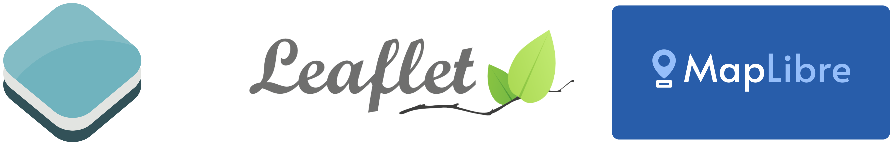
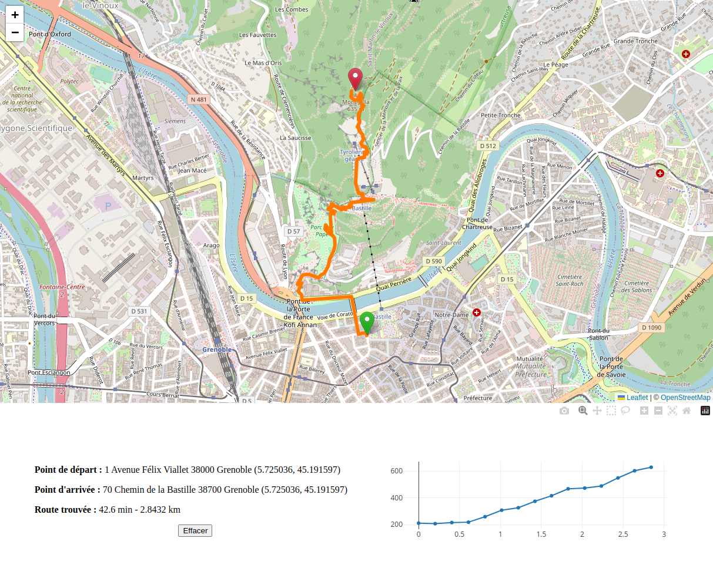

class: center, middle, first

# Module SIG
# Séance 7 - Cours/TD - Web et géospatial

### LP Programmation Avancée

<br>
<br>

.author[
    Matthieu Viry (UAR RIATE / CNRS)
    <br>
    🖂 <a href="mailto:matthieu.viry@cnrs.fr">matthieu.viry@cnrs.fr</a>
]

.date[
    <br>
    09/02/2023
]

---

class: section-change

# Partie cours
## Utilisation de services Web

---

## Web et information géographique

--

## Protocoles d'échanges (OGC)

--

- **Web Map Service (WMS)** : données cartographiques (raster)

.center.w60[

]

???


L’OGC est une association de 250 membres fondée en 1994, avec l’objectif de standardiser les échanges et la diffusion de données à caractère géographique. À ce titre l’OGC à mis en œuvre des services web : Un protocole informatique permettant à toute application indépendamment des plateformes et des langages sur lesquels elle repose, de dialoguer à distance via internet (par protocole HTTP(s), par URL donc). 

Ces standards OGC reposent donc sur internet et se placent de fait dans une structure globale de relation client-serveur. Les serveurs cartographiques sont les meilleurs moyens de construire et diffuser les standards de l’OGC. 

https://geoservices.ign.fr/documentation/services/utilisation-web/affichage-wmts/leaflet-et-wmts

https://wxs.ign.fr/decouverte/geoportail/wmts?service=WMTS&request=GetTile&version=1.0.0&tilematrixset=PM&tilematrix=14&tilecol=8299&tilerow=5635&layer=ORTHOIMAGERY.ORTHOPHOTOS&format=image/jpeg&style=normal

***

La spécification WMS normalise la manière selon laquelle des applications clientes doivent demander une carte et la manière selon laquelle les serveurs doivent décrire les données qu'ils sont capables de fournir.


GetCapabilities : retourne les métadonnées du service (couches proposées, projections associées, auteur…),
GetMap : retourne une carte (généralement dans un format d'image) selon les paramètres demandés,
GetFeatureInfo : retourne les informations sur un objet représenté sur la carte.

---

## Protocoles d'échanges (OGC)


- **Web Map Service (WMS)** : données cartographiques (raster)


```
http://geoservices.brgm.fr/geologie?SERVICE=WMS&VERSION=1.3.0&REQUEST=GetCapabilities
```

```
https://geoservices.brgm.fr/geologie?SERVICE=wms&VERSION=1.3.0&REQUEST=GetMap
    &LAYERS=Geologie
    &CRS=EPSG:27582
    &FORMAT=png
    &SERVICE=WMS
    &BBOX=851922.653184,2412291.653184,1122420.870912,2682789.870912
    &WIDTH=256
    &HEIGHT=256
```

--

<BR>


- **Web Map Tiled Service (WMTS)** : données cartographiques (raster) sous forme de tuiles prédéfinies

```
https://wxs.ign.fr/decouverte/geoportail/wmts?service=WMTS&version=1.0.0&request=GetTile
    &tilematrixset=PM
    &tilematrix=14
    &tilecol=8299
    &tilerow=5635
    &layer=ORTHOIMAGERY.ORTHOPHOTOS
    &format=image/jpeg
    &style=normal
```
???

https://www.geoportail.gouv.fr/carte


***

Le WMTS, pour Web Map Tile Service, est un standard décrivant la manière de diffuser des données cartographiques sous forme de tuiles prédéfinies.

WMTS est un complément à Web Map Service (WMS). Par rapport à WMS, WMTS a pour avantage principal d’offrir de meilleures performances dans la diffusion données cartographiques. Le revers de la médaille est une moins grande flexibilité que le WMS. WMTS n’est ainsi pas recommandé quand les données sont mises à jour de manière très fréquentes ou quand il est nécessaire d’offrir une symbologie à la demande.

Le fait de régénérer les tuiles implique que les niveaux de zoom et la symbologie sont définis à l’avance et ne peuvent être modifiés à la demande.


---

## Protocoles d'échanges (OGC)


- **Web Feature Service (WFS)** : données sous forme d'objets géographiques (vecteur) - *GetCapabilities*, *DescribeFeatureType*, *GetFeature*, etc.

```
https://geoservices.brgm.fr/geologie?SERVICE=wfs&VERSION=2.0.0&REQUEST=GetCapabilities
```

```
https://ahocevar.com/geoserver/wfs?service=WFS&version=1.1.0&request=GetFeature
    &typename=osm:water_areas
    &outputFormat=application/json
    &srsname=EPSG:4326
    &bbox=-80.61717826873064,42.99582840874791,-80.0200139852527,43.59299269222585,EPSG:4326
```

<br>

- **Catalogue Service for the Web (CSW)** pour interagir avec des catalogues de ressources spatialisées (pour découvrir des ressources, ou pour gérer les méta-données du catalogue avec CSW-T)


???


Le service Web Feature Service (WFS) représente un changement dans la façon dont l’information géographique est créée, modifiée et échangée sur Internet. Plutôt que de partager de l’information géographique au niveau des fichiers à l’aide du protocole de transfert de fichiers (FTP), par exemple, le WFS offre un accès direct et détaillé à l’information géographique au niveau des caractéristiques et des propriétés.

---

## Protocoles d'échanges (OGC)

.center.w40[

]

---

## Protocoles d'échange

- **XYZ Tiles** :

    * Tuiles de 256x256 pixels, au format `png`

    * Format de l'url : `/zoom/x/y.png` (ex: https://tile.openstreetmap.org/zoom/x/y.png - https://tile.openstreetmap.org/3/4/2.png)

    * C'est le type de fond de carte par défaut des bibliothèques comme Leaflet ou OpenLayers (mais elles supportent aussi WMS etc.)

    * Méthode de calcul des coordonnées : https://wiki.openstreetmap.org/wiki/Slippy_map_tilenames

---

## Tuiles vectorielles

.left-column-33.w100.center[

.small[Source : [QGIS Documentation](https://docs.qgis.org/3.22/en/docs/user_manual/working_with_vector_tiles/vector_tiles_properties.html)]
]

.right-column-66.w100.center[


.small[Source : [Boris Mericskay, La géovisualisation de données massives sur le Web : entre avancées technologiques et évolutions cartographiques, 2021](https://journals.openedition.org/mappemonde/5595
)]
]

???

cf. https://sites-formations.univ-rennes2.fr/mastersigat/MaplibreGL/maps/Buildingmaps.html


https://sites-formations.univ-rennes2.fr/mastersigat/MaplibreGL/maps/Basemapsmenu.html

https://maplibre.org/

Les tuiles vectorielles sont des paquets de données géographiques, conditionnés en « tuiles » prédéfinies de forme approximativement carrée pour le transfert sur le web.

Le serveur de tuiles vectorielles renvoie des données cartographiques vectorielles, qui ont été découpées aux limites de chaque tuile, au lieu d’une image cartographique pré-rendue. Les tuiles découpées représentent les niveaux de zoom du service de tuiles vectorielles, dérivés d’une approche pyramidale. Grâce à cette structure, le transfert de données est réduit par rapport aux cartes vectorielles non découpées. Seules les données situées dans la vue actuelle de la carte et au niveau de zoom actuel doivent être transférées. De plus, par rapport à une carte raster en mosaïque, le transfert de données est également très réduit, car les données vectorielles sont généralement beaucoup plus petites qu’un bitmap rendu. Les tuiles vectorielles n’ont pas d’informations de style assignées. Le client doit donc appliquer un style cartographique afin d’afficher les données.

Pour résumer elles permettent de faire des rendus plus personnalisés, de naviguer dans des cartes avec plus d'interactions, tout en réduisant la quantité de données transférée entre le serveur et le client.


---

## Serveurs Web cartographiques : principe et fonctionnement

C'est un logiciel qui permet de **gérer et diffuser des données géographiques**, via le protocole HTTP, dans des formats lisibles par les navigateurs Web (*par ex. png pour les images, GeoJSON pour les données vectorielles, etc.*)

--

.center.w65[


.small[Source : https://eatlas.org.au/book/export/html/300]
]

???

Un serveur cartographique est un type spécifique de serveur web permettant de gérer et distribuer des données géographiques. C’est l’intermédiaire entre la base de données spatiales (PostGIS ou Oracle par exemple) et l’interface web. Il permet notamment de distribuer des flux WMS/WMTS/WFS pour visualiser de l’information. Encore une fois, plusieurs solutions existent : MapServer, GeoServer, ArcGIS Server, QGIS Server…


le rôle du serveur cartographique dans une infrastructure web basique


---

## Serveurs Web cartographiques : solutions


- [**MapServer**](https://mapserver.org/) - *an Open Source platform for publishing spatial data and interactive mapping applications to the web*

- [**GeoServer**](https://geoserver.org/) - *an open source server for sharing geospatial data*

- [**QGIS Server**](https://docs.qgis.org/3.22/en/docs/server_manual/index.html#qgis-server-manual) - *an open source WMS, WFS, OGC API for Features 1.0 (WFS3) and WCS implementation that, in addition, implements advanced cartographic features for thematic mapping*

- Les outils de la suite [**OpenMapTiles**](https://github.com/openmaptiles)

- [**TileServer GL**](http://tileserver.org/)

- Etc.

<br><br>

.center.w40[

]

---

## Framework de webmapping

<br>

- [**Leaflet**](https://leafletjs.com/) - *An open-source JavaScript library for mobile-friendly interactive maps*

- [**OpenLayers**](https://openlayers.org/) - *A high-performance, feature-packed library for all your mapping needs*

- [**Mapbox GL JS**](https://docs.mapbox.com/mapbox-gl-js/example/) - *A client-side JavaScript library for building web maps and web applications with Mapbox's modern mapping technology*

- [**MapLibre GL JS**](https://maplibre.org/) - *Open-source TypeScript library for publishing maps on your website. Fast displaying of maps is possible thanks to GPU-accelerated vector tile rendering.*

.center.w60[
    
]

---

## Autres framework pour visualiser les données géospatiales

- [**CesiumJS**](https://cesium.com/platform/cesiumjs/) - *an open source JavaScript library for creating world-class 3D globes and maps with the best possible performance, precision, visual quality, and ease of use*

.center.w50.border[
  
]

- [**Itowns**](http://www.itowns-project.org/) - *a web framework written in Javascript/WebGL for the visualisation of 3D geographic data and precise 3D measurements*


---

## Autres framework pour visualiser les données géospatiales


- Les frameworks de la suite [**vis.gl**](https://vis.gl/frameworks), notamment [**Deck.gl**](https://deck.gl/).

<br>


.center.w60[


.small[Source: https://deck.gl/examples/hexagon-layer/]
]


???

https://map.geo.admin.ch/?layers=ch.swisstopo.swissnames3d&lon=8.24528&lat=46.04722&elevation=87928&heading=360.000&pitch=-44.188&lang=en&topic=ech&bgLayer=ch.swisstopo.pixelkarte-farbe

---

## D'autres types de services Web géospatiaux

<br>

Les **services cartographiques** (WMS, WFS, etc.) **ne sont pas les services Web géospatiaux existants** :

<br>

- **géocodage** et **géocodage inverse** (*adresse → coordonnées* et *coordonnées → adresse*)

- **calcul d'itinéraire** (voir calcul d'isochrones, de matrice de temps de parcours, etc.)

- **calcul altimétrique**

- d'autres API de mise à disposition de données diverses...


???

communément appelée API de "routing" en anglais.

---

## Exemple : les géoservices de l'IGN

**URL** : https://geoservices.ign.fr/documentation/services/api-et-services-ogc

- [Images](https://geoservices.ign.fr/documentation/services/api-et-services-ogc/images-wms-ogc) (WMS)

- [Images tuilées](https://geoservices.ign.fr/documentation/services/api-et-services-ogc/images-tuilees-wmts-ogc) (WMTS)

- [API Carto](https://geoservices.ign.fr/documentation/services/api-et-services-ogc/api-carto-rest) (REST)

- [Données vecteur](https://geoservices.ign.fr/documentation/services/api-et-services-ogc/donnees-vecteur-wfs-ogc) (WFS) - Donne accès aux objets de différents BD de l'IGN : BD TOPO®, BD CARTO®, BD FORET® ou PARCELLAIRE EXPRESS (PCI).


---

## Rappels en JavaScript - l'API Fetch

**[API Fetch](https://developer.mozilla.org/fr/docs/Web/API/Fetch_API)** pour faire des requêtes HTTP.

Expose une méthode globale dans le navigateur nommée `fetch` qui accepte deux arguments : l'url (ou un objet `Request`) et optionnellement un objet qui contient les paramètres de la requête.

La fonction `fetch` retourne une promesse (`Promise`) qui se résout avec un objet `Response`.

Concrètement :

```js
fetch('mon-document.json')
  .then((resp) => resp.json())
  .then((obj) => {
    // la réponse, au format json, a été désérialisée en
    // un objet qu'on peut désormais utiliser...
    console.log(obj);
  });
```

--

Si vous n'êtes pas à l'aise avec les fonctions fléchées (*arrow functions*), ça revient au même que :

```js
fetch('mon-document.json')
  .then(function(resp) {
    return resp.json();
  })
  .then(function(obj) {
    console.log(obj);
  });
```

Si vous voulez en savoir plus sur la fonction `fetch` : https://developer.mozilla.org/fr/docs/Web/API/fetch

Si vous voulez en savoir plus sur les fonctions fléchées : https://developer.mozilla.org/fr/docs/Web/JavaScript/Reference/Functions/Arrow_functions ou https://unblogdedev.com/blog/javascript-es6-les-fonctions-flechees

---

## Rappels en JavaScript - l'API Fetch

Si vous êtes dans une fonction qui a été déclarée comme `async`, vous pouvez utiliser `await` plutôt que `then()` pour attendre qu'une promesse soit résolue :

```js
async function fetchMyDocument() {
  const resp = await fetch('mon-document.json');
  const obj = await resp.json();
  // la réponse, au format json, a été désérialisée en
  // un objet qu'on peut désormais utiliser...
  console.log(obj);
}
```

Si besoin de plus d'exemple vous pouvez par exemple consulter : https://dmitripavlutin.com/javascript-fetch-async-await/

---

## Rappels en JavaScript - l'API Fetch

Il est souvent nécessaire de passer des paramètres supplémentaires à `fetch` via le deuxième argument attendu.


```js
fetch('mon-document.json', {
  method: 'GET', // La méthode HTTP
  mode: 'cors', // Permet les requêtes cross-origin pour, par exemple, accéder à diverses APIs fournies par de tierces parties
  cache: 'default' // Comment la requête interagi avec le cache du navigateur
})
  .then((resp) => resp.json())
  .then((obj) => {
    // la réponse, au format json, a été désérialisé
    // un objet qu'on peut désormais utiliser...
    console.log(obj);
  });
```

Le détails est donné sur la page de la fonction `fetch` : https://developer.mozilla.org/fr/docs/Web/API/fetch#param%C3%A8tres

---

## Rappels en JavaScript - Sélectionner des éléments du DOM

Avec des méthodes de l'interface [`Document`](https://developer.mozilla.org/fr/docs/Web/API/Document) :

.medium[

**document.getElementById**

- renvoie un objet `Element` représentant l'élément dont la propriété id correspond à la chaîne de caractères spécifiée.

```js
const menu = document.getElementById('menu');
```

**document.querySelector**

- retourne le premier `Element` dans le document correspondant au sélecteur - ou groupe de sélecteurs - spécifié(s), ou null si aucune correspondance n'est trouvée.

```js
const menu = document.querySelector('#menu');
```

```js
const navBar = document.querySelector('header > .navbar');
```

**document.querySelectorAll**

- renvoie une `NodeList` statique représentant une liste des éléments du document qui correspondent au groupe de sélecteurs spécifiés.


```js
const buttons = document.querySelectorAll('button');
```

]

---

## Rappels en JavaScript - Modifier le contenu d'un élément

<br>

Avec l'attribut [`innerHTML`](https://developer.mozilla.org/fr/docs/Web/API/Element/innerHTML) des [`Element`](https://developer.mozilla.org/fr/docs/Web/API/Element) HTML :

<br>

```js
const monElement = document.getElementById('foo');
monElement.innerHTML = 'Nouveau contenu !';
```

<br>

```js
const monElement = document.querySelector('#foo');
monElement.innerHTML = 'Un <i>super</i> nouveau contenu';
```


---

class: section-change

# Partie TD
## Construction d'une application Web


---

## Présentation du sujet

Développer une **application Web** permettant de calculer l'**itinéraire piéton le plus rapide** entre deux points et de l'**afficher sur une carte interactive**.

L'application présentera également :

- un **profil altimétrique** de l'itinéraire proposé.
- l'**adresse** des points sélectionnés par l'utilisateur
- la **possibilité de changer le fond de carte affiché pour afficher des orthophotographies**

.w40.border.center[

]


---

## Exemple de résultat

.center.w65.border[

]


---

## Exemple de résultat

.center.w65.border[

]


---

## Exemple de résultat

.center.w65.border[

]


---

## Consignes détaillées (1)

### Base

.medium[

- **Créer un document HTML**.

- **Suivre le début du tutoriel https://leafletjs.com/examples/quick-start/** (i.e. inclure les fichiers CSS et JS de leaflet, créer une `div` pour accueillir la carte, instancier la carte en JS).

- Faire en sorte que la carte utilise 70% de la hauteur de la page avec la règle CSS `#map { height: 70vh; }`.

- Créer une `div` utilisant 30% de la hauteur de la page (`30vh`), sous la carte pour accueillir des informations sur l'itinéraire calculé et sur les points de départ et d'arrivé.

- **Lors d'un clic sur la carte**, afficher :
    * **un marker pour symboliser le point de départ**,
    * **les coordonnées du point du départ dans la zone d'information** créée sous la carte.

- **Lors d'un second clic sur la carte** :
    * afficher **un marker pour symboliser le point d'arrivée**,
    * afficher **les coordonnées du point d'arrivée dans la zone d'information** précédemment créée,
    * **faire appel au service de calcul d'itinéraire** en utilisant les deux points sélectionnés par l'utilisateur.

- Lorsque la réponse est arrivée, **afficher l'itinéraire** sur la carte et **zoomer sur l'emprise de cet itinéraire**.

]

---

## Consignes détaillées (2)

.medium[

### Utiliser d'autres géoservices...

- **Remplacer les coordonnées affichées dans la zone d'information par des adresses** (*géocodage inverse*).

- **En utilisant l'itinéraire reçu, calculer et afficher son profil altimétrique** (*utiliser un échantillon de 15 points répartis le long de l'itinéraire* - essayez avec plus si vous souhaitez, l'API de l'IGN dit supporter jusqu'à 5000 points mais parfois elle semble ne renvoyer que des '0' lorsque trop de points sont demandés). Vous pouvez utiliser la bibliothèque de votre choix pour dessiner le graphique.


### Améliorer l'interface...

- **Faire en sorte que le marker de départ soit vert et celui d'arrivée soit rouge**.

- **Faire en sorte de pouvoir calculer un nouvel itinéraire** (lorsqu'un itinéraire est déjà affiché, un nouveau clic sur la carte efface cet itinéraire et recréé un point de départ) si ce n'était pas déjà fait.

- Ajouter un **bouton effacer** (qui permet d'effacer le point de départ, si seulement un point de départ sélectionné, ou d'effacer tout l'itinéraire si déjà un itinéraire présent).

- **Permettre à l'utilisateur de choisir entre le fond de carte actuel et des orthophotos** (*images satellitaires*), **fournies par le service WMTS de l'IGN**.

- **Gérer le cas où aucun itinéraire n'est trouvé** (*affichage d'un message d'erreur, etc.*)

]


---

## Pour aller plus loin (questions bonus)

.medium[
Vous souhaitez désormais proposez à l'utilisateur d'afficher différentes aménités situées le long de son parcours.
Pour cela nous utiliserons l'**API Overpass**, qui permet de faire des requêtes sur les **données du projet OpenStreetMap**.

Il vous faudra donc : 
  - choisir un type d'aménité (par les exemples "les bars"),
  - vous rendre sur le [wiki du projet OSM](https://wiki.openstreetmap.org/wiki/FR:Page_principale) (par exemple pour les bars : https://wiki.openstreetmap.org/wiki/Tag:amenity%3Dbar) afin de voir quelle paire de clé/valeur est utilisée pour représenter l'aménité choisie dans OSM,
  - faire une requête overpass (vous pouvez tester vos requête sur https://overpass-turbo.eu/) utilisant une *bounding-box* appropriée (afin de ne récupérer les données que dans la zone englobant l'itinéraire affiché sur la carte),
  - afficher les objets reçus sur la carte, sous forme de markers différents de ceux utilisés pour les points d'arrivée et de départ (optionnellement, vous pouvez filtrer les objets reçus afin de vous assurez qu'ils soient bien, par exemple, à moins de 200m de l'itinéraire que vous proposez à l’utilisateur).

```js
r = await fetch('https://overpass-api.de/api/interpreter?data=[out:json];node[name=\"Châtenay-Malabry\"];out;');

```
.center[*Requête Overpass dans le paramètre "data" - À adapter avec votre requête pour chercher l'aménité de votre choix dans la zone appropriée...* ]

Ressources :

- https://wiki.openstreetmap.org/wiki/Overpass_API
- https://wiki.openstreetmap.org/wiki/Overpass_API/Overpass_QL
- https://overpass-turbo.eu/

]
---

## Ressources 


.small.pull-left[


### Géoservices IGN

- https://geoservices.ign.fr/documentation/services/api-et-services-ogc/itineraires

- https://geoservices.ign.fr/documentation/services/api-et-services-ogc/geocodage-20/doc-technique-api-geocodage

- https://geoservices.ign.fr/documentation/services/api-et-services-ogc/calcul-altimetrique-rest

<br><br><br>

### Leaflet

- https://leafletjs.com/examples/quick-start/

- https://leafletjs.com/examples/geojson/

- https://leaflet-extras.github.io/leaflet-providers/preview/

]

.small.pull-right[

### JavaScript

- https://developer.mozilla.org/fr/docs/Web/API/Fetch_API/Using_Fetch

- https://developer.mozilla.org/fr/docs/Web/API/Element/innerHTML

<br>

### Plotly

- https://plotly.com/javascript/getting-started/ (cf. *plotly.js CDN*)

- https://plotly.com/javascript/line-charts/

<br>

### Turf

- https://turfjs.org/getting-started (cf. *Using directly in the browser*)

- https://turfjs.org/docs/#along
]